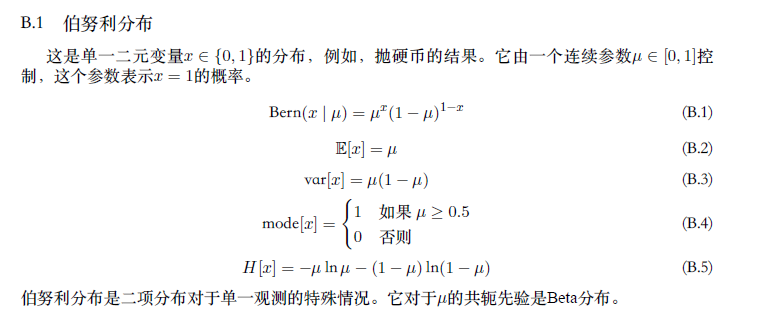
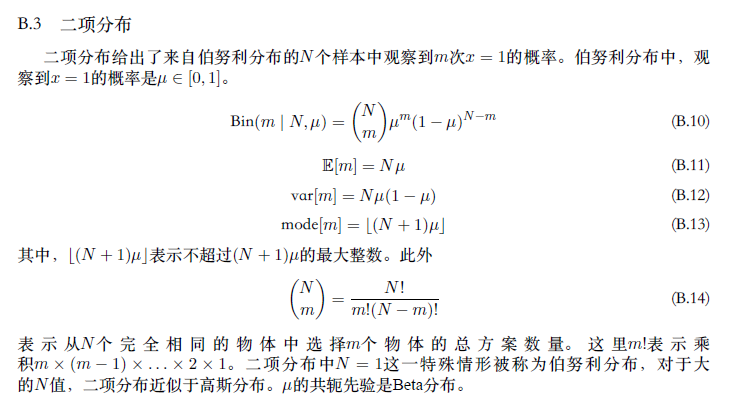
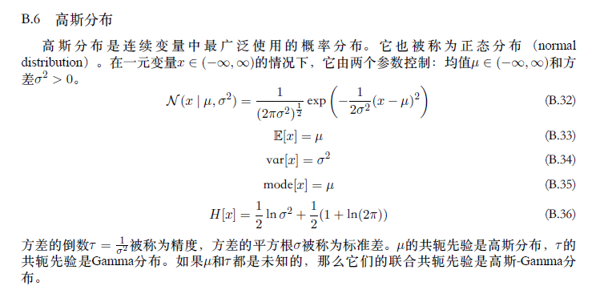
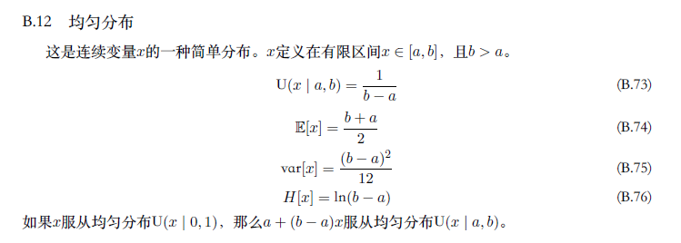
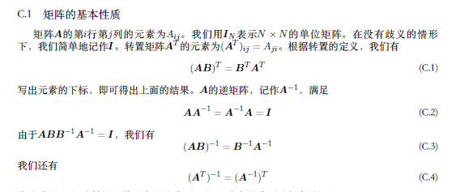
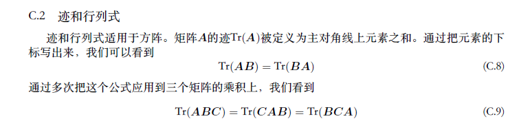
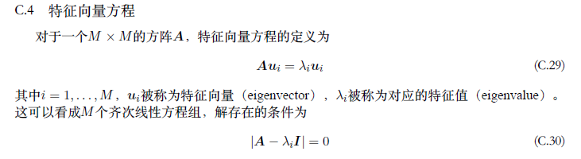

# 数学基础

## 概率论

## 矩阵论
### 一、求导总结
- 包含元素x的求导就是元素x对矩阵的各元素a求导,或者矩阵各元素a对元素x的求导。

- 向量对向量求导
  行向量m对列向量n：行的每一个元素对列向量求导，导数矩阵：n*m;
  列向量m对行向量n：列的每一个元素对行向量求导，导数矩阵：m*n;
  行向量m对行向量n：一行m*n列
  列向量m对列向量n：一列m*n行

- 矩阵对向量求导
  矩阵看做列向量，对行向量求导：**矩阵**对各个元素求导，横向拼接
  矩阵看做列向量，对列向量求导：**各个元素**对列向量求导，整体拼接

- 向量对矩阵求导
  行向量对矩阵求导：行向量对矩阵的**各个元素**求导，然后拼接
  列向量对矩阵求导：列向量的**各个元素**对矩阵求导，然后拼接

- 矩阵Y对矩阵X求导
  Y看做列向量，X看做行向量：Y的列向量对X的行向量逐一求导

