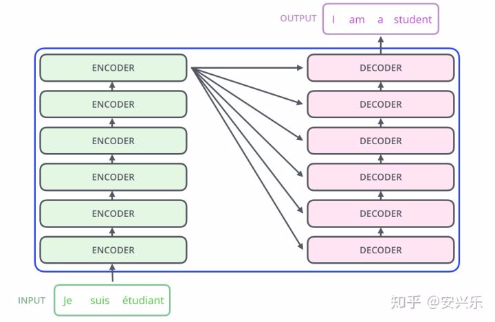
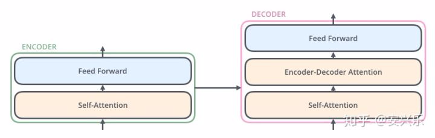
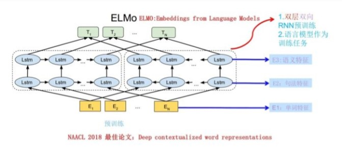
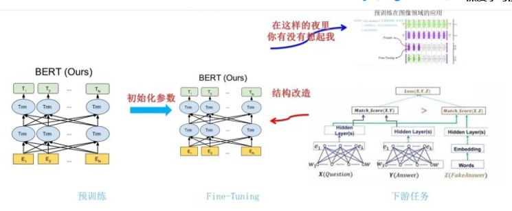
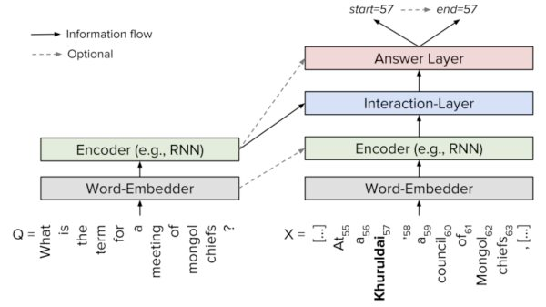
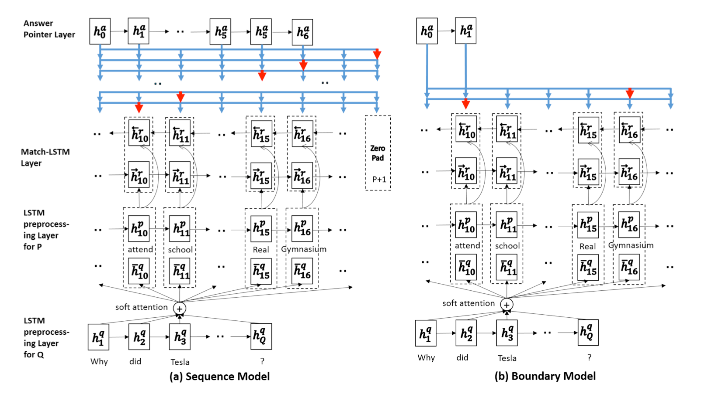

## word2vec
详见3_word2vec.md

## TextCNN

## Transformer
### 一、编码器与解码器

各层结构相同，权重不共享
### 二、编码器结构细节
we+pos_en，词向量+位置编码

### 三、计算任意两词的注意力加权后的向量表示

### 四、单词的矩阵运算，获取注意力加权后的向量表示

#### 解码器端动态展示

---
## EMLO——特征融合
word embedding：无法解决多义词问题；
elmo：we训练后获得上下文语义了，根据这个语义调整单词的we表示；we适配语义，完成多义词问题。
两阶段：语言模型预训练+下游任务。
语言模型预训练：we输入到双层双向LSTM网络；最终得到句子每个单词对应的(单词we，单词的句法信息，单词的语义信息)。每一个we对应一个权重a，累加求和整合成一个。

---
## GPT——预训练+fine tune
重点是Transformer，特征抽取的能力强于RNN，只有单向的特征提取能力。

---
## BERT

### Mask LM
随机选择预料15%单词，用掩码覆盖，然后要求模型去正确预测被抠掉的单词。实际上80%真正被mask标记，10%替换成另外的词，10%未改。
### Next Sentence Prediction

多任务训练，增加句子关系推断。（选择两个句子：语料中真正顺序相连的两个句子；或者选择随机取两个句子）判断第二个是否是第一个句子的后续句子。考虑到单词预测粒度到不了句子关系层级。

---
## QA系统基本框架

