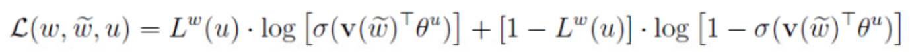

# word2vec
[《word2vec中的数学原理.pdf》](https://github.com/yuyinxiao/interview/blob/master/doc/word2vec-中的数学原理详解.pdf) 
[网页版笔记](http://www.hankcs.com/nlp/word2vec.html)
## Negative Sampling
对于机器学习中的分类任务，在训练的时候不但要给正例，还要给负例。对于Hierarchical Softmax，负例是二叉树的其他路径。对于Negative Sampling，负例是随机挑选出来的。Negative Sampling能**提高速度、改进模型质量。**

### CBOW
给定训练样本，即一个词w和它的上下文Context(w)，Context(w)是输入，w是输出。那么w就是正例，词汇表中其他的词语的就是负例。假设我们通过某种采样方法获得了负例子集NEG(w)。对于正负样本，分别定义一个标签：正样本为1，负样本为0。
$$L^w(\tilde{w})=\left\{ 
\begin{array}{ll} 
1 & \tilde{w}=w;\\ 
0 & \tilde{w} \neq w;
\end{array}
\right.$$

对于给定正样本（Context(w),w）我们希望最大化
$$g(w)=\prod _{
    u{\epsilon {\left \{ w \right \}} \cup NEG(w)}}
    p(u|Context(w))$$
其中，
$$p(u|Context(w))=[\sigma (X_w^T\theta ^u)]^{L^w(u)}\cdot [1-\sigma(X_w^T\theta ^u)]^{1-L^w(u))}$$
也就是说，当u是正例时，$\sigma (X_w^T\theta ^u)$越大越好，当u是负例时，$\sigma (X_w^T\theta ^u)$越小越好。因为$\sigma (X_w^T\theta ^u)$ 等于模型预测样本为正例的概率，当答案就是正的时候，我们希望这个概率越大越好，当答案是负的时候，我们希望它越小越好，模型也符合极大似然估计。
$$\log\prod _{w\epsilon C} g(w)=\sum _{w\epsilon C}\log g(w)$$

每个词都是如此，语料库有多个词，我们将g累积得到优化目标。因为对数方便计算，我们对其取对数得到目标函数：
训练伪码为：

### Skip-gram
对于(w,Context(w))我们希望最大化：
$$g(w)=\prod _{\tilde{w}\epsilon Context(w)} \prod _{u\epsilon \left \{ w \right \}\cup NEG^{\tilde{w}}(w)}p(u|\tilde w)$$
其中，
$$L =\sum _{w\epsilon C} \sum _{\tilde{w}\epsilon Context(w)} \sum _{u\epsilon \left \{ w \right  \}\cup NEG^{\tilde w }(w)} L(w,\tilde w,u)$$

训练伪码为：

#### 补充Huffman树
Huffman树只是二叉树中具体的一种，word2vec训练的时候按照词频将每个词语Huffman编码，由于Huffman编码中词频越高的词语对应的编码越短。所以越高频的词语在Hierarchical Softmax过程中经过的二分类节点就越少，整体计算量就更少了。

#### 负采样算法
任何采样算法都应该保证频次越高的样本越容易被采样出来。基本的思路是对于长度为1的线段，根据词语的词频将其公平地分配给每个词语：
$$len(w)=\frac{counter(w)}{\sum _{u\epsilon D} counter(u)}$$

counter就是w的词频。
接下来我们只要生成一个0-1之间的随机数，看看落到哪个区间，就能采样到该区间对应的单词了，很公平。word2vec用的是一种查表的方式，将上述线段标上M个“刻度”，刻度之间的间隔是相等的，即1/M：接着我们就不生成0-1之间的随机数了，我们生成0-M之间的整数，去这个刻度尺上一查就能抽中一个单词了。在word2vec中，该“刻度尺”对应着table数组。具体实现时，对词频取了0.75次幂：这个幂实际上是一种“平滑”策略，能够让低频词多一些出场机会，高频词贡献一些出场机会，劫富济贫。
