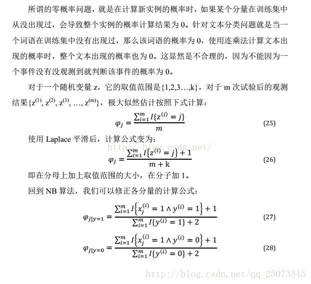

# NavBoost
1. 取30天的数据ctx_id和rec_id之间的展点数据，impression必须大某个阈值（1W）
2. 计算ctx_id和rec_id之间的coec值
3. 计算最大的ctr，归一化所有的ctr；计算新鲜度值$=1.5 - \frac{1}{1 + \exp(-\frac{age}{100})}$
4. 计算最终得分，ctrScore * 0.8 + ageScore * 0.2

## COEC 
解决item在页面上位置的不同造成CTR的差异性

---
用户注意力一般集中在左上，因此每次 impression 能导致的 click 是与位置相关的。变现有效 impression 的方式是通过每个位置的平均 CTR（reference CTR）来处理，这样将每次 impression 乘以对应位置的 reference CTR 就获得了所谓的 EC（expected click），这样消除了 position bias 的 EC 就变成可加的了。观测到的 click 数目从统计上来看应该是分布在 EC 附近，也就是说 CoEC（clicks over expected clicks）的期望应该是 1。

使用 CoEC 而不是 CTR 作为每个 item 的 relevance 的反应是一个不错的选择，但是实际操作中与 CTR 类似都面临着 data sparsity 的问题。一般我们也会使用 Laplace smoothing 解决 0 观测。
#### 拉普拉斯平滑
分子+1；分母+可取值范围大小

