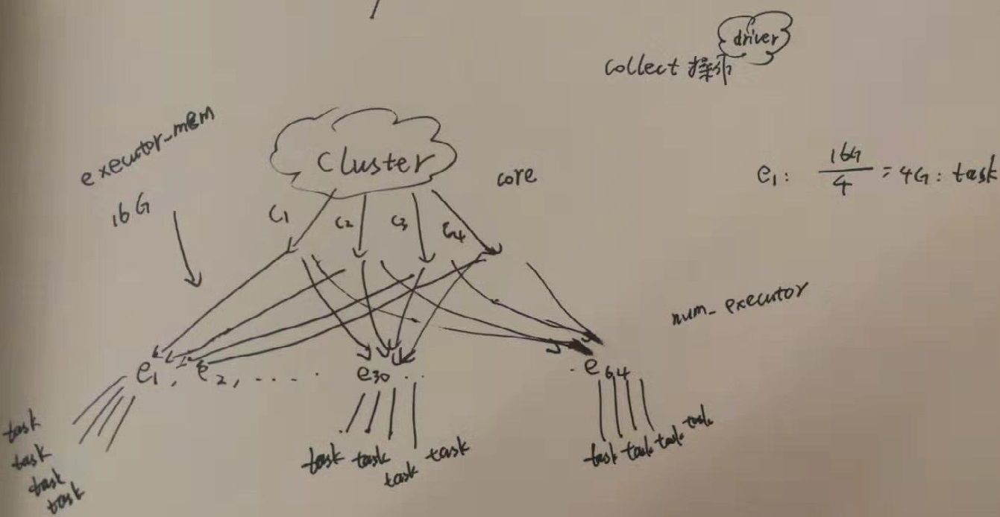

# Spark
### 1、Spark job资源分配

|config|num|annotation|
|--------|--------|--------|
|driver-memory	|4g	|driver使用的内存，不可超过单机的 core 总数。
|num-executors	|2 |创建多少个 executor。
|executor-memory	|2g	|各个 executor使用的最大内存，不可超过单机的最大可使用内存。
|executor-cores	|2	|各个 executor 使用的并发线程数目，也即每个 executor 最大可并发执行的 Task 数目。

### 2、 faiss

支持两种相似性计算方法：L2距离（即欧式距离）和点乘（归一化的向量点乘即cosine相似度）

### 3、指标
|config|annotation|
|--------|--------|
display_count |  展示量
session_display_count  | 去重展示量
click_count   |	点击量
long_click_count|长点击量
short_click_count|短点击量
mid_click_count |中点击量
playtime | 播放时长
click_uv| 点击UV
display_uv | 展示UV
video_count	| 视频个数（新加）
ctr	 | 点击量/展示量
lctr	 | 长点击量/展示量
uctr | 	点击UV/展示UV
人均feed数	 | feed展示量/展示UV
点击人均播放时长 | 	总播放时长/点击UV
展示人均播放时长PPUI | 	总播放时长/展示UV
平均播放时长	 | 总播放时长/feed展示次数

### MMR && DPP

MMR的原则是，结果文档之间彼此越不相似，整个结果文档集的多样化程度越高

