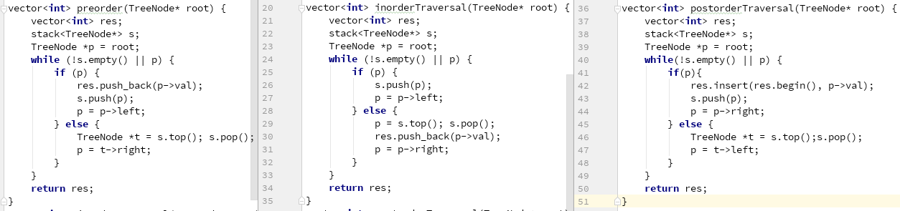

<a id="markdown-二叉树" name="二叉树"></a>
# 二叉树

<!-- TOC -->

- [二叉树](#二叉树)
    - [遍历](#遍历)
        - [前中后遍历](#前中后遍历)
        - [层序遍历](#层序遍历)
    - [路径和：只能是先序遍历](#路径和只能是先序遍历)
    - [二叉树横向连接](#二叉树横向连接)
    - [二叉树右视图](#二叉树右视图)
    - [子树](#子树)
        - [判断t是s的子树](#判断t是s的子树)
        - [二叉树内部找重复子树](#二叉树内部找重复子树)
    - [最低公共祖先](#最低公共祖先)
        - [二叉搜索树的最低公共祖先](#二叉搜索树的最低公共祖先)
        - [一般二叉树的最低公共祖先](#一般二叉树的最低公共祖先)
    - [翻转二叉树](#翻转二叉树)
    - [二叉树的打家劫舍](#二叉树的打家劫舍)
    - [二叉搜索树（二叉排序树）](#二叉搜索树二叉排序树)
        - [构造二叉搜索树](#构造二叉搜索树)
        - [验证二叉排序树](#验证二叉排序树)
        - [搜索第k小的值](#搜索第k小的值)
        - [插入[更改树结构需要指针重新指向]](#插入更改树结构需要指针重新指向)
        - [删除某个目标节点[更改树结构需要指针重新指向]](#删除某个目标节点更改树结构需要指针重新指向)
        - [实现二叉搜索树迭代器](#实现二叉搜索树迭代器)
    - [二叉平衡树](#二叉平衡树)
        - [验证是否平衡](#验证是否平衡)
        - [二叉平衡且排序的树](#二叉平衡且排序的树)
    - [二叉树与链表](#二叉树与链表)
        - [先序遍历将二叉树转单向链表](#先序遍历将二叉树转单向链表)
        - [二叉树转双向链表](#二叉树转双向链表)
    - [完全二叉树的节点数](#完全二叉树的节点数)

<!-- /TOC -->


对于树的问题，**涉及两个或多个问题则考虑最终使用哪一种遍历方式解决**
默认对树的层数定义为： 1,2,3,4……k……h  总结点数N；度为0：n0，度为1：n1，度为2：n2
- 性质1: 树的第 k 层至多有$2^{k-1}$个节点
- 性质2: 树深度为 n ，总结点数至多$2^{n}-1$
- 性质3: 叶节点数$n_0$，度数为2的结点树$n_2$ 则有${n_0}={n_2}+1$ 如果一棵完全二叉树的结点总数为N，那么叶子结点${n_0}=\frac{N}{2}$
- 性质4: 结点总数为N，则树深为${log_2(N+1)}$

**对于树的删除和增加操作改变树结构时**
递归定义：
```cpp
root->left=delete(root->left,key);
root->right=delete(root->right,key);
```
---

<a id="markdown-遍历" name="遍历"></a>
## 遍历
>>不同题目应用遍历方式是不同的。有的公司面试会问你非递归实现。树的所有题目最后都是基于这几种遍历方式实现的。

<a id="markdown-前中后遍历" name="前中后遍历"></a>
### 前中后遍历


<a id="markdown-层序遍历" name="层序遍历"></a>
### 层序遍历
使用队列取出弹出加入左右；之字形用两个栈交替加入左右，右左。


<a id="markdown-路径和只能是先序遍历" name="路径和只能是先序遍历"></a>
## 路径和：只能是先序遍历
```cpp
help(node*,curSum,out,res){
    if(!node || cur_Sum < node->val)
        return;
    out.push_back(node->val);
    if(!node->left && !node->right && curSum==node->val)
        res.push_back(out);
    help(left,curSum-node->val,out,res);
    help(right,curSum-node->val,out,res);
    out.pop_back();
}
```

<a id="markdown-二叉树横向连接" name="二叉树横向连接"></a>
## 二叉树横向连接
```cpp
TreeNode* dummy=cur;
while(root){
    if(root->left)
        cur->next=left;
        cur=cur->next;
    if(root->right)
        cur->next=right;
        cur=cur->next;
    //平移
    root=root->next;
    //是否换层
    if(!root)
        root=dummy->next;//本层头节点作为下一层的父节点
        cur=dummy;//从辅助节点开始
        dummy->next=NULL;//断开
}
```

<a id="markdown-二叉树右视图" name="二叉树右视图"></a>
## 二叉树右视图
>>左视图类似
```cpp
while(!q.empty()){
    res.push_back(q.back());
    for(int i=0;i < q_size();i++){
        node=q.top();q.pop();
        if(node->left)
            q.push(node->left);
        if(node->right)
            q.push(node->right);
    }
}
```

<a id="markdown-子树" name="子树"></a>
## 子树

<a id="markdown-判断t是s的子树" name="判断t是s的子树"></a>
### 判断t是s的子树
>>先序判断：先对根和t去比较；再对左和右对t去比较
```cpp
bool isSame(s,t){
    if(!s && !t) return true;
    if(!s || !t) return false;
    if(s->val!=t->val)
        return false;
    return isSame(s->left,t->left) && isSame(s->right,t->right);
}

bool fun(s,t){
    if(!s)
        return false;
    if isSame(s,t)
        return true;
    return fun(s->left,t) || fun(s->right,t);
}
```

<a id="markdown-二叉树内部找重复子树" name="二叉树内部找重复子树"></a>
### 二叉树内部找重复子树
>>二叉树先序遍历序列化为字符串，后序得到str结果；用map<str,int>来存储分支的次数
```
string str = to_string(node->val) + "," + helper(node->left, m, res) + "," + helper(node->right, m, res);
```
```cpp
string helper(TreeNode* node, unordered_map<string, int>& m, vector<TreeNode*>& res) {
    if (!node) 
        return "#";
    string str = to_string(node->val) + "," + helper(node->left, m, res) + "," + helper(node->right, m, res);
    if (m[str] == 1) 
        res.push_back(node);
    ++m[str];
    return str;
}
```


<a id="markdown-最低公共祖先" name="最低公共祖先"></a>
## 最低公共祖先

<a id="markdown-二叉搜索树的最低公共祖先" name="二叉搜索树的最低公共祖先"></a>
### 二叉搜索树的最低公共祖先
>>O(h)
```cpp
//当前大于较大值：两节点在左子树上；
//当前小于较小值：两节点在右子树上。
TreeNode* generate(TreeNode* root, TreeNode* p, TreeNode* q) {
    if(!root)
        return null;
    if(root->val > max(p->val, q->val))
        return generate(root->left, p, q);
    if(root->val < min(p->val, q->val))
        return generate(root->right, p, q);
    return root; //p,q之间则找到
}
```

<a id="markdown-一般二叉树的最低公共祖先" name="一般二叉树的最低公共祖先"></a>
### 一般二叉树的最低公共祖先
```cpp
TreeNode* fun(TreeNode* root, TreeNode* p, TreeNode* q) {
    if (!root || p == root || q == root) 
        return root;
    TreeNode *left = fun(root->left, p, q);
    TreeNode *right = fun(root->right, p , q);
    if (left && right)
        return root;
    return left ? left : right;
}
```

<a id="markdown-翻转二叉树" name="翻转二叉树"></a>
## 翻转二叉树
```cpp
TreeNode* invertTree(TreeNode* root) {
    if (!root) 
        return NULL;
    TreeNode *tmp = root->left;//保留左指针
    root->left = invertTree(root->right);
    root->right = invertTree(tmp);
    return root;
}
```

<a id="markdown-二叉树的打家劫舍" name="二叉树的打家劫舍"></a>
## 二叉树的打家劫舍
```cpp
int rob(TreeNode* root) {
    int l = 0, r = 0;
    return helper(root, l, r);
}
int helper(TreeNode* node, int& l, int& r) {
    if (!node)
        return 0;
    int ll = 0, lr = 0, rl = 0, rr = 0;
    l = helper(node->left, ll, lr);
    r = helper(node->right, rl, rr);
    return max(node->val + ll + lr + rl + rr, l + r);
}
```

<a id="markdown-二叉搜索树二叉排序树" name="二叉搜索树二叉排序树"></a>
## 二叉搜索树（二叉排序树）
左子树的值 < 当前节点值 < 右子树的值
优点在于，最坏的情况下，搜索插入删除的复杂度为$O(h)=O({log_2N})$。
>>**可构造树的种数：
$$n个节点可构成的二叉排序树种类：C_{2n}^{n}-C_{2n}^{n-1}$$

<a id="markdown-构造二叉搜索树" name="构造二叉搜索树"></a>
### 构造二叉搜索树
>>遍历start\~end选择中间节点，然后(start,i-1),(i+1,end);非平衡的二叉搜索树;如果需要平衡的则需要i取中间值；截止条件就是如果相等则返回该值
```cpp
vector<TreeNode*> helper(int start, int end) {
    if (start > end) 
        return {nullptr};
    vector<TreeNode*> res;
    for (int i = start; i <= end; ++i) {   
        TreeNode* left = helper(start, i - 1);
        TreeNode* right = helper(i + 1, end);
        for (TreeNode* a : left) {
            for (TreeNode* b : right) {
                TreeNode *node = new TreeNode(i);
                node->left = a;
                node->right = b;
                res.push_back(node);
            }
        }
    }
    return res;
}
```

<a id="markdown-验证二叉排序树" name="验证二叉排序树"></a>
### 验证二叉排序树
>>返回bool、先序遍历
```cpp 
//定义递归 fun(root,INT_MAX,INT_MIN);
bool fun(TreeNode* root,int mx,int mn){
    if(!root)
        return true;

    if(root->val >= mx || root->val <= mn)
        return false;

    return fun(root->left,mn,node->val) && fun(root->right,node->val,mx);
}
```

<a id="markdown-搜索第k小的值" name="搜索第k小的值"></a>
### 搜索第k小的值
>>中序遍历：判断；k--；再判断
```cpp
int kthSmallestDFS(TreeNode* root, int &k) {
    if (!root) 
        return -1;
    int val = kthSmallestDFS(root->left, k);
    if (k == 0) //先判断之前是否已找到
        return val;
    k--;
    if (k == 0) //再判断现在是否已找到
        return root->val;
    return kthSmallestDFS(root->right, k);
}
```

<a id="markdown-插入更改树结构需要指针重新指向" name="插入更改树结构需要指针重新指向"></a>
### 插入[更改树结构需要指针重新指向]
>>二分搜索；root->left=delete(root->left,key);
```cpp
TreeNode* insertIntoBST(TreeNode* root, int val) {
    if (!root) //查找到位置
        return new TreeNode(val);
    if (root->val > val) 
        root->left = insertIntoBST(root->left, val);
    else
        root->right = insertIntoBST(root->right, val);
    return root;
}
```

<a id="markdown-删除某个目标节点更改树结构需要指针重新指向" name="删除某个目标节点更改树结构需要指针重新指向"></a>
### 删除某个目标节点[更改树结构需要指针重新指向]
>>root->left=delete(root->left,key);
```cpp
TreeNode* deleteNode(TreeNode* root, int key) {
    if (!root) 
        return NULL;
    if (key < root->val) {
        root->left = deleteNode(root->left, key);
    } else if (key > root->val) {
        root->right = deleteNode(root->right, key);
    } else {
        //找到；若仅一个子节点，则将较小的左给当前删除节点
        if (!root->left || !root->right) {
            root = (root->left) ? root->left : root->right;
        } else {
            TreeNode *cur = root->right;
            while (cur->left) 
                cur = cur->left;
            root->val = cur->val;
            //覆盖删除，从此子树开始继续将右重复节点删除
            root->right = deleteNode(root->right, cur->val);
        }
    }
    return root;
}
```

<a id="markdown-实现二叉搜索树迭代器" name="实现二叉搜索树迭代器"></a>
### 实现二叉搜索树迭代器
```cpp
//迭代器首先将左入栈
BSTIterator(TreeNode *root) {
    while (root) {
        s.push(root);
        root = root->left;
    }
}
//Core code
int next() {
    t=s.back();pop_back();
    int res=t->val;
    if(t->right){
        t=t->right;
        while(t)
            s.push(t);
            t=t->left;
    }
    return res;
}
```


<a id="markdown-二叉平衡树" name="二叉平衡树"></a>
## 二叉平衡树

<a id="markdown-验证是否平衡" name="验证是否平衡"></a>
### 验证是否平衡
后序遍历
```cpp
//验证平衡树
int balance(node){
    if(!node)
        return 0;
    l=balance(node->left)+1;
    if(l==0)
        return -1;
    r=balance(node->right)+1;
    if(r==0)
        return -1;
    return abs(l-r)>1?-1:max(l,r);
}

//验证排序树
bool fun(TreeNode* root){
    if(!root)
        return true;
    
    if(!fun(root->left) || !fun(root->right))
        return false;

    if((node->left && node->val <= node->left->val) || (node->right && node->val >= node->right->val))
        return false;
    else
        return true;
}

```

<a id="markdown-二叉平衡且排序的树" name="二叉平衡且排序的树"></a>
### 二叉平衡且排序的树
>>两个子树的深度不想差超过1. 简单测试过可以。

```cpp
int helper(TreeNode* node,int mx,int mn){
    if(!node)
        return 0;
    int l=helper(node->left,mn,node->val)+1;
    int r=helper(node->right,node->val,mx)+1;
    if(abs(l-r)>1 || l==0 || r==0 ||(node->left && node->val<=node->left->val) || (node->right && node->val>=node->right->val)){
        return -1;
    }else{
        return max(l,r);
    }
}
```


<a id="markdown-二叉树与链表" name="二叉树与链表"></a>
## 二叉树与链表


<a id="markdown-先序遍历将二叉树转单向链表" name="先序遍历将二叉树转单向链表"></a>
### 先序遍历将二叉树转单向链表
```cpp
while(cur){
    if(cur->left){
        //到达左的最右
        pre=root->left;
        while(pre->right)
            pre=pre->right;

        pre->right=cur->right;//连接右
        cur->right=cur->left;//right指针实现next
        cur->left=NULL;//左置空
    }
    cur=cur->right;  //其实是进入原树的左子树
```


<a id="markdown-二叉树转双向链表" name="二叉树转双向链表"></a>
### 二叉树转双向链表
>>定义全局变量，仅对root中序递归，tail为前，root为后
```cpp

TreeNode *head,*tail = NULL;
void fun(TreeNode *root){
    if(!root)
        return;
    fun(root->left);//至左

    root->left = tail;
    if (tail == NULL) //左右连接
        tail = head = root;
    else
        tail->right = root;

    tail = root;
    fun(root->right);//至右
}
```


<a id="markdown-完全二叉树的节点数" name="完全二叉树的节点数"></a>
## 完全二叉树的节点数
```cpp
int f(node){
    l,r=0;
    while(node->left)
        node=node->left;l++;
    while(node->right)
        node=node->right;r++;  //计算左右深度
    if(l==r){
        return pow(2,l)-1;
    }
    else{
        return f(left)+f(right)+1;
    }
}
```