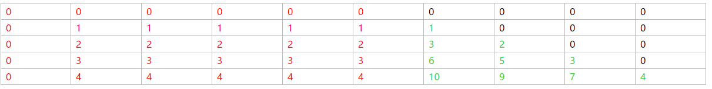
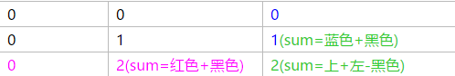
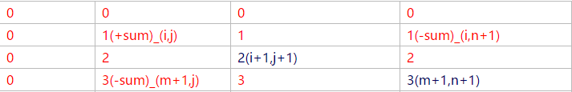
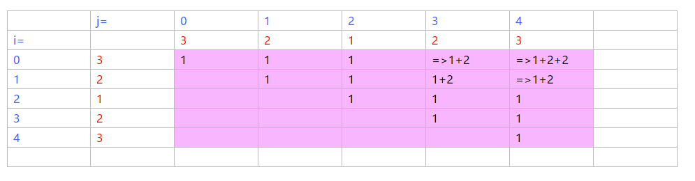
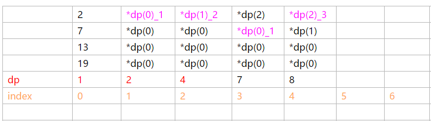

<a id="markdown-动态规划" name="动态规划"></a>
# 动态规划
字符串匹配，两个字符串的问题，二位数组的最值问题等。故将字符串问题也写入DP

---
<!-- TOC -->

1. [动态规划](#动态规划)
   1. [矩阵问题](#矩阵问题)
      1. [最大子数组和，最大子矩阵和——扩增](#最大子数组和最大子矩阵和扩增)
      2. [求取子矩阵的和——扩增](#求取子矩阵的和扩增)
      3. [最大正方形——扩增](#最大正方形扩增)
      4. [矩阵的最小路径和——扩增](#矩阵的最小路径和扩增)
      5. [被围绕的区域](#被围绕的区域)
      6. [最大矩形](#最大矩形)
      7. [二维矩阵的搜索——剑指offer](#二维矩阵的搜索剑指offer)
      8. [矩阵最小乘次](#矩阵最小乘次)
   2. [二维动规：字符串](#二维动规字符串)
      1. [最长公共子序列——扩增](#最长公共子序列扩增)
      2. [正则表达式](#正则表达式)
      3. [最长公共前缀](#最长公共前缀)
      4. [构造最长回文子串](#构造最长回文子串)
      5. [验证回文子串](#验证回文子串)
      6. [找出最长回文串](#找出最长回文串)
      7. [最长回文子序列](#最长回文子序列)
      8. [最小编辑距离——扩增](#最小编辑距离扩增)
   3. [一维动规：数组-典型子问题](#一维动规数组-典型子问题)
      1. [最少加油次数-贪心](#最少加油次数-贪心)
      2. [第N个丑数——累加](#第n个丑数累加)
      3. [等差递增子区间个数——累加](#等差递增子区间个数累加)
      4. [最大乘积子序列——累加](#最大乘积子序列累加)
      5. [分割整数使得乘积最大——子问题重复](#分割整数使得乘积最大子问题重复)
      6. [分割整数为平方数加和——子问题重复](#分割整数为平方数加和子问题重复)
      7. [26字母编码解码种类数——累加](#26字母编码解码种类数累加)
      8. [最长摆动子序列[返回摆动次数]——累加](#最长摆动子序列返回摆动次数累加)
      9. [0-1背包问题](#0-1背包问题)
      10. [数组元素加正负使其总和为target，返回次数。——累加](#数组元素加正负使其总和为target返回次数累加)

<!-- /TOC -->

<a id="markdown-矩阵问题" name="矩阵问题"></a>
## 矩阵问题
DFS,BFS，$N^2$技巧遍历
<a id="markdown-最大子数组和最大子矩阵和扩增" name="最大子数组和最大子矩阵和扩增"></a>
### 最大子数组和，最大子矩阵和——扩增
>>网易


```cpp
//{-1， 4， 6， -3， 7， -3， -3， 9}
int nums[M+1][N+1],b[M+1][N+1];
//解决子序列最大和，同时输出得到最大子数组的起始地址
void solve(int j) {
    int res=curSum=nums[j][0];
    int L, R, pos;
    for (int i = 1; i < nums[j].size(); i++){
        if (curSum < 0)
            curSum = nums[j][i], pos = i;
        else
            curSum += nums[j][i];
        if (curSum > res)
            res = curSum, L = pos, R = i;
    }
    cout << L << ',' << R << endl; //连续下标
    cout << res; //最大子序列和
}
int main(){
    for(int i=1;i<=M;i++){//从第i行开始累加到最后一行
        memset(b,0,sizeof(b));
        for(int j=i;j<=M;j++)//开始累加
            for(int k=1;k<=N;k++){
                b[j][k]=nums[j][k]+b[j-1][k];
            }
            solve(j);
        }
    }
}
```

<a id="markdown-求取子矩阵的和扩增" name="求取子矩阵的和扩增"></a>
### 求取子矩阵的和——扩增
>>给定位置得到和
- 加和


- 得到子矩阵的和


```cpp
void fun(vector<vector<int>> &nums) {
    vector<vector<int>> dp(nums.size()+1,vector<int>(nums[0].size()+1));
    for (int i = 1; i <= nums.size(); ++i) {
        for (int j = 1; j <= nums[0].size(); ++j){
            //上+左-到[i-1,j-1]的重复路径+本地元素
            dp[i][j] = dp[i][j - 1] + dp[i - 1][j] - dp[i - 1][j - 1] + nums[i - 1][j - 1];
        }
    }
}
int main(int i, int j, int m, int n) {
    return dp[m + 1][n + 1] - dp[i][n + 1] - dp[m + 1][j] + dp[i][j];
}
```

<a id="markdown-最大正方形扩增" name="最大正方形扩增"></a>
### 最大正方形——扩增
>>由0-1构成的矩阵，找到1构成的最大正方形

```cpp
dp[m+1][n+1]={0};//以当前为右下角构成的正方形，最小边长
for(int i=1;i<=m;i++){
    for(int j=1;j<=n;j++){
        if(nums[i][j]=='1')
            dp[i][j]=min(dp[i-1][j-1],dp[i-1][j],dp[i][j-1])+1;
        res=max(res,dp[i][j]);
}
return res*res;
```


<a id="markdown-矩阵的最小路径和扩增" name="矩阵的最小路径和扩增"></a>
### 矩阵的最小路径和——扩增

```cpp
int dp[m+1][n+1],int grid[m][n];
for(int i=1;i <= m;i++){
    for(int j=1;j <= n;j++){
        dp[i][j]=min(dp[i-1][j],dp[i][j-1])+grid[i-1][j-1];
    }
}
return dp[m][n];
```

<a id="markdown-被围绕的区域" name="被围绕的区域"></a>
### 被围绕的区域
>>找到所有被 'X' 围绕的区域，并将这些区域里所有的 'O' 用 'X' 填充

```cpp
for (int i = 0; i < m; ++i){
    for (int j = 0; j < n; ++j){
        if ((i != 0 && i != m - 1 && j != 0 && j != n - 1) || (board[i][j] != 'O'))
            continue;
        board[i][j]=='$';
        queue<pair<int,int>>q{{i,j}};
        while (!q.empty()) {
            pair{x,y} = q.front();q.pop();
            if (x >= 1 && board[x - 1][y] == 'O') {
                board[x - 1][y] = '$';
                q.push({x-1,y});
            }
            if (x < m - 1 && board[x + 1][y] == 'O') {
                board[x + 1][y] = '$';
                q.push({x+1,y})
            }
            if (y >= 1 && board[x][y - 1] == 'O') {
                board[x][y - 1] = '$';
                q.push({x,y-1});
            }
            if (y < n - 1 && board[x][y + 1] == 'O') {
                board[x][y + 1] = '$';
                q.push({x,y+1});
            }
        }
}
for (int i = 0; i < m; ++i) {
    for (int j = 0; j < n; ++j) {
        if (board[i][j] == 'O') 
            board[i][j] = 'X';
        if (board[i][j] == '$') 
            board[i][j] = 'O';
    }
}
//'O'->'X'
//'$'->'O'
```

<a id="markdown-最大矩形" name="最大矩形"></a>
### 最大矩形

```cpp
//得到连续1的长度
for (int i = 0; i < m; ++i) {
    for (int j = 0; j < n; ++j) {
        if (matrix[i][j] == '0') continue;
        if (j > 0) 
            h_max[i][j] = h_max[i][j - 1] + 1;
        else 
            h_max[i][0] = 1;
    }
}
for (int i = 0; i < m; ++i) {
    for (int j = 0; j < n; ++j) {
        if (h_max[i][j] == 0) continue;
        int mn = h_max[i][j];
        //高度为1时是否最大
        res = max(res, mn);
        //往上取各行最小长度再乘以高度
        for (int k = i - 1; k >= 0 && h_max[k][j] != 0; --k) {
            mn = min(mn, h_max[k][j]);
            res = max(res, mn * (i - k + 1));
        }
    }
}
```
<a id="markdown-二维矩阵的搜索剑指offer" name="二维矩阵的搜索剑指offer"></a>
### 二维矩阵的搜索——剑指offer
右上角出发：O(M+N)
二分：O(logM+logN)
```cpp
bool fun(vector<vector<int>> nums, int target) {
    //列二分，核心判断在哪一行通过mid和mid+1
    int l = 0, r = nums.size();
    int j, mid;
    while (l < r) {
        mid = (l + r) / 2;
        if (nums[mid][0] == target)
            return true;
        else if (nums[mid][0] > target) {
            r--;
        } else {
            if (nums[mid + 1][0] > target)
                break;
        }
    }
    j = mid;
    l = 0;
    r = nums[0].size();
    //对j行再进行二分
    while (l < r) {
        mid = (l + r) / 2;
        if (nums[j][mid] == target)
            return true;
        else if (nums[j][mid] > target) {
            r--;
        } else {
            l++;
        }
    }
    return false;
}
```
<a id="markdown-矩阵最小乘次" name="矩阵最小乘次"></a>
### 矩阵最小乘次
>>n^3复杂度：确定长度step；遍历所有可能窗口；在该窗口下找分割点；

- 矩阵=AxBxCxDxExFxG
- 维度列表=d[a,b,c,d,e,f,g]
- 维度=[a,b]x[b,c]x[c,d]x[d,e]x[f,g]
- 矩阵相乘mat[i][i+1]
- 对应维度:d[i]*d[i+1] x d[i+1] *d[i+2]
```cpp
m[i][j];//第i个矩阵到第j个矩阵的最少乘次
p[i][j];//从i到j中间乘以矩阵k
for(int i=1;i<=n;i++)
    m[i][i]=0;
for(int step=1;step<=n-1;step++){
    for(int i=1;i<=n-step;i++){
        int j=i+step;
        //确定从矩阵i->矩阵j；类似F算法从中间找k使得[i,k]*[k,j]最小
        int minx=INT_MAX;
        for(int k=i;k<=j-1;k++){
            if((m[i][k]+m[k+1][j]+d[i]*d[k+1]*d[j+1])< minx)
                minx=m[i][k]+m[k+1][j]+d[i]*d[k+1]*d[j+1];
                p[i][j]=k;
        }
        m[i][j]=minx;
    }
}
cout<<m[1][n]<<endl;//最少乘法次数
```

<a id="markdown-二维动规字符串" name="二维动规字符串"></a>
## 二维动规：字符串
<a id="markdown-最长公共子序列扩增" name="最长公共子序列扩增"></a>
### 最长公共子序列——扩增

>>dp[i,j]表示前面s1的i个,s2的j个字符的LCS

```cpp
int dp[M+1][N+1];
for(i=1;i<=M;i++){
    for(j=1;j<=N;j++){
        if(s[i-1]==t[j-1])
            dp[i][j]=dp[i-1][j-1]+1;
        else
            dp[i][j]=max(dp[i-1][j],dp[i][j-1]);
    }
}

//对dp数组回溯得到子序列
string res(dp[m][n]);
i= res.length()-1;
while(i >= 0){
    if(n>0 && dp[m][n] == dp[m][n-1])//同左
        n--;
    else if(m>0 && dp[m][n] == dp[m-1][n])//同上
        m--;
    else{   //同斜上，则赋值
        res[i--] = s1[m];
        m--;n--;
    }
}
```

<a id="markdown-正则表达式" name="正则表达式"></a>
### 正则表达式

匹配0次\
e b c\
e a * b c \
匹配1次\
e a a b c\
e a * b c
```cpp
vector<vector<bool>> dp(m + 1, vector< bool >(n + 1, false));
dp[0][0] = true;
//遍历字符串
for (int i = 0; i <= m; ++i) {
    //从1开始是因为考虑到*的存在会影响j的状态
    for (int j = 1; j <= n; ++j) {
        if (j > 1 && p[j - 1] == '*') {
                        //0次                   多次                                          前面都已匹配
            dp[i][j] = dp[i][j - 2] || (i > 0 && (s[i - 1] == p[j - 2] || p[j - 2] == '.') && dp[i - 1][j]);
        } else {
            //当前值相同且前面都已匹配
            dp[i][j] = i > 0 && dp[i - 1][j - 1] && (s[i - 1] == p[j - 1] || p[j - 1] == '.');
        }
    }
}
return dp[m][n];
```

<a id="markdown-最长公共前缀" name="最长公共前缀"></a>
### 最长公共前缀

```cpp
sort(strs.begin(), strs.end());
int i = 0;
int len = min(strs[0].size(), strs.back().size());
while (i < len && strs[0][i] == strs.back()[i]) 
    ++i;
return strs[0].substr(0, i);
```

<a id="markdown-构造最长回文子串" name="构造最长回文子串"></a>
### 构造最长回文子串
>>对于给定字符串构造回文串，返回其最大长度

```cpp
int longestPalindrome(string s) {
    unordered_set< char > t;//只要set不为空则就有单独存在的
    for (char c : s) {
        if (!t.count(c))
            t.insert(c);
        else
            t.erase(c);
    }
    if(t.size()==0){
        return s.size();
    }else{
        return s.size()-t.size()+1;
    }
}
```

<a id="markdown-验证回文子串" name="验证回文子串"></a>
### 验证回文子串

```cpp
boolean isPalindrome(string s) {
    if (s.length() == 0)
        return true;
    int l = 0, r = s.length() - 1;
    while (l < r) {
        if (!isLetterOrDigit(s[l]])) 
            l++;
        else if (!isLetterOrDigit(s[r]))
            r--;
        else
            if (lower(s[l]) != lower(s[r]))
                return false;
            l++;
            r--;
    }
    return true;
}
```

<a id="markdown-找出最长回文串" name="找出最长回文串"></a>
### 找出最长回文串

```cpp
int index, len;//全局变量
string longestPalindrome(string s) {
    if (s.length() < 2)
        return s;
    for (int i = 0; i < s.length() - 1; i++)
        helper(s, i, i);
        helper(s, i, i + 1);
    return s.substr(index, index + len);
}
void helper(string s, int l, int r) {
    while (l >= 0 && r < s.length() && s[l] == s[r])
        l--;
        r++;
    if (len < r - l - 1)
        index = l + 1;
        len = r - l - 1;
}
```

<a id="markdown-最长回文子序列" name="最长回文子序列"></a>
### 最长回文子序列


```cpp
//翻转得到两个字符串然后求LCS，实际上只计算上三角
//dp[i,j]代表[i,j]间最长回文序列长度
for(int i=n-1;i>=0;i++){//从后往前倒序
    dp[i][i]=1
    for(int j=i+1;j< n;j++){//从当前往后正序
        if (s[i] == s[j]) {
            dp[i][j] = dp[i+1][j-1] + 2;//左斜下位置+2
        } else {
            dp[i][j] = max(dp[i+1][j], dp[i][j-1]);//左和下的最大
        }
    }
}
return dp[0,n-1];
```

<a id="markdown-最小编辑距离扩增" name="最小编辑距离扩增"></a>
### 最小编辑距离——扩增

```cpp
int dp[m+1][n+1];
//空字符到当前w1的某个字符的编辑距离是长度
for (int i = 0; i <= m; ++i)
    dp[i][0] = i;
for (int i = 0; i <= n; ++i)//同上
    dp[0][i] = i;
for (int i = 1; i <= m; ++i) {
    for (int j = 1; j <= n; ++j) {
        if (word1[i - 1] == word2[j - 1]) {
            dp[i][j] = dp[i - 1][j - 1]; //字符相等，则当前编辑距离等于上一位置，也就是左上方
        } else {
            dp[i][j] = min(dp[i - 1][j - 1], dp[i - 1][j], dp[i][j - 1]) + 1;//不相等则左，上，左上的最小+1
        }
    }
}
return dp[m][n];
```

<a id="markdown-一维动规数组-典型子问题" name="一维动规数组-典型子问题"></a>
## 一维动规：数组-典型子问题
<a id="markdown-最少加油次数-贪心" name="最少加油次数-贪心"></a>
### 最少加油次数-贪心

```cpp
priority_queue<int,vector<int>,less<int>q;
stations.push_back({target,0});//加入终点,station{里程，可加油量}
for(auto station:stations){
    while(cur< station[0]){//到达不了此处，加油。
        if(q.empty()):
            return -1;
        cur+=q.top();q.pop();
    }
    //到达后入堆
    q.push(station[1]);
return stations.size()-q.size();
```

<a id="markdown-第n个丑数累加" name="第n个丑数累加"></a>
### 第N个丑数——累加
>>给定几个数定义为丑数，所有的数都是基于丑数的累乘。
brute force：第n个丑数；每个丑数累乘到之前，取大于dp[n-1]的最小的那个值。如果记住了丑数累乘到了第几个数，那么可以从当前累乘去比较，因为之前的一定太小。就略过。**故idx[i]保存第i个ugly丑数，这一次应该要累成到哪个已形成的dp[idx[i]]丑数上**
2,7,13,19



```cpp
vector<int> dp(n, 1);
vector<int> idx(ugly.size(), 0);//该丑数应该乘到哪个丑数上
for(int i=1;i< n;i++){
    dp[i]=INT_MAX;
    for(int j=0;j< ugly.size();j++)
        //丑数后累乘
        dp[i] = min(dp[i], ugly[j] * dp[idx[j]]);
    //标记基础丑数乘了几次
    for(int j=0;j< ugly.size();j++)
        if dp[i] == dp[idx[j]] * ugly[j]
            idx[j]++;
}
```

<a id="markdown-等差递增子区间个数累加" name="等差递增子区间个数累加"></a>
### 等差递增子区间个数——累加
>>新的区间个数是之前基础+1，最后再累加

```cpp
dp[2] = 1
    [0, 1, 2]
dp[3] = dp[2] + 1 = 2
    [0, 1, 2, 3], // [0, 1, 2] 之后加一个 3
    [1, 2, 3]     // 新的递增子区间
dp[4] = dp[3] + 1 = 3
    [0, 1, 2, 3, 4], // [0, 1, 2, 3] 之后加一个 4
    [1, 2, 3, 4],    // [1, 2, 3] 之后加一个 4
    [2, 3, 4]        // 新的
int numberOfArithmeticSlices(int[] nums) {
    int n = nums.length();
    vector<int>dp(n);
    for (int i = 2; i < n; i++) {
        if (nums[i] - nums[i - 1] == nums[i - 1] - nums[i - 2])
            dp[i] = dp[i - 1] + 1;
    }
    int res=sum(dp);
    return res;
}
```

<a id="markdown-最大乘积子序列累加" name="最大乘积子序列累加"></a>
### 最大乘积子序列——累加

```cpp
int res = nums[0], mx = res, mn = res;
for (int i = 1; i < nums.size(); ++i) {
    if (nums[i] > 0) {//当前为正，则比较乘之前最大和最小
        mx = max(mx * nums[i], nums[i]);
        mn = min(mn * nums[i], nums[i]);
    } else {
        int t = mx;//当前为负，最大是最小乘和当前相比；最小是当前最大乘和当前相比
        mx = max(mn * nums[i], nums[i]);
        mn = min(t * nums[i], nums[i]);
    }
    res = max(res, mx);
}
```

<a id="markdown-分割整数使得乘积最大子问题重复" name="分割整数使得乘积最大子问题重复"></a>
### 分割整数使得乘积最大——子问题重复
>>显然子问题重复: dp[i]=max(dp[i],max(j*(i-j),j*dp[i-j]));10=3+3+4

```cpp
vector<int>dp(n+1);
dp[1] = 1;
for (int i = 2; i <= n; i++) {
    for (int j = 1; j <= i - 1; j++){
        //直接分割相乘大 还是 子问题的值更大
        dp[i] = max(dp[i], max(j * dp[i - j], j * (i - j)));
    }
}
return dp[n];
```

<a id="markdown-分割整数为平方数加和子问题重复" name="分割整数为平方数加和子问题重复"></a>
### 分割整数为平方数加和——子问题重复
>>dp[i]代表i可以最少分为多少个平方数加和

```cpp
List<Integer> squareList = generateSquareList(n);//1,4,9,16,25,,,
vector<int>dp(n + 1);
for (int i = 1; i <= n; i++) {
    dp[i] = INT_MAX;
    for (int square : squareList) {
        if (square > i)
            break;
        dp[i] = min(dp[i], dp[i - square] + 1);//与已解决子问题比较
    }
}
return dp[n];
```

<a id="markdown-26字母编码解码种类数累加" name="26字母编码解码种类数累加"></a>
### 26字母编码解码种类数——累加
>>dp[i]代表[0,i-1]范围内可构成的次数

```cpp
int numDecodings(string s) {
    vector<int>dp(n+1);
    dp[0] = 1;
    dp[1] = s[0]=='0' ? 0 : 1;
    for (int i = 2; i <= n; i++) {

        //先保留之前种类数
        if (atoi(s.substr(i - 1, i)) != 0) {
            dp[i] += dp[i - 1];
        }

        //再判断是否能组成两位数的编码
        if (s[i-2]== '0')
            continue;

        //如果能则加上之前的种类数dp[i-2]
        if (atoi(s.substr(i-2, i)) <= 26) {
            dp[i] += dp[i - 2];
        }
    }
    return dp[n];
}

```

<a id="markdown-最长摆动子序列返回摆动次数累加" name="最长摆动子序列返回摆动次数累加"></a>
### 最长摆动子序列[返回摆动次数]——累加

```cpp
int up = 1, down = 1;
for (int i = 1; i < nums.size(); i++) {
    if (nums[i] > nums[i - 1]) {
        up = down + 1;
    } else if (nums[i] < nums[i - 1]) {
        down = up + 1;
    }
}
return max(up, down);
```

<a id="markdown-0-1背包问题" name="0-1背包问题"></a>
### 0-1背包问题

```cpp
int knapsack(int W, int N, int[] weights, int[] values) {
    vector<int>dp(n+1);
    for (int i = 1; i <= N; i++) {
        int w = weights[i - 1], v = values[i - 1];
        for (int j = W; j >= 1; j--) {
            if (j >= w) {
                dp[j] = max(dp[j], dp[j - w] + v);
            }
        }
    }
    return dp[W];
}
```

<a id="markdown-数组元素加正负使其总和为target返回次数累加" name="数组元素加正负使其总和为target返回次数累加"></a>
### 数组元素加正负使其总和为target，返回次数。——累加
>>dp[value]代表累加到此值的次数

```cpp
int sum = sum(nums);
int value = (sum + target) / 2;
vector<int>dp(value + 1);
dp[0] = 1;
for (int num : nums)
    //累加上数值(i-num)加上num到达i的次数
    for (int i = value; i >= num; i--)
        dp[i] = dp[i] + dp[i - num];
return dp[value];
```