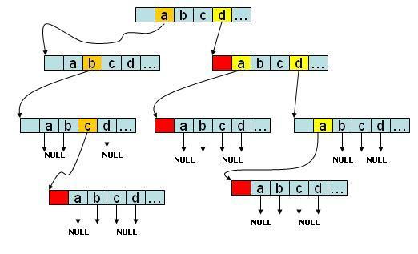

# Trie树


- Trie树的search
```cpp
struct TrieNode {
    public:
        TrieNode *child[26];
        bool isWord;
        TrieNode():isWord(false) {
            for (auto &a:child) 
                a=NULL;
        }
};
bool search(word,node,i):
    if i==word.size:
        return node->isWord
    if word[i]!='.':  //正常字符当前存在则判断下一层
        return node->child[word[i]-'a'] && search(word,node->child[word[i]-'a'],i+1)
    else：  //特殊字符时，则遍历当前子节点
        for(auto a:node->child){
            if a and search(word,a,i+1)
                return true;
        }
        return false;

```
