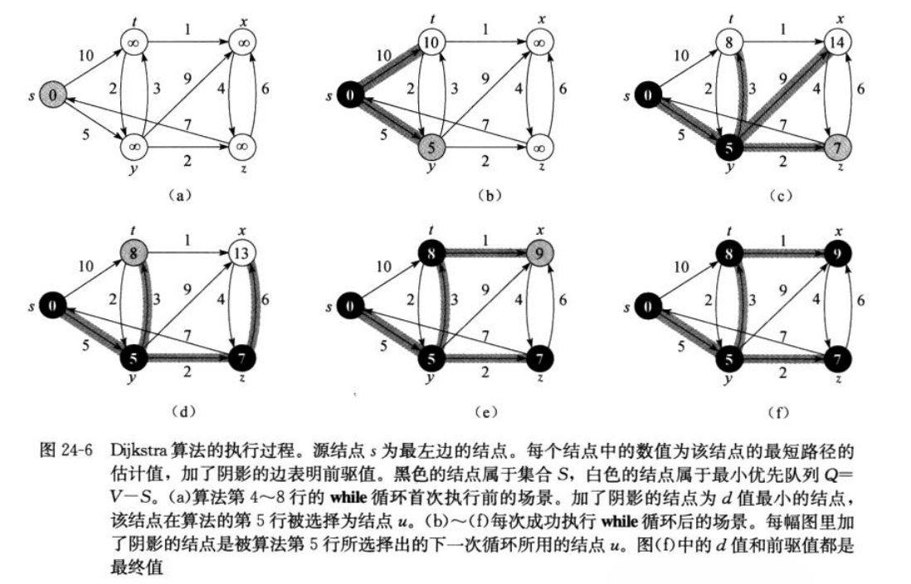
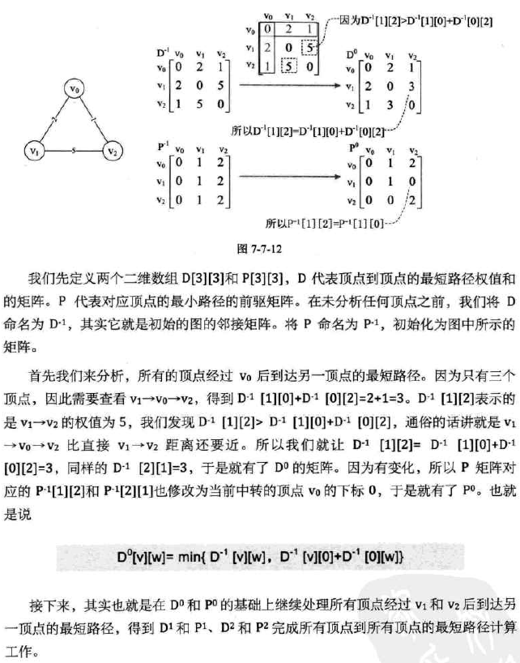

# 图
主要是针对D算法，F算法。

---

- 图的表示：**邻接链表，邻接矩阵**
- BFS：能够正确计算最短路径；
- DFS：图的结构；前驱子图构成森林
```cpp
//对边：邻接链表
typedef struct _ENode{
	int ivex;       //该边所指向的顶点的位置
	int source;		//前节点
	int weight;		//权重
	struct _ENode *next_edge;  //指向节点的下一个边
}ENode, *PENode;
//顶点：链接邻边
typedef struct _VNode{
	char data;         //顶点信息
	enum Color color;//颜色
	int pre;		//前驱结点
	int category;  //是否已遍历
	int d;	//源节点到当前节点的距离
	int f;  //dfs中 d 开始时间，f 结束时间。
	ENode *first_edge; //邻接链表头结点
}
// 邻接表，图。邻接链表中存储的是当前节点相连的点
typedef struct _LGraph
{
	int vexnum;             // 图的顶点的数目
	int edgnum;             // 图的边的数目
	VNode *vexs[SIZE];   //节点数组编号：0~N-1
}LGraph;
```
拓扑排序：有向无环图，在一条水平线展示出来，该水平线上的边都是左指向右。
计算完成时间，先后排序，然后节点连接。

## 最小生成树（边权重最小）
无环子集T，将所有节点连接，边权重最小。这样的图T称为 最小生成树。

### K算法-O(ElogE)
贪心算法，**选择权重最小边加入森林**

---
```cpp
按照边权重排序：
    考察每一个边：
        如果该条边将两棵不同的树连接起来就加入森林完成合并。
```

### Prim算法
[图解Prim算法](https://www.cnblogs.com/alantu2018/p/8464561.html)


---
```cpp
//初始化 图：G,节点：r；其他节点在最小堆当中。（依据节点临边的最小边权重key排序）
Q=G.V 
while Q!=∅：
    u=Q.top();pop();
    for v in r.u: //遍历最小生成树附近的点
        if v in Q and w(u,v)<v.key：//与u相连，在Q中未在子树中的点。且权重最小的节点
            连接
```

## 图-最短路径（变权重最小）

### Dijkstra（迪克斯特拉）算法：带权重单源最短路径问题  (单源，非负)
时间复杂度为O(V^2+E) ; 所有边权重非负。


```cpp
//松弛操作：移动到目标节点前一个节点比较路径和，小则更新
void Relax(LGraph *graph, int front, int behand){
	ENode *edge =graph->vexs[front]->first_edge;
	while (graph->vexs[edge->ivex]!= graph->vexs[behand]){
		edge = edge->next_edge;
	}
	if (graph->vexs[edge->ivex] == graph->vexs[behand]){
		if (graph->vexs[behand]->d > graph->vexs[front]->d + edge->weight){
			graph->vexs[behand]->d = graph->vexs[front]->d + edge->weight;
			graph->vexs[behand]->pre = front;
		}
	}
}
//找到所有节点中d值最小的，然后标记为已遍历
int getMin(LGraph *graph){
	int min_node = 0;
	int min = INT_MAX;
	for (int i = 1; i <= graph->vexnum; i++){
		if (graph->vexs[i]->category != IN_S){
			if (graph->vexs[i]->d < min){
				min = graph->vexs[i]->d;
				min_node = i;
			}
		}
	}
	if (min_node == 0)
		return 0;
	graph->vexs[min_node]->category = IN_S;
	return min_node;
}
//D算法，整体为BFS
void Dijkstra(LGraph *graph, int source){
	InitializeSingleSource(graph, source);
    graph->vexs[source]->category = IN_S;
	ENode *edge = graph->vexs[source]->first_edge;//遍历源节点外一层，对其松弛
	while (edge != NULL){
		Relax(graph, source, edge->ivex);
		edge = edge->next_edge;
	}
    //原则上对每个节点的周围节点都松弛，故对剩余节点抽取n-1次。每一次选择剩余节点里面得分最小的节点，标记后对其松弛。
	for (int i = 0; i < graph->vexnum - 1; i++){
		int u = getMin(graph);//遍历O(N)得到d最小的节点编号
		if (u == 0) return;//无可取则返回
		edge = graph->vexs[u]->first_edge; //遍历u节点相邻的点对其松弛
		while (edge != NULL){
			Relax(graph, u, edge->ivex);
			edge = edge->next_edge;
		}
	}
}
```

### Floyd算法：图中所有节点的最短路径 (全局)
时间复杂度 O(V^3)；所有边权重可负，但环路不可负；
可以用于无向图和有向图中。也可以用于负权的最短路径问题（虽然复杂度会比较高）。Floyd算法的时间复杂度为O（n^3），空间复杂度为O（n^2）。


```cpp
// 弗洛伊德算法实现
//D：用来计算每个相邻点的距离，也就是我们的已知条件；
//P：用来表示中间点k的代数。比如说P中p[i,j]的值就是i与j两点的中间点代数。
void ShortestPath_Floyd(int** p, int** D){
    int v = 0, w = 0, k = 0;
    // 初始化数据
    for (v = 0; v < nVer; ++v){
        for (w = 0; w < nVer; ++w){
            D[v][w] = Edges[v][w];//v-w间的边
            p[v][w] = w;//v-w路径v的下一节点w
        }
    }
    //把K为中间节点
    for (k = 0; k < nVer; ++k){
        for (v = 0; v < nVer; ++v){
            for(w = 0; w < nVer; ++w){
                if (D[v][w] > D[v][k] + D[k][w]){
                    D[v][w] = D[v][k] + D[k][w];
                    p[v][w] = p[v][k];
                }
            }
        }
    }
}

```
#### 最短路径
- D算法：单源、权值不可负、有向/无向（自环）
- F算法：全局、权值可负但环路不可负、有向/无向（自环）


## 图题目

- 1、最少换乘次数 BFS
n个城市，部分城市之间有单向航道，给定起始点，得到各个城市的最少换乘次数

```cpp

typedef struct{
    int id;     //城市的id
    int count;//该城市到其他城市的道路数目
    int des[LEN];//到的其他城市
}City;
City city[LEN];
queue<City>q; //队列
int ans[LEN];  //结果
bool vis[LEN];//记录有没有访问过
int n;
void bfs(int v){
    int num=0;
    vis[v]=1;
    for(int i=0;i<city[v].count;i++){ //将起点v指向的目的地压入队列
        vis[city[v].des[i]]=1;
        q.push(city[city[v].des[i]]);
    }
    while(!q.empty()){   //当队列非空时
        num++;   //代表bfs的深度,到当前城市的换乘次数，BFS层次遍历这一层结果是一样的
        for(int i=0;i<q.size();i++){//该层可到达的目的地
            int tmp=q.front().id;q.pop();
            ans[tmp]=num;//保留到达此地的换乘次数
			//将此地的下一层目的地push到Q
            for(int j=0;j<city[tmp].count;j++){
                if(!vis[city[tmp].des[j]]){
                    vis[city[tmp].des[j]]=1;
                    q.push(city[city[tmp].des[j]]);
                }
            }
        }
    }
}
```

- 2、克隆图 BFS，Map<old,new>
```cpp
Node* cloneGraph(Node* node) {
    unordered_map<Node*, Node*> m;
    queue<Node*> q{{node}};
    Node *clone = new Node(node->val);
    m[node] = clone;
    while (!q.empty()) {
        Node *t = q.front(); q.pop();

		//取当前节点，克隆其邻居(if该邻居还未克隆)
        for (Node *neighbor : t->neighbors) {
            if (!m.count(neighbor)) {
                m[neighbor] = new Node(neighbor->val);       q.push(neighbor);
            }
			//取当前节点克隆后的节点，对其邻居进行补充
            m[t]->neighbors.push_back(m[neighbor]);
        }
    }
    return clone;
}
```

-3、课程表：是否可以完成所有课程学完(在有向图中检测是否有环)
一系列[0,1]学0前必须先学1->0；路径题目，是否能够全部走完
```cpp
bool canFinish(int numCourses, vector<vector<int>>& prerequisites) {
    vector<vector<int>> graph(numCourses, vector<int>());
    vector<int> in(numCourses);
	//统计入度；构造邻接矩阵
    for (auto a : prerequisites) {
        graph[a[1]].push_back(a[0]);
		++in[a[0]];
    }
    queue<int> q;
	//根据入度寻找入口
    for (int i = 0; i < numCourses; ++i) {
        if (in[i] == 0)
            q.push(i);
    }
    while (!q.empty()) {
        int t = q.front(); q.pop();
		res.push_back(t);//保留课程顺序
        for (auto a : graph[t]) {
            --in[a];
            if (in[a] == 0)
                q.push(a);
        }
    }

	//返回是否能够上完
	for (int i = 0; i < numCourses; ++i) {
        if (in[i] != 0)
            return false;
    }
    return true;
	
	//返回可能的上课顺序
	if (res.size() != numCourses) 
        res.clear();
	return res;


}
```


