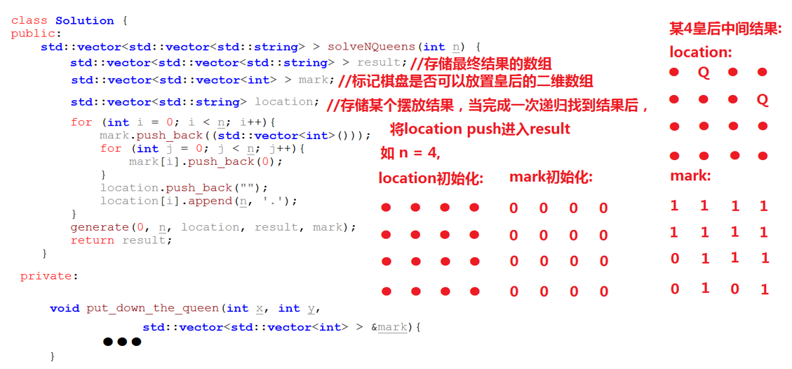
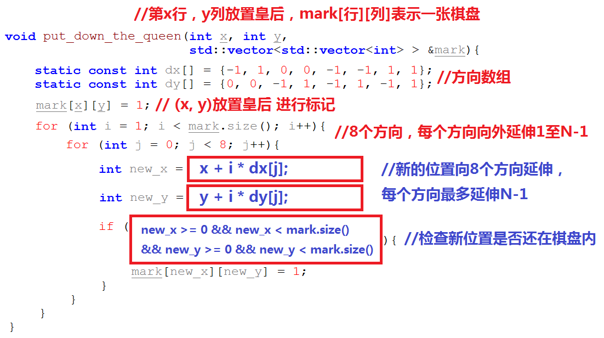

# 搜索回溯
采用DFS：递归+回溯；BFS：队列

<!-- TOC -->

- [搜索回溯](#搜索回溯)
    - [BFS+队列](#bfs队列)
        - [单词接龙](#单词接龙)
        - [朋友圈](#朋友圈)
    - [DFS+递归](#dfs递归)
        - [岛屿数量](#岛屿数量)
    - [回溯](#回溯)
        - [摆放火柴](#摆放火柴)
        - [n括号](#n括号)
        - [n皇后](#n皇后)

<!-- /TOC -->
## BFS+队列
### 单词接龙
```cpp
//BFS
word_set(wordList.begin(),wordList.end())
q{beginWord}
while(!q.empty()){
    word=q.top();q.pop()
    if(word==endWord)
        return res+1;
    for(inti i=0;i< word.size();i++){
        string bak=word;
        //替换26字符，将可能的下一层可替换单词入队列
        for(char ch:a~z){
            bak[i]=ch;
            if(word_set.count(bak) && bak!=word)
                q.push(bak);
                word_set.erase(bak);
        }
    }
    res++;
}
return 0;
```

### 朋友圈
>>通过BFS，将相关的人都标记，标记完作为一个朋友圈，res++;如果不标记会有重复，且一个人必定属于某个朋友圈故用一维标记即可
```cpp
int findCircleNum(vector<vector<int>>& M) {
    int n = M.size(), res = 0;
    vector<bool> visited(n, false);
    queue<int> q;
    for (int i = 0; i < n; ++i) {
        if (visited[i])
            continue;
        q.push(i);
        while(!q.empty()) {
            int t = q.front(); q.pop();
            visited[t] = true;
            for (int j = 0; j < n; ++j) {
                if (!M[t][j] || visited[j])
                    continue;
                q.push(j);
            }
        }
        ++res;
    }
    return res;
}
```

## DFS+递归
### 岛屿数量
```cpp
for(int i=0;i<grid.size();i++){
    for(int j=0;j<grid[0].size();j++){
        if(mark[i][j]==0 && grid[i][j]=='1')
            DFS(mark,grid,i,j);
            count++;
    }
}
void DFS(& mark,& grid,int x,int y){
    mark[x][y]=1;
    static const int dx[]={-1,1,0,0};
    static const int dy[]={0,0,-1,1};
    for(int i=0;i<4;i++){
        int x_=x+dx[i];
        int y_=y+dy[i];
        if(x_<0||x_>=mark.size()||y_<0||y_>=mark[x_].size()){
            continue;
        }
        if(mark[x_][y_]==0 && grid[x_][y_]=='1'){
            DFS(mark,grid,x_,y_);
        }
    }
}
```

## 回溯
### 摆放火柴
```cpp
整体遍历的是火柴，但需要回溯故pos为火柴的下标；火柴需要排序，先放大的；还需要判断火柴和是否为4的倍数
bool helper(vector<int>& nums, vector<int>& sums, int pos, int target)
    如果pos到末尾判断sums数组是否都为target；
    遍历4个边长：
        如果当前边长+当前火柴>target，则继续观察后面的边长；如果<=target，则加上当前火柴；去遍历下一个火柴；
        if(helper(pos+1)):
            return true;
        否则回溯当前边长-当前火柴，有可能当前火柴不够
```

### n括号
```cpp
//括号验证
遍历：
    左则push；右则和top一起pop掉
//n括号可能组合
generate(item,left,right,res){
    左右都0，res入结果；
    左>0：
        generate(item+'(',left-1,right,res)
    右>0：
        generate(item+')',left,right-1,res)
}

```

### n皇后


