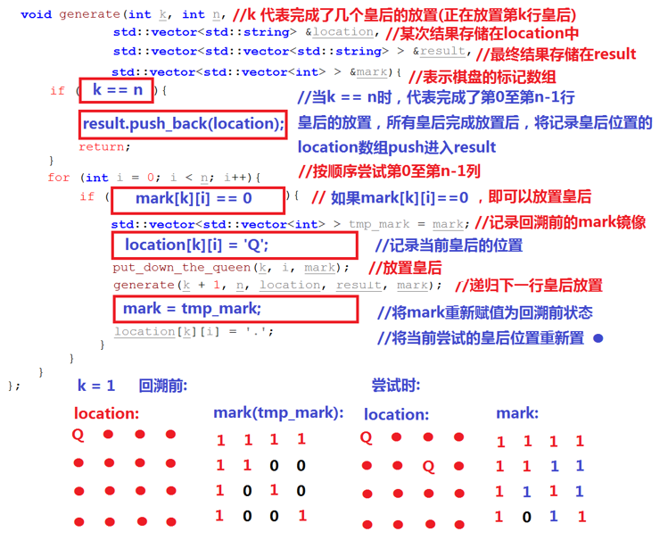
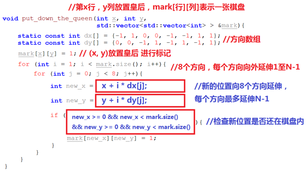

## 
- 摆放火柴
```cpp
整体遍历的是火柴，但需要回溯故pos为火柴的下标；火柴需要排序，先放大的；还需要判断火柴和是否为4的倍数
bool helper(vector<int>& nums, vector<int>& sums, int pos, int target)
    如果pos到末尾判断sums数组是否都为target；
    遍历4个边长：
        如果当前边长+当前火柴>target，则继续观察后面的边长；如果<=target，则加上当前火柴；去遍历下一个火柴；
        if(helper(pos+1)):
            return true;
        否则回溯当前边长-当前火柴，有可能当前火柴不够
```
-- n括号
```cpp
//括号验证
遍历：
    左则push；右则和top一起pop掉
//n括号可能组合
generate(item,left,right,res){
    左右都0，res入结果；
    左>0：
        generate(item+'(',left-1,right,res)
    右>0：
        generate(item+')',left,right-1,res)
}

```
- n皇后


