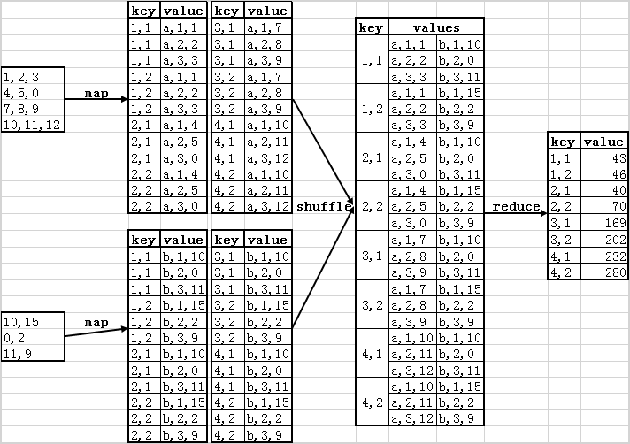
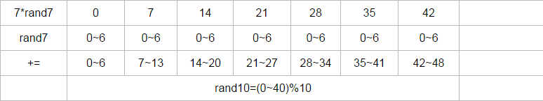

<!-- TOC -->

- [数据结构与算法](#数据结构与算法)
    - [常用STL函数与数据结构](#常用stl函数与数据结构)
    - [复杂数据结构构造器](#复杂数据结构构造器)
        - [Trie树](#trie树)
        - [LRU缓存实现](#lru缓存实现)
        - [快排](#快排)
        - [MR实现矩阵相乘](#mr实现矩阵相乘)
        - [生成随机数](#生成随机数)
        - [计算器](#计算器)
        - [KMP](#kmp)

<!-- /TOC -->

# 数据结构与算法
有的一面会问数据结构与算法的基础：线性表，堆，栈，队列，树，图定义，最短路径算法等等

---

## 常用STL函数与数据结构
```cpp
//字符串
istringstream is(s);
getline(is,t,' ');//迭代返回单词

//字符与数字
val=atoi(s.substr(0, k))
str=to_string(val)

//数据结构
multiset<double> ms(nums.begin(), nums.begin() + k);//维护一个可重复有序集合。

//二分函数
lower_bound(num.begin(),num.end(),num)：//二分查找第一个大于或等于num的数字，找到返回该数字的地址，不存在则返回end。通过返回的地址减去起始地址begin,得到找到数字在数组中的下标。
upper_bound(num.begin(),num.end(),num)：//从数组的begin位置到end-1位置二分查找第一个大于num的数字，

//堆 empty();pop();push();top();size()
priority queue<int,vectot<int>,greater<int>>small_heap;  //构造最小堆
priority queue<int,vectot<int>,less<int>>big_heap;  //构造最大堆
priority_queue<int,vector<int>>p;//默认最大堆。
//插入logK，n个；logk为高度
```

## 复杂数据结构构造器

### Trie树
```cpp
struct TrieNode {
    public:
        TrieNode *child[26];
        bool isWord;
        TrieNode():isWord(false) {
            for (auto &a:child) 
                a=NULL;
        }
};
```

### LRU缓存实现
>>//构造List存储pair<k,v>;//构造Map存储<k,List->pointer>
```cpp
class LRUCache{
public:
    LRUCache(int capacity) {
        cap = capacity;
    }
    int get(int key) {
        auto it = m.find(key);
        if (it == m.end())//没找到
            return -1;
        l.splice(l.begin(), l, it->second);//找到则拼接到l的前端
        return it->second->second;
    }
    //重新放到头部，如果有则删除；如果空间满则移除尾部
    void put(int key, int value) {
        auto it = m.find(key);
        if (it != m.end()) //找到了
            l.erase(it->second);
        l.push_front(make_pair(key, value));
        m[key] = l.begin();
        
        if (m.size() > cap) {
            int k = l.rbegin()->first;
            l.pop_back();
            m.erase(k);
        }
    }
private:
    int cap;
    list<pair<int, int>> l;//可左右端操作
    unordered_map<int, list<pair<int, int>>::iterator> m;
};

```

### 快排
>>传说中的实习面试必考
i为分割节点，左边i+1个数就是最小的i+1个数
```cpp
int[] QuickSort(int nums[], int start, int end){
    if (start < end){
        int i = start;
        int j = last;
        int base = nums[i];
        while (i < j){
            while (i < j &&  nums[j]>=base)
                j--;
            nums[i] = nums[j];
            while (i < j &&  nums[i]<=base)
                i++;
            nums[j] = nums[i];
        }
        nums[i] = base;
        QuickSort(nums, start, i - 1);
        QuickSort(nums, i + 1, last);
    }
    return nums;
}
```

### MR实现矩阵相乘



### 生成随机数

```cpp
while(1){
    x = a*rand_a()+rand_a();
    if x < N{  //N=max(N%b==0,N<-[0,a^2+a])
        return x%b;
```

### 计算器
初始op为+，保存连续的两个运算符op,c：先结算op；然后判断当c是+-时将中间结果累加到res。
```cpp
//25x4x3+20x3
char op = '+';
for(int i=0;i < n;i++){
    char c=s[i];
    //当前数
    if(c>='0' && c<='9'){
        num=num*10+c-'0';
    }
    if (c == '+' || c == '-' || c == '*' || c == '/' || i == n - 1){
        //当前乘除的子结果
        switch(op):{
            case '+': curRes += num; break;
            case '-': curRes -= num; break;
            case '*': curRes *= num; break;
            case '/': curRes /= num; break;
        }
        //子表达式结果累加到res
        if (c == '+' || c == '-' || i == n - 1) {
            res += curRes;
            curRes = 0;
        }
        //保留本次运算符
        op = c;
        num = 0;
    }
return res;
```

### KMP
>>字符串匹配算法
```cpp
void KMP(string ss, string tmp, vector< int > f) {
    int n = ss.size(), m = tmp.size();
    process(temp, f); //预处理得到失配表
    int j = 0; //j表示当前模版串的待匹配位置
    for(int i = 0; i < n; ++i) {
        while(j && ss[i] != tmp[j]) 
            j = f[j]; //不停的转移，直到可以匹配或者走到0
        if(ss[i] == tmp[j])
            j++; //如果相等，模版串中待匹配位置可以移一位了。
        if(j == m)
            cout<< i - m + 1;
    }
}
//计算失配表
void process(string* tmp, vector< int > f) {
    int n = tmp.size();
    f[0] = f[1] = 0; //边界
    for(int i = 1; i < n; ++i) {
        int j = f[i];
        while(j && tmp[i] != tmp[j])
            j = f[j]; //一旦回到1，表明窗口大小为0了，只能回到最初的字符
        f[i + 1] = tmp[i] == tmp[j] ? j + 1: 0;
    }
}
```