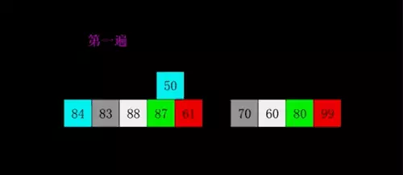

<!-- TOC -->

- [数据结构与算法](#数据结构与算法)
    - [常用STL函数与数据结构](#常用stl函数与数据结构)
    - [好几大排序](#好几大排序)
        - [冒泡排序](#冒泡排序)
        - [选择排序](#选择排序)
        - [插入排序](#插入排序)
        - [归并排序](#归并排序)
        - [快速排序](#快速排序)
        - [希尔排序](#希尔排序)
        - [计数排序](#计数排序)
        - [基数排序](#基数排序)
    - [复杂数据结构构造器](#复杂数据结构构造器)
        - [Trie树](#trie树)
        - [LRU缓存实现](#lru缓存实现)
    - [基本算法题](#基本算法题)
        - [平生不识TwoSum，刷尽力扣也枉然](#平生不识twosum刷尽力扣也枉然)
        - [行列递增数组的查找](#行列递增数组的查找)
        - [移除K个数字](#移除k个数字)
        - [快排-传说中的实习面试必考](#快排-传说中的实习面试必考)
        - [MR实现矩阵相乘](#mr实现矩阵相乘)
        - [生成随机数](#生成随机数)
        - [计算器](#计算器)
        - [KMP](#kmp)
    - [智力题](#智力题)
        - [海量数据topK问题](#海量数据topk问题)
        - [64匹马8赛道，求top4的问题](#64匹马8赛道求top4的问题)
        - [N瓶药log2N个白鼠问题](#n瓶药log2n个白鼠问题)

<!-- /TOC -->

<a id="markdown-数据结构与算法" name="数据结构与算法"></a>
# 数据结构与算法
有的一面会问数据结构与算法的基础：线性表，堆，栈，队列，树，图定义，最短路径算法等等

---


<a id="markdown-常用stl函数与数据结构" name="常用stl函数与数据结构"></a>
## 常用STL函数与数据结构

```cpp
//字符串
istringstream is(s);
getline(is,t,' ');//迭代返回单词

//字符与数字
val=atoi(s.substr(0, k))
str=to_string(val)

//数据结构
multiset<double> ms(nums.begin(), nums.begin() + k);//维护一个可重复有序集合。
//堆 empty();pop();push();top();size()
priority queue<int,vectot<int>,greater<int>>small_heap;  //构造最小堆
priority queue<int,vectot<int>,less<int>>big_heap;  //构造最大堆
priority_queue<int,vector<int>>p;//默认最大堆。
queue<int>q; //队列
dequeue<int>q; //双向队列

//二分函数
lower_bound(num.begin(),num.end(),num)：//二分查找第一个大于或等于num的数字，找到返回该数字的地址，不存在则返回end。通过返回的地址减去起始地址begin,得到找到数字在数组中的下标。
upper_bound(num.begin(),num.end(),num)：//从数组的begin位置到end-1位置二分查找第一个大于num的数字，


```


<a id="markdown-好几大排序" name="好几大排序"></a>
## 好几大排序
[排序算法整理](https://zhuanlan.zhihu.com/p/34894768)


排序算法的稳定性：**保证排序前后两个相等的数的相对顺序不变**，只有**冒泡，插入，归并**是稳定的。

<a id="markdown-冒泡排序" name="冒泡排序"></a>
### 冒泡排序


<a id="markdown-选择排序" name="选择排序"></a>
### 选择排序


<a id="markdown-插入排序" name="插入排序"></a>
### 插入排序


<a id="markdown-归并排序" name="归并排序"></a>
### 归并排序


<a id="markdown-快速排序" name="快速排序"></a>
### 快速排序


<a id="markdown-希尔排序" name="希尔排序"></a>
### 希尔排序


<a id="markdown-计数排序" name="计数排序"></a>
### 计数排序


<a id="markdown-基数排序" name="基数排序"></a>
### 基数排序


<a id="markdown-复杂数据结构构造器" name="复杂数据结构构造器"></a>
## 复杂数据结构构造器

<a id="markdown-trie树" name="trie树"></a>
### Trie树

```cpp
struct TrieNode {
    public:
        TrieNode *child[26];
        bool isWord;
        TrieNode():isWord(false) {
            for (auto &a:child) 
                a=NULL;
        }
};
```

<a id="markdown-lru缓存实现" name="lru缓存实现"></a>
### LRU缓存实现

>>构造List存储pair<k,v>;//构造Map存储<k,List->pointer>
```cpp
class LRUCache{
public:
    LRUCache(int capacity) {
        cap = capacity;
    }
    int get(int key) {
        auto it = m.find(key);
        if (it == m.end())//没找到
            return -1;
        l.splice(l.begin(), l, it->second);//找到则拼接到l的前端
        return it->second->second;
    }
    //重新放到头部，如果有则删除；如果空间满则移除尾部
    void put(int key, int value) {
        auto it = m.find(key);
        if (it != m.end()) //找到了
            l.erase(it->second);
        l.push_front(make_pair(key, value));
        m[key] = l.begin();
        
        if (m.size() > cap) {
            int k = l.rbegin()->first;
            l.pop_back();
            m.erase(k);
        }
    }
private:
    int cap;
    list<pair<int, int>> l;//可左右端操作
    unordered_map<int, list<pair<int, int>>::iterator> m;
};

```

<a id="markdown-基本算法题" name="基本算法题"></a>
## 基本算法题

<a id="markdown-平生不识twosum刷尽力扣也枉然" name="平生不识twosum刷尽力扣也枉然"></a>
### 平生不识TwoSum，刷尽力扣也枉然

```cpp
//{1, 1, 2, 3, 4, 4, 4, 7, 7, 8, 9, 10},8
vector<pair<int, int>> twoSum(vector<int> nums, int target) {
    map<int, int> m;
    vector<pair<int, int>> res;
    for (int i = 0; i < nums.size(); ++i) {
        m[nums[i]]++;
    }
    for (int i = 0; i < nums.size(); ++i) {
        if (m[target - nums[i]] > 0) {
            if (nums[i] == target / 2 && m[nums[i]] == 1)
                continue;
            res.push_back(make_pair(nums[i], target - nums[i]));
            m[target - nums[i]]--;
            m[nums[i]]--;
        }
    }
    return res;
}
```

<a id="markdown-行列递增数组的查找" name="行列递增数组的查找"></a>
### 行列递增数组的查找
```cpp
bool searchMatrix(vector<vector<int>>& nums, int target){
    if(nums.size()==0 || nums[0].size()==0)
        return false;
    //列二分，核心判断在哪一行通过mid和mid+1
    int l = 0, r = nums.size();
    int j, mid=0;
    while (l < r) {
        mid = (l + r) / 2;
        if (nums[mid][0] == target)
            return true;
        else if (nums[mid][0] > target) {
            r--;
        } else {
            if (mid+1 < nums.size() && nums[mid + 1][0] > target)
                break;
            l++;
        }
    }
    j = mid;
    l = 0;
    r = nums[0].size();
    //对j行再进行二分
    while (l < r) {
        mid = (l + r) / 2;
        if (nums[j][mid] == target)
            return true;
        else if (nums[j][mid] > target) {
            r--;
        } else {
            l++;
        }
    }
    return false;
}
```

<a id="markdown-移除k个数字" name="移除k个数字"></a>
### 移除K个数字
```cpp
string removeKdigits(string num, int k) {
    string res;
    int n = num.size();
    for (char c : num) {
        while (k && res.size() && res.back() > c) {
            res.pop_back();
            --k;
        }
        //前导0
        if (res.size() || c != '0')
            res.push_back(c);
    }
    while (res.size() && k--)
        res.pop_back();
    return res.empty() ? "0" : res;
}

```

<a id="markdown-快排-传说中的实习面试必考" name="快排-传说中的实习面试必考"></a>
### 快排-传说中的实习面试必考

```cpp
int partition(vector<int> nums, int start, int end){
    int key = nums[start];
    while (start < end) {
        while (start < end && nums[end] >= key)
            end --;
        nums[start] = nums[end];
        while (start < end && nums[start] <= key)
            start ++;
        nums[end] = nums[start];
        nums[start] = key;
    }
    return start;
}
void quick_sort(vector<int>nums, int start, int end){
    if(start== end) return;
    int k = partition(nums, start, end);
    quick_sort(nums, start, index-1);
    quick_sort(nums, index+1, end);
}
```


<a id="markdown-mr实现矩阵相乘" name="mr实现矩阵相乘"></a>
### MR实现矩阵相乘


<a id="markdown-生成随机数" name="生成随机数"></a>
### 生成随机数


```cpp
while(1){
    x = a*rand_a()+rand_a();
    if x < N{  //N=max(N%b==0,N<-[0,a^2+a])
        return x%b;
    }
}
```

<a id="markdown-计算器" name="计算器"></a>
### 计算器

初始op为+，保存连续的两个运算符op,c：先结算op；然后判断当c是+-时将中间结果累加到res。
```cpp
//25x4x3+20x3
char op = '+';
for(int i=0;i < n;i++){
    char c=s[i];
    //当前数
    if(c>='0' && c<='9'){
        num=num*10+c-'0';
    }
    if (c == '+' || c == '-' || c == '*' || c == '/' || i == n - 1){
        //当前乘除的子结果
        switch(op):{
            case '+': curRes += num; break;
            case '-': curRes -= num; break;
            case '*': curRes *= num; break;
            case '/': curRes /= num; break;
        }
        //子表达式结果累加到res
        if (c == '+' || c == '-' || i == n - 1) {
            res += curRes;
            curRes = 0;
        }
        //保留本次运算符
        op = c;
        num = 0;
    }
return res;
```

<a id="markdown-kmp" name="kmp"></a>
### KMP

>>字符串匹配算法
```cpp
void KMP(string ss, string tmp, vector< int > f) {
    int n = ss.size(), m = tmp.size();
    process(temp, f); //预处理得到失配表
    int j = 0; //j表示当前模版串的待匹配位置
    for(int i = 0; i < n; ++i) {
        while(j && ss[i] != tmp[j]) 
            j = f[j]; //不停的转移，直到可以匹配或者走到0
        if(ss[i] == tmp[j])
            j++; //如果相等，模版串中待匹配位置可以移一位了。
        if(j == m)
            cout<< i - m + 1;
    }
}
//计算失配表
void process(string* tmp, vector< int > f) {
    int n = tmp.size();
    f[0] = f[1] = 0; //边界
    for(int i = 1; i < n; ++i) {
        int j = f[i];
        while(j && tmp[i] != tmp[j])
            j = f[j]; //一旦回到1，表明窗口大小为0了，只能回到最初的字符
        f[i + 1] = tmp[i] == tmp[j] ? j + 1: 0;
    }
}
```

<a id="markdown-智力题" name="智力题"></a>
## 智力题
<a id="markdown-海量数据topk问题" name="海量数据topk问题"></a>
### 海量数据topK问题

- Top K问题：分治+Trie树/Hash_map+小顶堆。采用Hash(x)%M将原文件分割成小文件，如果小文件太大则继续Hash分割，直至可以放入内存。
- 重复问题：BitMap位图 或 Bloom Filter布隆过滤器 或 Hash_set集合。每个元素对应一个bit处理。
- 排序问题：外排序 或 BitMap位图。分割文件+文件内排序+文件之间归并。


<a id="markdown-64匹马8赛道求top4的问题" name="64匹马8赛道求top4的问题"></a>
### 64匹马8赛道，求top4的问题
1. 分8场全部赛一遍，得到各分组排名

2. 各组头名赛1场，得到**top1**

3. 分析仅有9个中会出现**top2,3,4**

4. 故取8个赛一场,得到前三名1=**top2**,2=**top3**,3；
5. 第三名和剩下那一只赛一次得到**top4**

<a id="markdown-n瓶药log2n个白鼠问题" name="n瓶药log2n个白鼠问题"></a>
### N瓶药log2N个白鼠问题
问题描述：有1000个一模一样的瓶子，其中有999瓶是普通的水，有1瓶是毒药。任何喝下毒药的生命都会在一星期之后死亡。现在你只有10只小白鼠和1个星期的时间，如何检验出哪个瓶子有毒药？

---

根据2^10=1024，所以10个老鼠可以确定1000个瓶子具体哪个瓶子有毒。具体实现跟3个老鼠确定8个瓶子原理一样。


