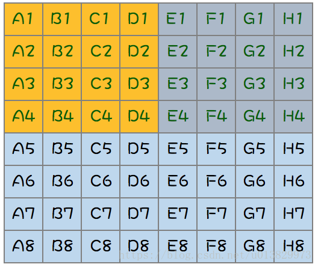
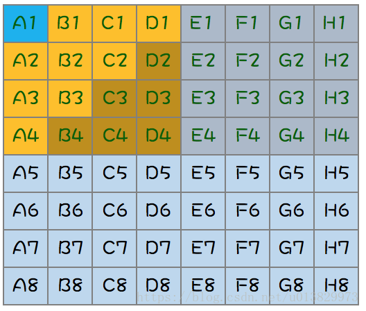

## 海量数据topK问题

- Top K问题：分治+Trie树/Hash_map+小顶堆。采用Hash(x)%M将原文件分割成小文件，如果小文件太大则继续Hash分割，直至可以放入内存。
- 重复问题：BitMap位图 或 Bloom Filter布隆过滤器 或 Hash_set集合。每个元素对应一个bit处理。
- 排序问题：外排序 或 BitMap位图。分割文件+文件内排序+文件之间归并。

## 64匹马8赛道，求top4的问题
1. 分8场全部赛一遍，得到各分组排名

2. 各组头名赛1场，得到**top1**

3. 分析仅有9个中会出现**top2,3,4**

4. 故取8个赛一场,得到前三名1=**top2**,2=**top3**,3；
5. 第三名和剩下那一只赛一次得到**top4**

