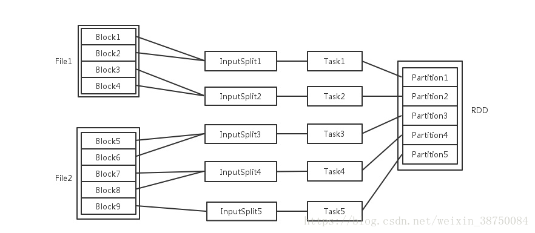

<!-- TOC -->

1. [大数据要点整理](#大数据要点整理)
   1. [Hadoop](#hadoop)
      1. [SecondaryNamenode](#secondarynamenode)
      2. [HDFS读写流程](#hdfs读写流程)
      3. [提交job应用流程](#提交job应用流程)
      4. [MapReduce](#mapreduce)
      5. [详解shuffle过程](#详解shuffle过程)
         1. [tips](#tips)
      6. [Partition](#partition)
      7. [Combiner](#combiner)
      8. [二次排序](#二次排序)
   2. [HBase](#hbase)
   3. [Hive](#hive)
      1. [Hive与SQL](#hive与sql)
   4. [Kafka](#kafka)
   5. [Flink](#flink)
      1. [流处理与批处理](#流处理与批处理)
         1. [Flink容错性高，快照恢复](#flink容错性高快照恢复)
   6. [Scala基础](#scala基础)
   7. [Spark](#spark)
      1. [Spark job资源分配](#spark-job资源分配)

<!-- /TOC -->


<a id="markdown-大数据要点整理" name="大数据要点整理"></a>
# 大数据要点整理

<a id="markdown-hadoop" name="hadoop"></a>
## Hadoop
map->buff环形缓存区->溢出后shuffle->

---
<a id="markdown-secondarynamenode" name="secondarynamenode"></a>
### SecondaryNamenode

SecondaryNameNode的作用就是周期性（周期长短也可配）保存NameNode的元数据。以便在namenode失效时能从SecondaryNameNode恢复出namenode上的元数据。

namenode的元数据中包括文件镜像数据FSImage和编辑日志EditLog。FSImage相当于HDFS的检查点，namenode启动时候会读取FSImage的内容到内存，并将其与EditLog日志中的所有修改信息合并生成新的FSImage；在namenode运行过程中，所有关于HDFS的修改都将写入EditLog。这样，如果namenode失效，可以通过SecondaryNameNode中保存的FSImage和EditLog数据恢复出namenode最近的状态。

<a id="markdown-hdfs读写流程" name="hdfs读写流程"></a>
### HDFS读写流程

1. 向HDFS写数据

2. 从HDFS读数据


<a id="markdown-提交job应用流程" name="提交job应用流程"></a>
### 提交job应用流程


<a id="markdown-mapreduce" name="mapreduce"></a>
### MapReduce

从文件中获取block

- 本文件内若干个Block合并成一个输入分片split；不能跨越文件；
- 一个split对应一个Task；
- 一个Task执行结果对应RDD的partition**增大分区数，增大task数，增大并行度**
- 一个Executor数目包含多个core；


map task读取文件写入环形缓冲区（100M），一次溢出后按照key进行hash分区，多次溢出的文件按照分区合并(归并排序)；对多个map task的相同分区内的key进行归并排序，然后传给reduce task。

<a id="markdown-详解shuffle过程" name="详解shuffle过程"></a>
### 详解shuffle过程


上面的流程是整个mapreduce最全工作流程，但是shuffle过程只是从第7步开始到第16步结束，具体shuffle过程详解，如下：

1. maptask收集我们的map()方法输出的kv对，放到内存缓冲区中
2. 从内存缓冲区不断溢出本地磁盘文件，可能会溢出多个文件
3. 多个溢出文件会被合并成大的溢出文件
4. 在溢出过程中，及合并的过程中，都要调用partitoner进行分组和针对key进行排序
5. reducetask根据自己的分区号，去各个maptask机器上取相应的结果分区数据
6. reducetask会取到同一个分区的来自不同maptask的结果文件，reducetask会将这些文件再进行合并（归并排序）
7. 合并成大文件后，shuffle的过程也就结束了，后面进入reducetask的逻辑运算过程（从文件中取出一个一个的键值对group，调用用户自定义的reduce()方法）

<a id="markdown-tips" name="tips"></a>
#### tips
- Shuffle中的缓冲区大小会影响到mapreduce程序的执行效率，原则上说，缓冲区越大，磁盘io的次数越少，执行速度就越快。
- 缓冲区的大小可以通过参数调整，参数：io.sort.mb  默认100M


<a id="markdown-partition" name="partition"></a>
### Partition

map端输出(k,v)对key取hash值实现分区负载均衡算法

<a id="markdown-combiner" name="combiner"></a>
### Combiner

每一个map都可能会产生大量的本地输出，Combiner的作用就是对**本地的map端的输出先做一次合并**key下value以list形式存储，**大大减少在map和reduce节点之间的数据传输量，以提高网络IO性能**是MapReduce的一种优化手段之一。就在part下对相同的key提前合并一下
- combiner是MR程序中Mapper和Reducer之外的一种组件
- combiner组件的父类就是Reducer
- combiner和reducer的区别在于运行的位置：Combiner是在每一个maptask所在的节点运行，Reducer是接收全局所有Mapper的输出结果；
- combiner的意义就是对每一个maptask的输出进行局部汇总，以减小网络传输量
- combiner能够应用的前提是不能影响最终的业务逻辑，而且，combiner的输出kv应该跟reducer的输入kv类型要对应起来

<a id="markdown-二次排序" name="二次排序"></a>
### 二次排序

如何做到在Reduce阶段，先对Key排序，再对Value排序
该问题通常称为”二次排序“，最常用的方法是将Value放到Key中，实现一个组合Key，然后自定义Key排序规则（为Key实现一个WritableComparable）

<a id="markdown-hbase" name="hbase"></a>
## HBase

- 行键：是hbase表自带的，每个行键对应一条数据。
- 列族：是创建表时指定的，为列的集合，每个列族作为一个文件单独存储，存储的数据都是字节数组，其中数据可以有很多，通过时间戳来区分。
- 物理模型：整个hbase表会拆分成多个region，每个region记录着行键的起始点保存在不同的节点上，查询时就是对各个节点的并行查询，当region很大时使用.META表存储各个region的起始点，-ROOT又可以存储.META的起始点。
1. Rowkey的设计原则：各个列族数据平衡，长度原则、相邻原则，创建表的时候设置表放入regionserver缓存中，避免自动增长和时间，使用字节数组代替string，最大长度64kb，最好16字节以内，按天分表，两个字节散列，四个字节存储时分毫秒。
2. 列族的设计原则：尽可能少(按照列族进行存储，按照region进行读取，不必要的io操作)，经常和不经常使用的两类数据放入不同列族中，列族名字尽可能短


<a id="markdown-hive" name="hive"></a>
## Hive

```sql
#以某字符连接字段
concat_ws：SELECT CONCAT_WS('_',id,name) AS con_ws FROM info;
#对字段A分组，队字段B降序且取字段B的top3
row_number：select id,age,name,sex from
(select id,age,name,sex,row_number() over(partition by sex order by age desc) as rownumber from rownumber) temp where rownumber<3 
#条件真值与假值
case..when：case tb1.os when 'android' then 'android' when 'ios' then 'iPhone' else 'PC' end as os
##[{"name":"王二狗","sex":"男","age":"25"},{"name":"李狗嗨","sex":"男","age":"47"}]
get_json_object：
1.SELECT get_json_object(xjson,"$.[0]") FROM person;
2.SELECT get_json_object(xjson,"$.[0].age") FROM person;
```

<a id="markdown-hive与sql" name="hive与sql"></a>
### Hive与SQL

- 数据存储位置不同：hive是把数据存储在hdfs上，mysql数据是存储在自己的系统中
- 数据格式：hive数据格式用户可以自定义，mysql有自己的系统定义格式
- 数据更新：hive不支持数据更新，只可以读，不可以写，而sql支持数据更新
- 索引：hive没有索引，因此查询数据的时候是通过mapreduce很暴力的把数据都查询一遍，也造成了hive查询数据速度很慢的原因，而mysql有索引；
- 延迟性：hive延迟性高，原因就是上边一点所说的，而mysql延迟性低；
- 数据规模：hive存储的数据量超级大，而mysql只是存储一些少量的业务数据；
- 底层执行原理：hive底层是用的mapreduce，而mysql是excutor执行器

<a id="markdown-kafka" name="kafka"></a>
## Kafka

消息是kafka主要处理的对象，在某个主题之下，生产者向主题发布新消息，消费者从主题订阅新消息。
异步处理、应用解耦、流量缓冲、日志采集
- 消息队列实现订单系统与库存系统的解耦，到应用层的解耦，防止短时间压垮应用；
- 负责日志数据接收存储与转发

<a id="markdown-flink" name="flink"></a>
## Flink
<a id="markdown-流处理与批处理" name="流处理与批处理"></a>
### 流处理与批处理

1. 流处理系统：一条数据被处理完成后，序列化到缓存中，通过网络传输到下一个节点，由下一个节点继续处理。
2. 批处理系统：一条数据被处理完成后，序列化到缓存中，并不会立刻通过网络传输到下一个节点，当缓存写满，就持久化到本地硬盘上，当所有数据都被处理完成后，才数据通过网络传输到下一个节点。

- 数据传输的两个极端：流处理系统对低延迟；批处理系统对高吞吐量。
- **Flink是两个极端的折中，以固定缓存块为单位传输，且缓存块超时值是可调的**。如果缓存块为0，则是低延迟的流处理系统；如果缓存块的超时值为无限大，则是高吞吐量的批处理系统。

<a id="markdown-flink容错性高快照恢复" name="flink容错性高快照恢复"></a>
#### Flink容错性高，快照恢复

Flink基于分布式快照与可部分重发的数据源实现了容错。用户可自定义对整个Job进行快照的时间间隔，当任务失败时，Flink会将整个Job恢复到最近一次快照，并从数据源重发快照之后的数据。


<a id="markdown-scala基础" name="scala基础"></a>
## Scala基础

- case class：自动生成常用方法(equals&hashCode,toString,copy)；自动生成伴生对象；实现了 apply 方法让你不需要通过 new 来创建类实例
- 宽依赖，窄依赖：窄依赖：map和filter，一个父RDD对应一个子RDD；宽依赖：一个父RDD对应非全部的子RDD；
- Transformation与Action：Transformation 操作是延迟计算的，也就是说从一个RDD 转换生成另一个 RDD 的转换操作不是马上执行，需要等到有 Action 操作的时候才会真正触发运算（map, filter）；Action是count之类的算子出发计算；
- 存在shuffle的spark算子：distinct、groupByKey，reduceByKey、repartition，coalesce、interection，join；


<a id="markdown-spark" name="spark"></a>
## Spark
<a id="markdown-spark-job资源分配" name="spark-job资源分配"></a>
### Spark job资源分配

|config|num|annotation|
|--------|--------|--------|
|driver-memory	|4g	|driver使用的内存，不可超过单机的 core 总数。
|num-executors	|2 |创建多少个 executor。
|executor-memory	|2g	|各个 executor使用的最大内存，不可超过单机的最大可使用内存。
|executor-cores	|2	|各个 executor 使用的并发线程数目，也即每个 executor 最大可并发执行的 Task 数目。

- 数据倾斜：某个key下value过多，reduce_task处理任务过重导致运行特别慢。shuffle出现在期间。造成后果：有得任务执行完毕，某个任务执行很慢而且可能出现OOM错误；一般增大执行器与核数，并行数，自定义partition

- 尽量减少spark任务的空间占用，同时加速spark任务运行速度
