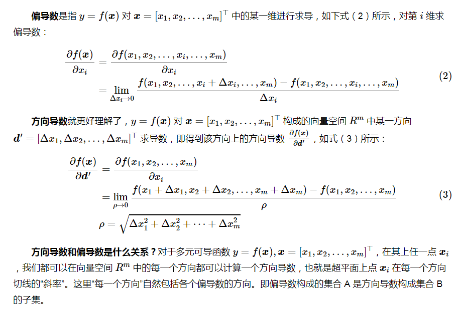

<!-- TOC -->

- [数学基础](#数学基础)
  - [一、导数、偏导数与方向导数](#一导数偏导数与方向导数)
  - [二、概率论](#二概率论)
    - [1、极大似然与概率](#1极大似然与概率)
    - [2、概率分布](#2概率分布)
    - [3、条件概率与链式法则](#3条件概率与链式法则)
      - [拉普拉斯平滑](#拉普拉斯平滑)
    - [4、置信度与置信区间](#4置信度与置信区间)
    - [5、各种熵](#5各种熵)
  - [三、矩阵论](#三矩阵论)
    - [1、向量与矩阵求导](#1向量与矩阵求导)
    - [2、矩阵分解](#2矩阵分解)
      - [2.1 矩阵分解为特征值与特征向量](#21-矩阵分解为特征值与特征向量)
      - [2.2 矩阵分解为奇异值与奇异向量SVD](#22-矩阵分解为奇异值与奇异向量svd)

<!-- /TOC -->

# 数学基础

## 一、导数、偏导数与方向导数

首先明确，导数是一个值，代表切线的斜率，而梯度是一个向量。**最大方向导数的方向就是梯度代表的方向。**
梯度是$f(\bm x)$对各个自变量$\bm x = [x_1, x_2, ..., x_m]^\top$每一维分别求偏导数得到的向量。
从式（5）和（6）中我们也可以知道，当$\bm d = \frac{\nabla f(\bm x)}{\|\nabla f(\bm x)\|}$方向导数最大。 **最大方向导数的方向就是梯度，最大的方向导数就是梯度的欧几里德范数。**

## 二、概率论

### 1、极大似然与概率
- 1> 多个时间概率相乘得到似然表达式，值的大小意味着这组样本值都发生的可能性的大小；
- 2> 对似然表达式求导，必要时进行预处理，比如取对数（逻辑回归需要），令其导数为0，得到似然方程。
- 3> 求解似然方程，得到的参数解即为极大似然估计的解。
>>何为极大似然：“模型已定，参数未知”。通过若干次试验，观察其结果，反推得到某个参数值能够使样本出现的概率为最大，则称为极大似然估计。**利用已知的样本结果，反推最大概率导致这样结果的参数值。**

### 2、概率分布

### 3、条件概率与链式法则
1. 协方差矩阵
$$cov(X,Y)= E\{(X_i-E(X))(Y_i-E(Y)\},i=1,2,……n;j=i,2,……n$$
2. 全概率公式
$$P(A_1A_2...A_{n-1}A_n)=P(A_1)P(A_2|A_1)P(A_3|A_1A_2)...P(A_n|A_1A_2...A_{n-1})$$
$$P(X=x)=\sum_{k=1}^{K}P(X=x|Y=c_k)P(Y=c_k)$$
3. 朴素贝叶斯=贝叶斯公式+条件独立性假设
   1. 贝叶斯公式
   $$y=\argmax_{c_k}\frac{P(Y=c_k)P(X=x|Y=c_k)}{\displaystyle\sum_{k}^KP(Y=c_k)P(X=x|Y=c_k)}$$
   1. 条件独立性假设
   $$P(X=x|Y=c_k)=\prod_{j=1}^nP(X_j=x_j|Y=c_k)P(Y=c_k)$$

>>计算后验概率分布，将后验概率最大的x的类别作为输出，使用贝叶斯定理计算最大后验概率。另：贝叶斯公式=条件概率公式+全概率公式。

#### 拉普拉斯平滑
 如果$P(x_i|y=c_k)$中的某一项为0，则其联合概率的乘积也为0.如果是k类分母+k，分子+1；分母加k的原因是使之满足全概率公式。

### 4、置信度与置信区间

置信度：95%，置信区间(u-a,u+a)样本数目不变的情况下，做100次试验，有95个置信区间包含了总体真值(虚线)。

样本均值为整体均值的一个点估计。**置信水平95%表示，有100个样本，每个样本会计算出一个置信区间。100个置信区间有95个包含了总体平均值。也就是包含总体平均值的概率为95%。样本估计总体--核心思想**

### 5、各种熵
- 信息熵：
  $$H(D)=-\sum_{y=k}^{K}p_k·log(p_k)$$

- 联合熵：
  $$H(X,Y)=-\sum_{x,y}p(x,y)\log p(x,y)$$

- 条件熵：条件熵=联合熵-熵
  $$H(Y|X)=H(X,Y)-H(X)$$
  $$H(D|f)=-\sum_{v\epsilon V_f}\frac{|D_v|}{|D|}H(D_v)$$
- 信息增益：
  $$Gain(D,f)=H(D)-H(D|f)$$
- 交叉熵：
$$H(p,q)=-\sum_x p(x)\log q(x)$$
- KL散度（相对熵）=交叉熵-熵
$$D_{KL}(p||q)=H(p,q)-H(p)$$
>>p对q的相对熵,q拟合p的分布情况
$$D_{KL}(p||q)=\sum_{x}p(x)\log \frac{p(x)}{q(x)}=-\sum_x p(x)\log q(x)-(-\sum_x p(x)\log p(x))$$
相对熵可以用来衡量两个概率分布之间的差异，上面公式的意义就是求 p 与 q 之间的对数差在 p 上的期望值。

## 三、矩阵论

### 1、向量与矩阵求导
- 包含元素x的求导就是元素x对矩阵的各元素a求导,或者矩阵各元素a对元素x的求导。
- 向量对向量求导
  1. 行向量m对列向量n：行的每一个元素对列向量求导，导数矩阵：n*m;
  2. 列向量m对行向量n：列的每一个元素对行向量求导，导数矩阵：m*n;
  3. 行向量m对行向量n：一行m*n列
  4. 列向量m对列向量n：一列m*n行

- 矩阵对向量求导
  1. 矩阵看做列向量，对行向量求导：**矩阵**对各个元素求导，横向拼接
  2. 矩阵看做列向量，对列向量求导：**各个元素**对列向量求导，整体拼接

- 向量对矩阵求导
  1. 行向量对矩阵求导：行向量对矩阵的**各个元素**求导，然后拼接
  2. 列向量对矩阵求导：列向量的**各个元素**对矩阵求导，然后拼接

- 矩阵Y对矩阵X求导
  1. Y看做列向量，X看做行向量：Y的列向量对X的行向量逐一求导

### 2、矩阵分解

#### 2.1 矩阵分解为特征值与特征向量
$$Av=\lambda v$$
$V=[v_1,v_2,v_3,,,,v_n]$,$\Lambda=[\lambda_1,\lambda_2,\lambda_3,,,]$则有
>>$\lambda$降序排列
$$A=V * diag(\lambda)*V^{-1}$$
>>正定矩阵的转置就是正定矩阵的逆
$$A=Q \Lambda Q^{T}$$
Q是正交矩阵，将A看作沿方向$v^i$延展$\lambda ^i$倍的空间。所有的特征值都是正数则正定，非负数半正定。

#### 2.2 矩阵分解为奇异值与奇异向量SVD
$$A_{m,n}=U_{m,m}D_{m,n}V^T_{n,n}$$
U,V正交矩阵，D对角矩阵，对角线元素为为奇异值，U,V列向量为奇异向量
U是$AA^T$的特征向量；V是$A^TA$的特征向量。$AA^T$特征值的平方根就是D的非0奇异值

