<!-- TOC -->

- [树模型总结](#树模型总结)
    - [一、决策树ID3,C4.5,CART树](#一决策树id3c45cart树)
        - [ID3算法——使用信息增益度量纯度](#id3算法使用信息增益度量纯度)
        - [C4.5算法——使用信息增益率度量纯度](#c45算法使用信息增益率度量纯度)
        - [CART树——使用Gini系数度量纯度](#cart树使用gini系数度量纯度)
            - [CART树，ID3，C4.5对比](#cart树id3c45对比)
    - [二、集成学习](#二集成学习)
        - [1、Random Forest](#1random-forest)
        - [2、GBDT](#2gbdt)
            - [2.1 GBDT多分类以及训练过程](#21-gbdt多分类以及训练过程)
            - [2.2 求解树结构复杂度：](#22-求解树结构复杂度)
        - [4、特征离散化优点](#4特征离散化优点)
        - [5、XGBoost](#5xgboost)
            - [5.1 GBDT VS XGB](#51-gbdt-vs-xgb)
    - [三、FM算法](#三fm算法)
        - [FM的计算](#fm的计算)
        - [计算过程](#计算过程)
    - [四、GBDT+FM](#四gbdtfm)
        - [稀疏特征进FM](#稀疏特征进fm)
        - [连续特征进GBDT](#连续特征进gbdt)
        - [DNN的应用](#dnn的应用)
        - [GBDT+FM为什么不是RF+FM](#gbdtfm为什么不是rffm)

<!-- /TOC -->

# 树模型总结
## 一、决策树ID3,C4.5,CART树
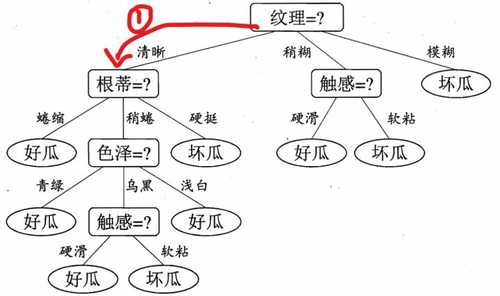
特征枚举：根据规则选择特征
划分节点：根据特征进一步分裂叶子节点
**根据样本训练出GBDT树，对于每个叶子节点，回溯到根节点都可以得到一组组合特征，所以用叶子节点的标号可以代表一个新的组合特征**

### ID3算法——使用信息增益度量纯度
D为样本集合；$D_v$是特征f取v时的样本集。Gain信息增益=信息熵-条件熵
- 信息熵：
  $$H(D)=-\sum_{y=k}^{K}p_k·log(p_k)$$
- 条件熵：
  $$H(D|f)=-\sum_{v\epsilon V_f}\frac{|D_v|}{|D|}H(D_v)$$
- 信息增益：
  $$Gain(D,f)=H(D)-H(D|f)$$
- 缺点：**信息增益准则倾向于选取多值特征！**假如把“编号”也作为一个候选划分属性，因为每一个样本的编号都是不同的（由于编号独特唯一，条件熵为0，每一个结点中只有一类，纯度非常高），也就是说，来了一个预测样本，你只要告诉我编号，其它特征就没有用了，这样生成的决策树显然不具有泛化能力。

### C4.5算法——使用信息增益率度量纯度
信息增益比：
$$Gain\_ratio(D,f)=\frac{Gain(D,f)}{IV(f)}$$
$$IV(f)=-\sum_{y=k}^{K}p_{k,f}·log(p_{k,f})$$
IV(f)表明：某属性分成的K类别数越大，IV(f)就越大；是对多值属性的罚项，描述该特征下类别的离散程度。C4.5算法不直接选择增益率最大的候选划分属性，候选划分属性中找出信息增益高于平均水平的属性（这样保证了大部分好的的特征），再从中选择增益率最高的（又保证了不会出现编号特征这种极端的情况）
- 优点
  1. 可处理连续特征，排序取中间值。


### CART树——使用Gini系数度量纯度
- 总体样本的Gini系数：
  $$Gini(D)=1-\sum_{y=k}^{K}(\frac{D_k}{D})^2$$
- 特征f下的Gini系数
  $$Gini(D|f)=1-\sum_{v\epsilon V_f}\frac{D_v}{D}Gini(D_v)$$
**无论是回归还是分类问题，无论特征是离散的还是连续的，无论特征取值有多个还是两个，CART树内部节点只能根据属性值进行二分**
- 作为回归树：使用最小化MSE来选择特征并进行划分。遍历特征以及取值尝试划分，每一个叶子节点给出的预测值，是该叶子节点中所有样本的均值，计算最小平方误差。回归树生成使用平方误差最小化准则。
- 作为分类树：使用Gini指数最小化准则来选择特征并进行划分。Gini指数表示集合的不确定性，或者是不纯度。基尼指数越大，集合不确定性越高，不纯度也越大。这一点和熵类似。另一种理解基尼指数的思路是，基尼指数是为了最小化误分类的概率。

#### CART树，ID3，C4.5对比
|算法|树|准则|多分类|回归|特征|缺失值|特点|
|--------|--------|--------|--------|--------|--------|--------|--------|
|ID3|多叉树|信息增益|仅二分类|不能|仅离散|敏感|倾向多值特征	
|C4.5|多叉树|信息增益比|仅二分类|不能|离散/连续|可处理|偏向少值特征。实际信息增益+信息增益比	
|CART|仅二叉树|Gini系数|多分类|能|离散/连续|可处理|不需对数运算，更偏向于连续属性	

## 二、集成学习
集成学习——bagging与boosting
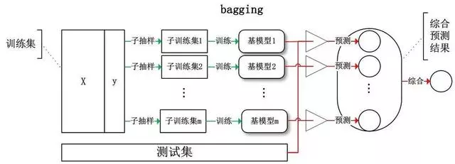
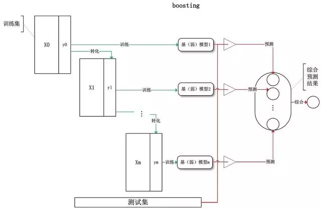

|集成学习|基学习器|依赖关系|串/并行|复杂度|关注点|应用|预测结果|数据使用|
|--------|--------|--------|--------|--------|--------|--------|--------|--------|
bagging|强|弱|并行|基学习器同阶|降方差|可回归，可分类|投票/平均|有放回抽取	
boosting|弱|强|串行|基学习器叠加|降偏差|可回归，可分类|累加/阈值|原数据样本权重会改变	

### 1、Random Forest
多棵决策树，随机样本，随即特征进行划分。
分类：投票；回归：简单平均。
样本随机：63.2%（1-1/e）数据会被选区，**36.8%(1/e)未被用到称为OOB样本，包外估计**。
特征随机：从该节点特征集随机抽取K个，然后选择最优属性。
容易做成并行化方法

### 2、GBDT
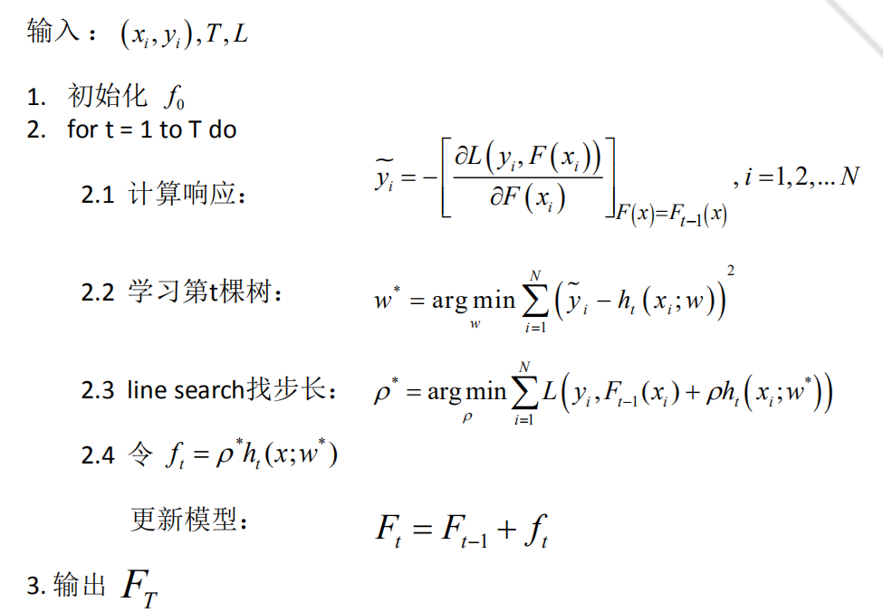
初始化第一棵树；计算损失对前面k-1棵树的负梯度；训练拟合得到第k棵树；有最小化损失获得步长η；将新的树添加到模型Fk。
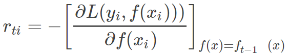
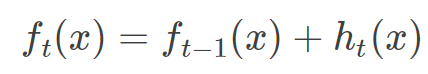

- 函数空间的梯度下降，函数拟合的是负梯度；最终函数等于每次迭代的增量的累加和。
- 参数空间的梯度下降，参数更新方向为负梯度方向；最终参数等于每次迭代的增量累加和。
新的一棵树拟合的是模型的整体损失对前面k-1棵树的负梯度。


#### 2.1 GBDT多分类以及训练过程
```cpp
X=[];label=[0,1,0]
(X,0) -> t1;得到预测值f1(X)
(X,1) -> t2;得到预测值f2(X)
(X,0) -> t3;得到预测值f3(X)
对f1(x),f2(x),f3(x)进行softmax产生概率。
得到残差：
类别1：y11(x)=0−p1(x);
类别2：y22(x)=1−p2(x);
类别3：y33(x)=0−p3(x);
-------------------------------
(X,y11) -> t11;得到预测值f11(X)
(X,y22) -> t22;得到预测值f22(X)
(X,y33) -> t33;得到预测值f33(X)
……
```

#### 2.2 求解树结构复杂度：
```
树深度K
  1  枚举所有特征d：
        1.1 该特征下值排序 nlogn
        1.2 线性扫描决定最佳分裂点，
  2  计算分裂后MSE或者Gini系数选择最优分裂点
```
总体复杂度：**K * d * nlogn。**

### 4、特征离散化优点
1. 离散特征的增加和减少都很容易，易于模型的快速迭代；
2. 稀疏向量计算快，特征易存储和扩展；
3. 对异常数据有很强的鲁棒性，更稳定；
4. 单变量离散化为N个后，相当于引入了非线性，加大拟合；
5. 离散化后可以进行特征交叉，由M+N个变量变为M*N个变量，进一步引入非线性，提升表达能力；
6. 简化模型，降低了过拟合的风险。


### 5、XGBoost
xgb与gbdt的算法对比
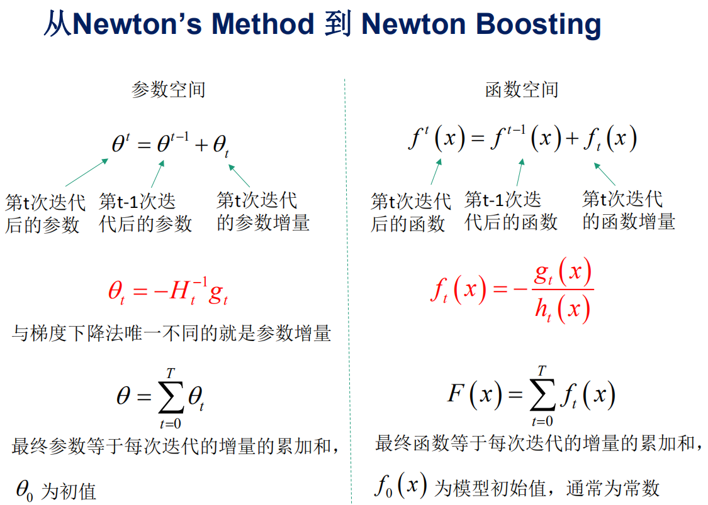
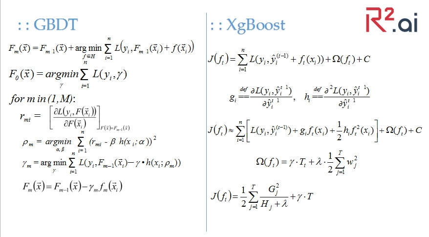
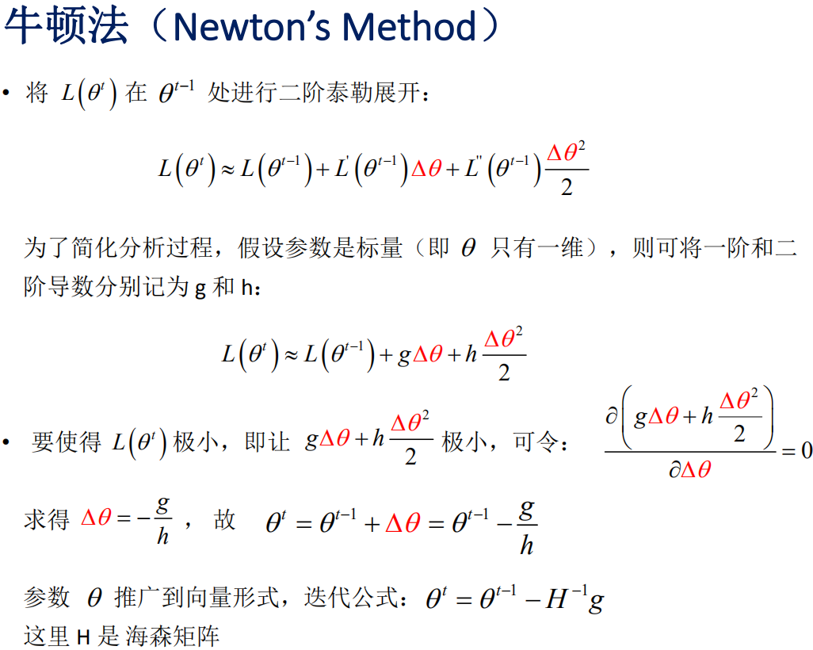

GBDT构造新的一棵树，对损失近似到一阶导，拟合负梯度；属于函数空间中利用梯度下降法进行优化；
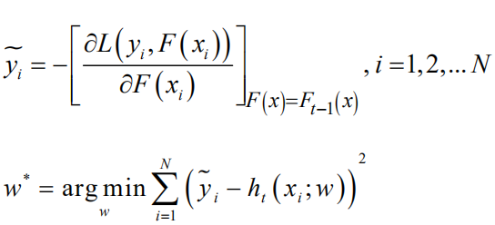

XGBoost构造新的一棵树，对损失近似到二阶导，拟合负一阶导/二阶导(+正则项)；属于函数空间中的牛顿法进行优化。
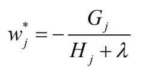

#### 5.1 GBDT VS XGB
||GBDT|XGB|
|--------|--------|--------|
|基分类器|树模型|树模型+LR回归
树拟合|负梯度|负梯度/二阶导
方差-偏差权衡||目标函数+正则（叶子节点数，节点权重）
分割准则|回归：MSE；分类：基尼系数|最大化损失增益
分割方法||分位数法列举候选分割，求Gain最佳
缺失值处理||指定学习缺失值分类方向；忽略缺失值
|||列抽样，数据集抽样
|||并行化：特征值排序找出候选点，保存为列块结构，各个特征增益计算并行运算
[XGB面试精选](https://mp.weixin.qq.com/s/a4v9n_hUgxNyKSQ3RgDMLA)


## 三、FM算法
- 优点： 减少特征交叉的选择工作，特征参数学习更加充分，提升参数学习效率和模型预估能力。
- 缺点：两两交叉，相比于DNN，GBDT更多特征的交叉

### FM的计算


### 计算过程


## 四、GBDT+FM
GBDT一棵树的叶子节点one-hot构成组合特征，该颗树特征对应一个K维向量作为该特$v_i$，进FM时两棵树的组合就是$v_i$和$v_j$的点成得到$w_{ij}$实际上是更多低阶特征的组合离散特征学习低维dense特征；

---
1. 提取统计类特征使用gbdt模型快速拿到收益;
2. 加入海量离散类特征（个性化），使用LR/FM模型进一步提升效果。
3. 至于原有的统计类特征可以通过gbdt叶子节点转换成离散特征一并加入到LR/FM中。
### 稀疏特征进FM
**高维稀疏特征适合线性模型；LR+L2正则可以使得权重降低，不容易对稀疏特征过拟合。**
### 连续特征进GBDT
**统计特征，低维稠密特征适合树模型**；一般统计特征具有总体的特征效果或全局性的因素

>>离散特征进GBDT时根据0，1划分节点偶然性太大，很容易过拟合；特征太多，树模型不易训练

### DNN的应用
解决FM特征交叉能力受限的问题。**DNN较容易学习到高阶非线性特征**

### GBDT+FM为什么不是RF+FM
- GBDT前面的树侧重对多数样本有区分度的特征；后面的树针对经过前面的树仍然残差大的少数样本
- 从bias and variance角度，RF降低variance而不改变bias, 而LR线性模型的variance足够低，需要更多的组合特征降低bias
