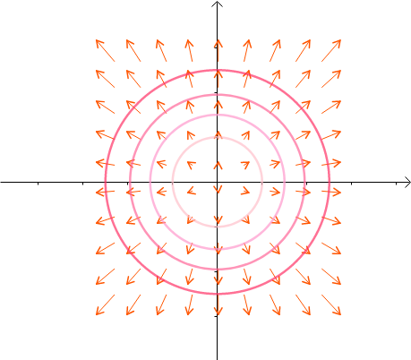
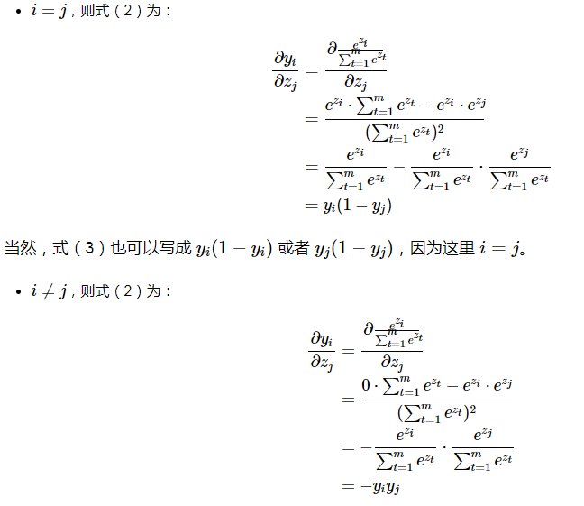
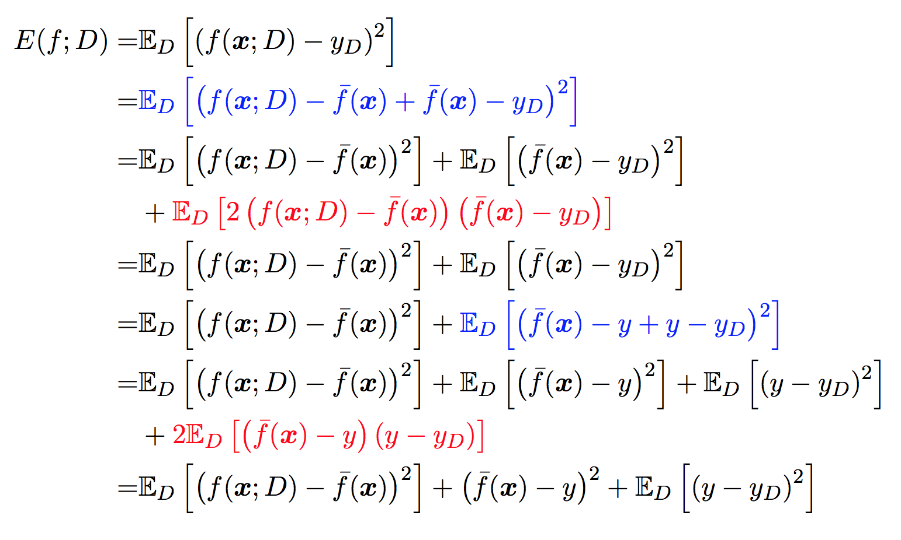
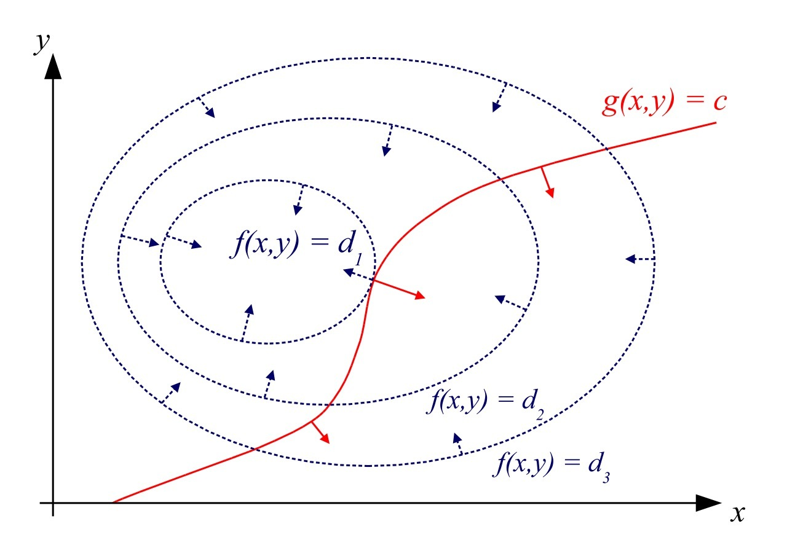
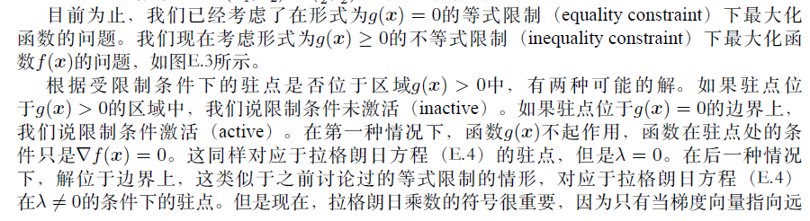

<!-- TOC -->

1. [机器学习基础](#机器学习基础)
   1. [模型](#模型)
      1. [生成式模型](#生成式模型)
      2. [判别式模型](#判别式模型)
      3. [模型的泛化能力-泛化误差上界](#模型的泛化能力-泛化误差上界)
      4. [模型融合](#模型融合)
   2. [策略](#策略)
      1. [Loss 损失函数](#loss-损失函数)
      2. [评价指标](#评价指标)
      3. [3、ROC曲线](#3roc曲线)
         1. [3.1、AUC](#31auc)
         2. [3.2、AUC值的物理意义](#32auc值的物理意义)
         3. [3.3、AUC值的计算](#33auc值的计算)
         4. [3.4、ROC与P-R曲线对比](#34roc与p-r曲线对比)
      4. [4、排序指标](#4排序指标)
         1. [MAP](#map)
         2. [举个列子](#举个列子)
         3. [NDCG](#ndcg)
   3. [三、方法](#三方法)
      1. [1、机器学习中的梯度下降](#1机器学习中的梯度下降)
         1. [1.1、批梯度下降比较](#11批梯度下降比较)
         2. [1.2、最速下降](#12最速下降)
         3. [1.3、多分类梯度下降](#13多分类梯度下降)
      2. [2、牛顿法](#2牛顿法)
      3. [3.Levenberg-Marquardt修正](#3levenberg-marquardt修正)
         1. [牛顿法 vs 梯度下降](#牛顿法-vs-梯度下降)
      4. [4.拟牛顿法-牛顿法hessian矩阵的优化求解](#4拟牛顿法-牛顿法hessian矩阵的优化求解)
   4. [四、偏差与方差](#四偏差与方差)
      1. [4.1、方差与偏差推导](#41方差与偏差推导)
   5. [五、L1和L2正则](#五l1和l2正则)
      1. [解的稀疏性](#解的稀疏性)
   6. [六、优化过拟合和欠拟合](#六优化过拟合和欠拟合)
      1. [降低过拟合](#降低过拟合)
      2. [降低欠拟合](#降低欠拟合)
   7. [七、拉格朗日乘法](#七拉格朗日乘法)
      1. [7.1、KKT条件](#71kkt条件)
   8. [八、特征选择](#八特征选择)
      1. [为何标准化和归一化](#为何标准化和归一化)
         1. [模型求解需要](#模型求解需要)
         2. [无量纲化](#无量纲化)
         3. [避免数值bias](#避免数值bias)
      2. [标准化：更好保持样本间距；符合统计假设](#标准化更好保持样本间距符合统计假设)
         1. [什么时候需要标准化](#什么时候需要标准化)
      3. [归一化-广义上也可以指标准化](#归一化-广义上也可以指标准化)
      4. [何时归一化，何时标准化](#何时归一化何时标准化)
      5. [特征选取方法-理论](#特征选取方法-理论)
      6. [特征离散化优点](#特征离散化优点)
   9. [数据不平衡](#数据不平衡)

<!-- /TOC -->

# 机器学习基础

[机器学习之数学01](https://www.cnblogs.com/wuliytTaotao/p/10513371.html)

[机器学习之数学02](https://www.cnblogs.com/wuliytTaotao/p/10603576.html)

## 模型

### 生成式模型
由数据学到联合概率分布$P(X,Y)$,然后求出条件概率分布$P(Y|X)$作为预测模型。给定输入$X$产生输出$Y$的生成关系。**收敛更快，隐变量时仍然能用**
$$P(Y|X)=\frac{P(X,Y)}{P(X)}$$

>>朴素贝叶斯、隐马尔科夫模型（HMM）。

### 判别式模型

由数据学习到决策函数$f(X)$或者条件概率模型$P(Y|X)$作为预测的模型。给定输入$X$，预测什么样的输出$Y$。**更为准确，隐变量失效，定义和使用特征**

>>KNN、感知机、逻辑斯蒂回归（Logistic Regression）、最大熵、支持向量机（SVM）、条件随机场（CRF）、决策树。

### 模型的泛化能力-泛化误差上界

对任意函数f，至少以概率$1-\delta$使得不等式成立
$$\delta=d*\exp(-2N\epsilon^2)$$
$$\epsilon(d,N,\delta)=\sqrt{\frac{1}{2N}(\log d+\log \frac{1}{\delta})}$$
$$R(f_N)<R_{f_N}^{train}+\epsilon(d,N,\delta)$$

1. 训练误差越小，则泛化误差越小；
2. 样本容量N越大，则训练误差与泛化误差越接近；
3. 假设空间中包含的函数越多，则泛化误差上界越大。

### 模型融合

1. 平均法
2. 投票法
3. bagging
4. boosting
5. stacking 精排得分入重排序

## 策略
$$\theta^*=\argmin_{\theta}\frac{1}{N}\sum_{i=1}^{N}L(y_i,f(x_i;\theta))+\lambda\Omega(\theta)$$

---

### Loss 损失函数

>>0-1损失、平方损失、绝对损失、对数损失、
1. 对数损失-交叉熵取均值
   1. $$J(\theta)=-\frac{1}{N}\sum_{i=1}^{N}[y_{i}log(h_{\theta}(x_i))+(1-y_{i})log(1-h_{\theta}(x_i))]$$
   2. $$CrossEntropy(\theta)=-\sum_{i=1}^{N}[y_{i}log(h_{\theta}(x_i))+(1-y_{i})log(1-h_{\theta}(x_i))]$$

2. 平方损失-回归
$$MSE=\frac{1}{N}\sum_{i=1}^{N}(y_i^{pred}-y_i^{true})^2$$
3. 指数损失-Adaboost
$$L(y,f(x))=\frac{1}{N}\sum_{i=1}^{N}e^{-y_if(x_i)}$$
4. 合页损失-SVM
$$L(y·(w*x+b))=\sum_{i=1}^{N}[1-y(w*x+b)]_++\lambda||w||^2$$
5. 决策树
$$C_\alpha(T)=\sum_{t=1}^{T}N_tH_t(T)+\alpha|T|$$
6. focal loss- 推荐挖掘困难样本
$$L_{fl}=-\alpha(1-p)^\gamma \log(p); p=1$$
$$L_{fl}=-(1-\alpha)p^\gamma \log(1-p); p=0$$

### 评价指标

>>准确率，精确率，召回率，均方根误差

- 准确率：正负样本不均衡时，大类别特别影响准确率；
- 精确率：$Precision=\frac{TP}{TP+FP}$
- 召回率：$Recall=\frac{TP}{TP+FN}$
>>由此得到P-R曲线越右上角越好；且$F_1=\frac{2pr}{p+r}$
- 均方根误差：异常点影响大
$$RMSE=\sqrt{\frac{1}{N}\sum_{i=1}^{N}(y_i^{pred}-y_i^{true})^2}$$
- MAPE：平均绝对百分比误差，每个点误差进行归一化
$$MAPE=\sum_{i=1}^{N}|\frac{y_i^{true}-y_i^{pred}}{y_i^{true}}|*\frac{100}{N}$$

### 3、ROC曲线
- 优点：不受类分布的影响，适合与评估、比较类分布不平衡的数据集。
- 缺点：ROC和AUC仅适合于两类问题 ,对多类问题 ,无法直接应用。

#### 3.1、AUC
定义：AUC值为ROC曲线所覆盖的区域面积，显然，AUC越大，分类器分类效果越好。
- AUC = 1，是完美分类器，采用这个预测模型时，不管设定什么阈值都能得出完美预测。绝大多数预测的场合，不存在完美分类器。
- 0.5 < AUC < 1，优于随机猜测。这个分类器（模型）妥善设定阈值的话，能有预测价值。
- AUC = 0.5，跟随机猜测一样（例：丢铜板），模型没有预测价值。
- AUC < 0.5，比随机猜测还差；但只要总是反预测而行，就优于随机猜测。

#### 3.2、AUC值的物理意义
假设分类器的输出是样本属于正类的socre（置信度），则AUC的物理意义为，任取一对（正、负）样本，正样本的score大于负样本的score的概率。

#### 3.3、AUC值的计算
- 第一种方法：AUC为ROC曲线下的面积，那我们直接计算面积可得。面积为一个个小的梯形面积之和，计算的精度与阈值的精度有关。
- 第二种方法：根据AUC的物理意义，我们计算正样本score大于负样本的score的概率。取N\*M（M为正样本数，N为负样本数）个二元组，比较score，最后得到AUC。时间复杂度为O(N*M)。
- **第三种方法**：[AUC计算](https://www.cnblogs.com/van19/p/5494908.html)首先对score从大到小排序，然后令最大score对应的sample的rank值为n，第二大score对应sample的rank值为n-1，以此类推从n到1。然后把所有的正类样本的rank相加，再减去正类样本的score为最小的那M个值的情况。得到的结果就是有多少对正类样本的score值大于负类样本的score值，最后再除以M×N即可。值得注意的是，当存在score相等的时候，对于score相等的样本，需要赋予相同的rank值(无论这个相等的score是出现在同类样本还是不同类的样本之间，都需要这样处理)。\
(正类与分数低者比较次数，正类与正类比较的次数)\
(n,m),\
(n-1,m-1),\
(n-2,m-2),\
,,,\
(n-(m-1),1)
左求和，右求和再相减即为下式
$$AUC=\frac{\sum_{i \in posClass}rank_i - \frac{M(M+1)}{2}}{M*N}$$
>>时间复杂度为O(N+M)。

#### 3.4、ROC与P-R曲线对比
ROC明显降低不同测试集带来的干扰，困难样本下，ROC更加稳定反应模型的排序效果。

### 4、排序指标

#### MAP
对用户u的返回结果I（item的顺序1,2,,,10）的平均准确率（AP）
$$AP_u = \frac{1}{|I_u|}\sum_{i \in I_u}\frac{\sum_{j \in I_u}\delta(p_{uj} < p_{ui}) + 1}{p_{ui}}$$
MAP(Mean Average Precision)即为所有用户取AP的均值有：
$$MAP = \frac{\sum_{u \in U}AP_u}{|{U}|}$$

#### 举个列子
>>$命中的pos对应precision=\frac{pos及以上的命中个数}{pos}$，没命中的为0

在对所有用户求均值

#### NDCG
计算该位置和item的相关性得分；
$$累计收益：CG_k = \sum_{i=1}^k rel_i$$
没有考虑不同位置，靠后得分应该低；故增加pos的罚项对排名靠后的收益打折：
$$贴现累计收益：DCG_k = \sum_{i=1}^k \frac{2^{rel_i}-1}{\log_2 (i+1)}$$
不同用户的推荐列表进行评估，需要以最好的收益IDCG为base进行归一化
$$归一化贴现累计收益：NDCG_u@k = \frac{DCG_u@k}{IDCG_u} ，k=list.size$$

## 三、方法
梯度下降、牛顿法

---

### 1、机器学习中的梯度下降
梯度下降首先需要明确损失函数Loss function（一个样本损失）和代价函数Cost function（统计平均意义下的损失）。
$$\bm w^{(k+1)} = \bm w^{(k)} - \alpha \cdot  \nabla C(\bm w^{(k)})$$
f(x,y)=x²+y²

将f(x,y)=x²+y²看做**二维等高图** 
**对于二维曲面来说，切线的方向有上有下描述的是函数值的方向；梯度代表使函数值增大时，各个自变量的变化方向；梯度下降就是梯度反方向更新各个自变量可以使得函数值减小。梯度方向与切线方向垂直。**

#### 1.1、批梯度下降比较
1. 批梯度下降会获得全局最优解，缺点是在更新每个参数的时候需要遍历所有的数据，计算量会很大，并且会有很多的冗余计算，导致的结果是当数据量大的时候，每个参数的更新都会很慢。
2. 随机梯度下降是以高方差频繁更新，优点是使得sgd会跳到新的和潜在更好的局部最优解，缺点是使得收敛到局部最优解的过程更加的复杂。
3. 小批量梯度下降结合了sgd和batch gd的优点，每次更新的时候使用n个样本。减少了参数更新的次数，可以达到更加稳定收敛结果，一般在深度学习当中我们采用这种方法。

>>**全局最优**<=>通过梯度下降得到的最小值在全局Loss中也是最小值<=>Loss函数是否是凸的<=>**二阶导(海森矩阵)判断是否正定**

#### 1.2、最速下降

最速下降法（Steepest descent）是梯度下降法的一种更具体实现形式，其理念为在每次迭代中选择合适的步长$\alpha_k$使得目标函数值能够得到最大程度的减少。
每一次迭代，沿梯度的反方向，我们总可以找到一个
$$\bm w^{(k+1)} = \bm w^{(k)} - \alpha_k \cdot  \nabla C(\bm w^{(k)})$$
使得在这个方向上$f(\bm x^{(k+1)})$取最小值。
$$\alpha_k = \mathop{\arg\min}_{\alpha \ge 0} f(\bm x^{(k)} - \alpha \nabla f(\bm x^{(k)}))$$
有意思的是，最速下降法每次更新的轨迹都和上一次垂直。而且只要梯度$\nabla f(\bm x^{(k)}) \not = 0$则$f(\bm x^{(k+1)}) < f(\bm x^{(k)})$
（即梯度不等于 0 时，肯定会下降。）

#### 1.3、多分类梯度下降
softmax 函数的表达式为:
$$y_i = \frac{e^{z_i}}{\sum_{t = 1}^m e^{z_t}}$$
$$\frac{\partial y_i}{\partial z_j} 
= \frac{\partial \frac{e^{z_i}}{\sum_{t = 1}^m e^{z_t}}}{\partial z_j}
\tag{2}$$

### 2、牛顿法

在确定搜索方向时，**梯度下降和最速下降只用到了目标函数的一阶导数（梯度），而牛顿法（Newton's method）用到了二阶（偏）导数。**
牛顿法的基本思路是在每次迭代中，利用二次型函数来局部近似目标函数f，并求解近似函数的极小点作为下一个迭代点，牛顿法自变量x的更新公式为：
$$\bm x^{(k+1)} = \bm x^{(k)} - F(\bm x^{(k)})^{-1}\nabla f(\bm x^{(k)})$$
当前点离min点较近趋势可能不会错，但较远时会带偏。

### 3.Levenberg-Marquardt修正
- 牛顿法引入二阶导数拟合f，依据f的变化趋势去梯度下降，收敛更快，迭代次数更少。但同时会引入问题，拟合会有误差，当前离min点较远时，趋势可能不对。
- 多元函数的Hessian矩阵就类似一元函数的二阶导。多元函数Hessian矩阵半正定就相当于一元函数二阶导非负，半负定就相当于一元函数二阶导非正

---
如果黑塞矩阵$F(\bm x^{(k)})$不正定，那么搜索方向$\bm d^{(k)} = - F(\bm x^{(k)})^{-1}\nabla f(\bm x^{(k)})$可能不会是下降方向。 牛顿法的 Levenberg-Marquardt 修正可以解决这个问题：
$$\bm x^{(k+1)} = \bm x^{(k)} - \alpha_k(F(\bm x^{(k)})  + \mu_k \bm I)^{-1}\nabla f(\bm x^{(k)})$$
其中，$\mu_k \ge 0$，I为单位矩阵。在该修正中，$F(\bm x^{(k)})$可以不正定，但是$\bm G = F(\bm x^{(k)}) + \mu_k ,\bm I$需要是正定的，所以，取适当的$\mu_k$使得$\bm G$正定即可。（矩阵正定，当前仅当所有特征值大于 0。）

#### 牛顿法 vs 梯度下降

- 牛顿法是二阶收敛，梯度下降法是一阶收敛，所以牛顿法就更快。
- 更通俗地，梯度下降法只从当前位置选择一个坡度最大的方向走一步，而牛顿法在选择方向时，不仅会考虑坡度是否够大，还会考虑走了一步后，坡度是否会变得更大。
- 从几何上说，牛顿法就是用一个二次曲面去拟合当前位置的的局部曲面，而梯度下降法用的是一个平面去拟合，通常情况下，二次曲面的拟合会比平面更好，所以牛顿法选择的下降路径会更符合真实的最优下降路径。

### 4.拟牛顿法-牛顿法hessian矩阵的优化求解
在每次迭代的时候计算一个矩阵，其逼近海塞矩阵的逆。最重要的是，该逼近值只是使用损失函数的一阶偏导来计算

---
求出$\bm H_{k+1}$给出 $\bm H_{k}$，梯度$f(\bm x^{(k)})$，$\bm d^{(k)}$，$\alpha_k$找到 $\bm H_{k+1}$的递推式，那么在迭代过程中就不需要涉及到黑塞矩阵也不会求逆。
$$\boldsymbol{H}_{k+1}=\boldsymbol{H}_{k}+\frac{\left(\Delta \boldsymbol{x}^{(k)}-\boldsymbol{H}_{k} \Delta \boldsymbol{g}^{(k)}\right)\left(\Delta \boldsymbol{x}^{(k)}-\boldsymbol{H}_{k} \Delta \boldsymbol{g}^{(k)}\right)^{\top}}{\Delta \boldsymbol{g}^{(k) \top}\left(\Delta \boldsymbol{x}^{(k)}-\boldsymbol{H}_{k} \Delta \boldsymbol{g}^{(k)}\right)}$$
$\Delta x^{(k)}=\alpha_{k} d^{(k)}$，$\Delta \boldsymbol{g}^{(k)}=\boldsymbol{g}^{(k+1)}-\boldsymbol{g}^{(k)}$
$\bm H_0$可以取任一对称正定实矩阵。

## 四、偏差与方差

[参考链接](http://liuchengxu.org/blog-cn/posts/bias-variance/)

1. 泛化误差：以回归任务为例, 学习算法的平方预测误差期望为:
$$Err(\mathbf{x}) = E\left[\left( y - f(\mathbf{x}; D) \right)^2\right]$$
2. 方差：在一个训练集 D上模型 f 对测试样本 x 的预测输出为 f(x;D), 那么学习算法 f 对测试样本 x 的 期望预测和使用样本数相同的不同训练集产生的方差为:
$$\overline{f}(\mathbf{x}) = E_D\left[f\left(\mathbf{x}; D\right)\right]$$
$$var(\mathbf{x}) = E_D\left[\left( f(\mathbf{x}; D) - \overline{f}(\mathbf{x}) \right)^2\right]$$
3. 偏差：期望预测与真实标记的误差称为偏差(bias), 为了方便起见, 我们直接取偏差的平方:
$$bias^2(\mathbf{x}) = \left( \overline{f}(\mathbf{x}) - y \right)^2$$
4. 噪声：噪声为真实标记与数据集中的实际标记间的偏差:
$$\epsilon^2 = E_D\left[ (y_D - y)^2 \right]$$

### 4.1、方差与偏差推导

- 偏差度量了学习算法的期望预测与真实结果的偏离程序, 即 刻画了学习算法本身的拟合能力 .
- 方差度量了同样大小的训练集的变动所导致的学习性能的变化, 即 刻画了数据扰动所造成的影响 .
- 噪声表达了在当前任务上任何学习算法所能达到的期望泛化误差的下界, 即 刻画了学习问题本身的难度.

## 五、L1和L2正则
- L1大部分特征的权重降为0，变稀疏矩阵，只保留少量特征。目标函数等高线与L1正则的解空间决定，“棱”状更能碰撞出稀疏值。类似减少特征的方式解决过拟合
- L2少量降为0，大部分权重减小。降低所有特征的权重。整体减小所有特征权重，来解决过拟合

L0范数指向量中非零元素的个数
$$\|w\|_0=\sum_{w_i!=0}^{W}{|w_i|}$$
L1范数：向量中每个元素绝对值的和
$$\|w\|_1=\sum_{i=1}^{N}{|w_i|}$$
L2范数：向量元素绝对值的平方和再开平方
$$\|w\|_2=\sqrt{\sum_{i=1}^{N}{w_i^2}}$$
L1正则公式
$$L=L_{0}+\lambda\sum_j|w_j|$$
L2正则公式
$$L=L_{0}+\lambda\sum_jw_j^2$$

### 解的稀疏性

## 六、优化过拟合和欠拟合

### 降低过拟合
1. 更多的数据；
2. 降低模型复杂度；
3. 正则化方法；
4. bagging 多个模型集成在一起，降低单一模型过拟合风险；
5. 减少特征：PCA等

### 降低欠拟合
1. 添加新特征（深度学习提供稠密特征，因子分解机）
2. 增加模型复杂度；
3. 减少正则化系数

## 七、拉格朗日乘法
$$ \begin{aligned}
&{}\max f(x, y), \\
&{}\text{s.t. } g(x, y) = c.
\end{aligned}$$
$$\mathcal{L}(x, y, \lambda) \overset{\text{def}}{=}f(x, y) + \lambda\cdot g(x, y).$$
$$\begin{cases}
\frac{\partial \mathcal{L}}{\partial x} = 0, \\
\frac{\partial \mathcal{L}}{\partial y} = 0, \\
\frac{\partial \mathcal{L}}{\partial \lambda} = 0.
\end{cases}$$
函数 f(x,y)=x²+y² 是曲面**特别地，对于序列 {d1,d2,…} 来说，f(x,y)=dk 形成了一系列的曲线。若将 dk 理解为高度，则这一系列的曲线即是函数 f(x,y) 的等高线组。** 同样，对于约束 g(x,y)=x²-y=C 来说它也是一条曲线，我们称之为约束曲线。对g曲线求导得到法向量，对f也如此；故有下式成立
$$\Bigl(\frac{\partial f}{\partial x}, \frac{\partial f}{\partial y}\Bigr) = \lambda\Bigl(\frac{\partial g}{\partial x}, \frac{\partial g}{\partial y}\Bigr)$$
函数曲线相切，意味着两个函数的法线在切点重合，也就是两个函数的法向量相差一个系数 λ，这也就是说两个函数在切点的梯度向量相差一个系数 λ 

### 7.1、KKT条件

因此我们说，拉格朗日乘数法有很直观的物理意义。
对于h(x)>=0的设定如下

## 八、特征选择
特征选取包含一些特征处理的操作：
- 特征清洗（缺失，异常，样本比例权重）
- **标准化**和归一化）

### 为何标准化和归一化

#### 模型求解需要
1. 归一化后加速学习，不同特征方向上收敛同步；
2. 距离求解

#### 无量纲化
1. 不同特征没有量纲不具有比较意义

#### 避免数值bias

### 标准化：更好保持样本间距；符合统计假设

#### 什么时候需要标准化
**正则一定标准化**.$w$的大小与特征数值范围有关；此外标准化w大小可以反映不同特征对样本的贡献度。**与测试集分开标准化**

### 归一化-广义上也可以指标准化
把数据归一化到[min,max]之间

### 何时归一化，何时标准化
- 优先标准化：数据分布有先验假设；
- 距离度量，PCA降维时用Z标准化；其他不涉及分布的时候可以区间归一化

### 特征选取方法-理论
1. 过滤：按照发散性对特征评分，比如特征的方差过小可以考虑过滤掉；**覆盖率，皮尔逊，fisher得分，假设检验，互信息，相关特征选择**；
2. 包装：根据目标函数，去掉特征观察效果；**完全搜索，启发式搜索**
3. 嵌入法：树模型（组合，特征重要性）；DNN；业务相关统计特征（线性与非线性特征转换）

### 特征离散化优点
1. 离散特征的增加和减少都很容易，易于模型的快速迭代；
2. 稀疏向量计算快，**特征易存储和扩展**
3. **对异常数据有很强的鲁棒性，更稳定**
4. **单变量离散化为多个后引入非线性，加大拟合**
5. **离散化后可以进行特征交叉**，由M+N个变量变为M*N个变量，进一步引入非线性，提升表达能力
6. **简化模型降低过拟合**

## 数据不平衡
- 采样，对小样本加噪声采样，对大样本进行下采样
- 进行特殊的加权，如在Adaboost中或者SVM中
- 采用对不平衡数据集不敏感的算法
- 改变评价标准：用AUC/ROC来进行评价
- 采用Bagging/Boosting/ensemble等方法
- 考虑数据的先验分布
