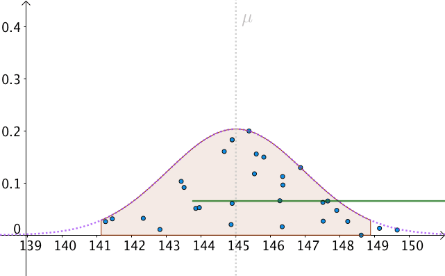
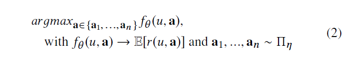

# 推荐系统

目标主要包括：用户满意性，多样性，新颖性，惊喜度，实时性，推荐透明度，覆盖率。
热门、人工、相关、个性化推荐

## 推荐系统比较

- LR：大规模离散特征
- LR + GBDT：GBDT叶子节点编码离散化连续值特征，同时实现特征交叉
- FM：特征交叉权重矩阵分解，交叉结果属于向量维度的交叉
- FFM：隐向量分filed，不同field 特征交叉时使用对应field的向量
- FNN：FM + concat + MLP 预训练FM，Embedding向量高阶交叉
- PNN：FM + vector product + MLP 层之后，加product 层做交叉（f个Embedding向量两两内积）
- NFM：FM + bi-interact + MLP bi-interation即Embedding向量element-wise product得到f(f-1)/2个向量 ，sum
- AFM：FM + bi-interact + attention + MLP 
- Wide&Deep： LR + Embeding + MLP， 低阶交叉保留记忆能力，deep 高阶交叉提升泛化能力（element-wise 高阶交叉）
- DeepFM： LR + FM +Embeding + deep，fm交叉vector-wise二阶特征交叉， Dnn高阶element-wise 特征交叉
- Deep&Cross： cross + deep，element-wise多项式交叉，element-wise 高阶特征交叉

## 推荐的分类

- 基于内容的过滤、协同过滤
- 基于用户的协同过滤、基于物品的协同过滤
1. 协同过滤的两种主要方式
- 近邻模型
  1. 面向用户：计算用户之间的关联；
  2. 面向物品的方法：计算待推荐物品与该用户已评级过的物品之间的关联。
  3. 用余弦值表示上述用户关联，该值就是皮尔逊相关系数。
- 隐变量模型
  1. 隐变量描述用户对物品的评级。物品（类型，流派）；用户（评分，评级等）
  2. 神经网络，矩阵分解实现隐变量表示。

## 推荐系统的评估
A/B测试：流量分发（随机，uid%100∈[0,20%]）

### 95%置信区间是什么意思

**置信区间是指试验用户的优化指标vs所有用户下指标均值的区间估计**展现的是指标的真实值与试验用户指标的相似度。95%是置信度，置信度越高，置信区间就越大。
分位数1.96处对应的阴影部分的面积(概率)为0.025，中间概率就为0.95.
$$P(\mu - 1.96 \frac{\sigma}{\sqrt{n}} < M < \mu + 1.96 \frac{\sigma}{\sqrt{n}} ) = 0.95$$
10%流量实验每一小时计算一次实验结果的置信区间，最后所有置信区间中有95%的置信区间包含了总体均值，则说明实验结果置信。

**小流量的用户行为统计在流量放宽后关键指标数据可能会发生变化。故由小到大逐步增加流量分配，同时实时监控关键指标的数据走势**

### 冷启动过程
#### 用户冷启动
1. 手机用户特征；
2. 粗粒度选项引导填写；
3. 热点，保量
#### 物品冷启动
1. 保量

### 多目标排序
$score=CTR*(\alpha+CVR)*(\beta+price)*staya*rule\_weight*...$
#### 难点
1. 目标重要性难以量化；
2. 超参难以学习；
3. 在线服务计算量大；

## 推荐系统架构

### online部分架构

#### 核心模块
推荐引擎，推荐系统核心，包括online逻辑，召回、过滤、特征计算、排序、 多样化等处理过程。
#### 数据路径
1. 请求的刷新从gateway，经过流量分配模块，传到业务gateway，业务gateway支持http，tcp（使用thirtf协议或者protobuf 协议）等多种类型接口；

2. 用户行为数据，从gateway到Flume agent，然后到kafka，为后面online，realtime userprofile部分的提供实时数据，也为offline部分的数据存储系统提供数据。

### offline部分架构

从框架的角度看，推荐系统基本可以分为数据层、召回层、排序层。
- sessionlog：对原始数据进行清洗合并，sessionlog一般就是清洗合并后的数据，后续的算法和统计都是根据sessionlog进行再加工。
- userprofile：对用户属性和行为等信息进行采集和统计，为后续算法提供特征支持。
- itemDoc：对视频、商品等属性、曝光、点击等字段进行统计， 为后续算法提供特征支持。
召回层主要是从用户的历史行为、实时行为等角度利用各种触发策略产生推荐的候选集，对不同的策略和算法产生的候选集进行融合并按照产品规则进行过滤，一般融合和过滤后的候选集还是比较多的，一次线上请求过来之后线上系统无法对那么多的候选集进行排序，所以在召回层一般还会有粗排序，对融合的候选集进行一次粗排序，过滤掉粗排分数较低的候选集。

## YouTubeDNN
- 1.召回TopN：生成倒排，近似搜索；
- 2.新视频：用该视频最近生成日志的时间example age；初始化训练时为0；就是说越短越可能为正样本（训练的trick）
- 3.测试集作为最近一次观看行为
- 4.优化目标非CTR，播放率而是曝光后预期播放时间
- 5.目标函数的设定应该是一个算法模型的根本性问题
- 6.对某些特征开方x，x，x^2处理后输入在线上serving中使用$e^{Wx+b}$做预测可以直接得到expected watch time的近似。
- 7.Weighted LR的特点是，正样本权重w的加入会让正样本发生的几率变成原来的w倍，也就是说样本i的Odds变成了下面的式子：

由于在视频推荐场景中，用户打开一个视频的概率p往往是一个很小的值，因此上式可以继续简化：
因此，Model Serving过程中[公式] 计算的正是观看时长的期望。

### 候选集生成

### 精排

## MMR(PostRank控制多样性)

lambad 越大，准确性越大；
lambda 越小，多样性越好。

## 序列评估与生成框架
### 目标函数
总收益函数：

模型fθ拟合：

优化函数1：

最终优化函数2：

- 两层Transformer，4个head；最后得到某个位置item的概率。最后计算总体收益。
- focal loss：更多关注错分的样本；a调节权重；
样本权重：

## NavBoost
1. 取30天的数据ctx_id和rec_id之间的展点数据，impression必须大某个阈值（1W）
2. 计算ctx_id和rec_id之间的coec值
3. 计算最大的ctr，归一化所有的ctr；计算新鲜度值$=1.5 - \frac{1}{1 + \exp(-\frac{age}{100})}$
4. 计算最终得分，ctrScore * 0.8 + ageScore * 0.2

### COEC 
解决item在页面上位置的不同造成CTR的差异性

---
用户注意力一般集中在左上，因此每次 impression 能导致的 click 是与位置相关的。变现有效 impression 的方式是通过每个位置的平均 CTR（reference CTR）来处理，这样将每次 impression 乘以对应位置的 reference CTR 就获得了所谓的 EC（expected click），这样消除了 position bias 的 EC 就变成可加的了。观测到的 click 数目从统计上来看应该是分布在 EC 附近，也就是说 COEC（clicks over expected clicks）的期望应该是 1。

使用 COEC 而不是 CTR 作为每个 item 的 relevance 的反应是一个不错的选择，但是实际操作中与 CTR 类似都面临着 data sparsity 的问题。一般我们也会使用 Laplace smoothing 解决 0 观测。
#### 拉普拉斯平滑
分子+1；分母+可取值范围大小

## Wide&Depp与DeepFM
### Wide&Deep
- Wide模型利用交叉特征高效的实现记忆能力，实现精准推荐
- Embedding类的模型通过学习到的低维稠密向量，实现模型的泛化推荐（未见过的内容）

W&D模型，平衡Wide模型和Deep模型的Memorization 与 Generalization(记忆与泛化)
$$P\left ( Y=1\mid \mathbf{x} \right )=\sigma \left ( \mathbf{w}_{wide}^T\left [ \mathbf{x},\phi \left ( \mathbf{x} \right ) \right ] + \mathbf{w}_{deep}^Ta^{\left ( l_f \right )}+b \right )$$

### DeepFM

黑色线表示带有权重的连接，红色线表示权重为1的连接，蓝色线表示one-hot映射到对应的embedding。图中的Field表示一个特征类别,每个field用one-hot表示，构成最下面的Sparse Features。稀疏特征有两部分输出，一部分是加权求和得到FM Layer中的第一个节点，另一部分索引对应的embedding得到Dense Embeddings。FM：LR的权重为一阶权重，组合特征权重为高阶权重。Dense Embeddings也有两部分输出，一部分是两两做点积输出到FM Layer，另外一部分是拼接起来作为Hidden Layer的输入

- wide模型部分由LR替换为FM,FM模型学习交叉特征的能力
- 共享原始输入特征。DeepFM模型的原始特征将作为FM和Deep模型部分的共同输入，保证模型特征的准确与一致。
- DeepFM模型包含FM和DNN两部分，FM模型可以抽取低阶特征，DNN可以抽取高阶特征。
- 由于输入仅为原始特征，而且FM和DNN共享输入向量特征，DeepFM模型训练速度很快。

## 热点feed流postrank
pointwise中query=user的emb
### 精排得到40个，为什么还要对12个重排序？
1. ctr预估，集中在预估单个item的ctr，和真实场景有一定的gap；
2. 广告位设置，多样性实验
3. 在真实的list顺序下，item被选中的概率与预测兴趣有差别
4. 多个item作为序列联合排序，整体提升排在前面被点击的概率，用户更多的关注前几个。

### Focal Loss 发掘困难样本

例如$\gamma$为2
- 对于正类样本而言，预测结果为0.95肯定是简单样本，所以（1-0.95）的gamma次方就会很小，这时损失函数值就变得更小。而预测概率为0.3的样本其损失相对很大;
- 对于负类样本而言同样，预测0.1的结果应当远比预测0.7的样本损失值要小得多。对于预测概率为0.5时，损失只减少了0.25倍，所以更加关注于这种难以区分的样本。

这样减少了简单样本的影响，大量预测概率很小的正样本叠加起来后的效应才可能比较有效。此外，加入平衡因子alpha，用来平衡正负样本本身的比例不均：文中alpha取0.25，即正样本要比负样本占比小，这是因为负例易分。

### pointwise，pairwise，listwise

#### 总结
Pointwise、Pairwise和Listwise的本质区别是训练过程中优化的目标或者损失函数不同。Pointwise优化的目标是单条样本与用户（查询词）之间的相关性（或者是否会点），即回归的目标是label。比如对于广告排序场景，优化目标是样本是否点击这个事情，这就是Pointwise。但对于如RankNet的Pairwise方法，优化的目标是正例与负例之间的序。而对于Listwise，优化的是一个序的好坏，比如用NDCG来评价。

#### pointwise
>>将排序问题当作二分类

训练样本
$$pointwise=(q_i,c_{i,j},y_{i,j})$$
$q_i$为第i个query，$c_{i,j}$为第i个query中第j个候选集，$y_{i,j}$为对该候选样本真实的概率
预测阶段二分类模型$h_\theta$排序每个候选句子，得到$\hat{y_{i,j}}$，选取top-ranked句自作为正确答案。目标函数为：
$$\argmax_{c_{i,j}} h_{\theta}(q_i,c_{i,j})$$

#### pairwise
>>让正确答案比错误答案得分高

训练样本
$$pairwise=(q_i,c^+_i,c^-_i)$$
给一个提问$q_i$，pairwise给定一对候选回答学习并预测最佳回答。$c^+$为正确回答，损失函数为合页函数
$$L=max\{0,m-(h_\theta(q_i,c^+_i)-h_\theta(q_i,c^-_i))\}$$
- 对（正样本预测值-负样本预测值）> m时则判断正确，损失为0；
- 对（正样本预测值-负样本预测值）< m时则判断错误，有损失。

##### 合页损失函数
促使正确答案的得分比错误答案的得分大于$m$。最后和pairwise类似，在预测阶段得分最高的候选答案被当作正确的答案。

#### listwise

g设想成最优评分函数,对查询Q1来说：文档A得6分,文档B得4分,文档C得3分
找到一个函数,使得其对Q1的搜索结果打分顺序尽可能的接近标准函数g.其中函数f和h就是实际的评分函数,通过比较两个概率之间的KL距离,发现f比h更接近假想的最优函数g.故选择函数f为搜索的评分函数.
>>q拟合p的分布
$$D_{KL}(p||q)=\sum_{x}p(x)\log \frac{p(x)}{q(x)}=-\sum_x p(x)\log q(x)-(-\sum_x p(x)\log p(x))$$