# 机器学习基础

[机器学习之数学01](https://www.cnblogs.com/wuliytTaotao/p/10513371.html)

[机器学习之数学02](https://www.cnblogs.com/wuliytTaotao/p/10603576.html)

## 评价指标

- ROC曲线和AUC的优势：不受类分布的影响，适合与评估、比较类分布不平衡的数据集。
- ROC曲线和AUC的劣势：ROC和AUC仅适合于两类问题 ,对多类问题 ,无法直接应用。
### AUC值
定义：AUC值为ROC曲线所覆盖的区域面积，显然，AUC越大，分类器分类效果越好。
- AUC = 1，是完美分类器，采用这个预测模型时，不管设定什么阈值都能得出完美预测。绝大多数预测的场合，不存在完美分类器。
- 0.5 < AUC < 1，优于随机猜测。这个分类器（模型）妥善设定阈值的话，能有预测价值。
- AUC = 0.5，跟随机猜测一样（例：丢铜板），模型没有预测价值。
- AUC < 0.5，比随机猜测还差；但只要总是反预测而行，就优于随机猜测。
#### AUC值的物理意义
　　假设分类器的输出是样本属于正类的socre（置信度），则AUC的物理意义为，任取一对（正、负）样本，正样本的score大于负样本的score的概率。
#### AUC值的计算
- 第一种方法：AUC为ROC曲线下的面积，那我们直接计算面积可得。面积为一个个小的梯形面积之和，计算的精度与阈值的精度有关。
- 第二种方法：根据AUC的物理意义，我们计算正样本score大于负样本的score的概率。取N\*M（N为正样本数，M为负样本数）个二元组，比较score，最后得到AUC。时间复杂度为O(N*M)。
- 第三种方法：与第二种方法相似，直接计算正样本score大于负样本的score的概率。我们首先把所有样本按照score排序，依次用rank表示他们，如最大score的样本，rank=n(n=N+M)，其次为n-1。那么对于正样本中rank最大的样本（rank_max），有M-1个其他正样本比他score小，那么就有(rank_max-1)-(M-1)个负样本比他score小。其次为(rank_second-1)-(M-2)。最后我们得到正样本大于负样本的概率为：
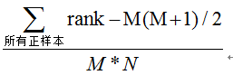
时间复杂度为O(N+M)。

## 一、导数、偏导数与方向导数

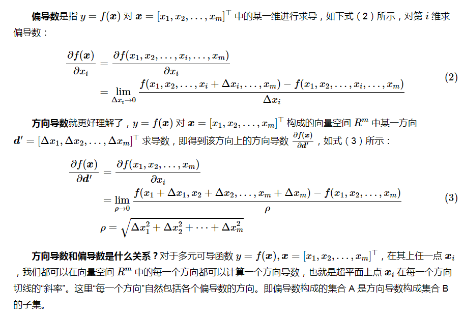

首先明确，导数是一个值，代表切线的斜率，而梯度是一个向量。**最大方向导数的方向就是梯度代表的方向。**
梯度是$f(\bm x)$对各个自变量$\bm x = [x_1, x_2, ..., x_m]^\top$每一维分别求偏导数得到的向量。
从式（5）和（6）中我们也可以知道，当$\bm d = \frac{\nabla f(\bm x)}{\|\nabla f(\bm x)\|}$方向导数最大。 **最大方向导数的方向就是梯度，最大的方向导数就是梯度的欧几里德范数。**

## 二、梯度下降

### 1.机器学习中的梯度下降

梯度下降首先需要明确损失函数Loss function（一个样本损失）和代价函数Cost function（统计平均意义下的损失）。
$$\bm w^{(k+1)} = \bm w^{(k)} - \alpha \cdot  \nabla C(\bm w^{(k)})$$
f(x,y)=x²+y²
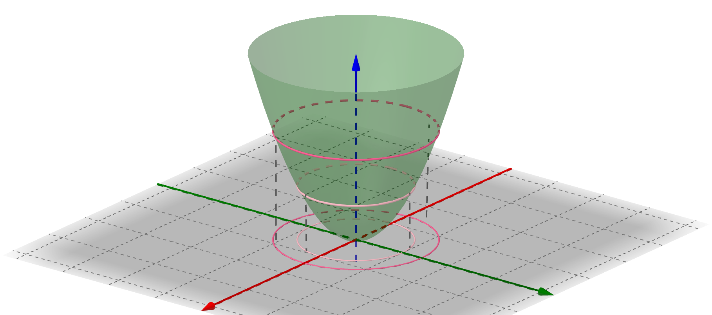
将f(x,y)=x²+y²看做**二维等高图** 

**对于二维曲面来说，切线的方向有上有下描述的是函数值的方向；梯度代表使函数值增大时，各个自变量的变化方向；梯度下降就是梯度反方向更新各个自变量可以使得函数值减小。梯度方向与切线方向垂直**
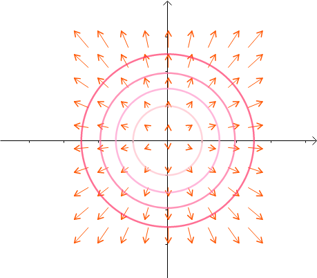
##### 解释梯度下降时：
- 1.从一维参数角度解析y=x²；
- 2.从二维参数角度解析如上图

#### 梯度下降
batch_size =训练样例的数量时，它被称为批量梯度下降。它只会在遍历整个数据集后面临开始学习的问题。
#### 批量梯度下降
batch_size = 1时，它被称为随机梯度下降。它没有充分利用矢量化，训练变得非常缓慢。

#### 全局最优

**全局最优**<=>通过梯度下降得到的最小值在全局Loss中也是最小值<=>Loss函数是否是凸的<=>**二阶导(海森矩阵)判断是否正定**

### 2.最速下降

最速下降法（Steepest descent）是梯度下降法的一种更具体实现形式，其理念为在每次迭代中选择合适的步长$\alpha_k$使得目标函数值能够得到最大程度的减少。
每一次迭代，沿梯度的反方向，我们总可以找到一个
$$\bm w^{(k+1)} = \bm w^{(k)} - \alpha_k \cdot  \nabla C(\bm w^{(k)})$$
使得在这个方向上$f(\bm x^{(k+1)})$取最小值。
$$\alpha_k = \mathop{\arg\min}_{\alpha \ge 0} f(\bm x^{(k)} - \alpha \nabla f(\bm x^{(k)}))$$
有意思的是，最速下降法每次更新的轨迹都和上一次垂直。而且只要梯度$\nabla f(\bm x^{(k)}) \not = 0$则$f(\bm x^{(k+1)}) < f(\bm x^{(k)})$
（即梯度不等于 0 时，肯定会下降。）

### 3.牛顿法

在确定搜索方向时，**梯度下降和最速下降只用到了目标函数的一阶导数（梯度），而牛顿法（Newton's method）用到了二阶（偏）导数。**
牛顿法的基本思路是在每次迭代中，利用二次型函数来局部近似目标函数f，并求解近似函数的极小点作为下一个迭代点，牛顿法自变量x的更新公式为：
$$\bm x^{(k+1)} = \bm x^{(k)} - F(\bm x^{(k)})^{-1}\nabla f(\bm x^{(k)})$$
当前点离min点较近趋势可能不会错，但较远时会带偏

### 4.Levenberg-Marquardt修正
- 牛顿法引入二阶导数拟合f，依据f的变化趋势去梯度下降，收敛更快，迭代次数更少。但同时会引入问题，拟合会有误差，当前离min点较远时，趋势可能不对。
- 多元函数的Hessian矩阵就类似一元函数的二阶导。多元函数Hessian矩阵半正定就相当于一元函数二阶导非负，半负定就相当于一元函数二阶导非正
---
如果黑塞矩阵$F(\bm x^{(k)})$不正定，那么搜索方向$\bm d^{(k)} = - F(\bm x^{(k)})^{-1}\nabla f(\bm x^{(k)})$可能不会是下降方向。 牛顿法的 Levenberg-Marquardt 修正可以解决这个问题：
$$\bm x^{(k+1)} = \bm x^{(k)} - \alpha_k(F(\bm x^{(k)})  + \mu_k \bm I)^{-1}\nabla f(\bm x^{(k)})$$
其中，$\mu_k \ge 0$，I为单位矩阵。在该修正中，$F(\bm x^{(k)})$可以不正定，但是$\bm G = F(\bm x^{(k)}) + \mu_k ,\bm I$需要是正定的，所以，取适当的$\mu_k$使得$\bm G$正定即可。（矩阵正定，当前仅当所有特征值大于 0。）

#### 牛顿法 vs 梯度下降

- 牛顿法是二阶收敛，梯度下降法是一阶收敛，所以牛顿法就更快。
- 更通俗地，梯度下降法只从当前位置选择一个坡度最大的方向走一步，而牛顿法在选择方向时，不仅会考虑坡度是否够大，还会考虑走了一步后，坡度是否会变得更大。
- 从几何上说，牛顿法就是用一个二次曲面去拟合当前位置的的局部曲面，而梯度下降法用的是一个平面去拟合，通常情况下，二次曲面的拟合会比平面更好，所以牛顿法选择的下降路径会更符合真实的最优下降路径。

### 5.拟牛顿法

在每次迭代的时候计算一个矩阵，其逼近海塞矩阵的逆。最重要的是，该逼近值只是使用损失函数的一阶偏导来计算

---
求出$\bm H_{k+1}$给出 $\bm H_{k}$，梯度$f(\bm x^{(k)})$，$\bm d^{(k)}$，$\alpha_k$找到 $\bm H_{k+1}$的递推式，那么在迭代过程中就不需要涉及到黑塞矩阵也不会求逆。
$$\boldsymbol{H}_{k+1}=\boldsymbol{H}_{k}+\frac{\left(\Delta \boldsymbol{x}^{(k)}-\boldsymbol{H}_{k} \Delta \boldsymbol{g}^{(k)}\right)\left(\Delta \boldsymbol{x}^{(k)}-\boldsymbol{H}_{k} \Delta \boldsymbol{g}^{(k)}\right)^{\top}}{\Delta \boldsymbol{g}^{(k) \top}\left(\Delta \boldsymbol{x}^{(k)}-\boldsymbol{H}_{k} \Delta \boldsymbol{g}^{(k)}\right)}$$
$\Delta x^{(k)}=\alpha_{k} d^{(k)}$，$\Delta \boldsymbol{g}^{(k)}=\boldsymbol{g}^{(k+1)}-\boldsymbol{g}^{(k)}$
$\bm H_0$可以取任一对称正定实矩阵。

## 三、激活函数的选择与softmax和交叉熵求导
- 分类，请使用softmax作为最后一层的非线性和交叉熵作为成本函数。
- 回归，则将sigmoid或tanh用作最后一层的非线性和平方误差作为成本函数。
- 使用更好的优化器(AdamOptimizer，AdagradOptimizer)而不是GradientDescentOptimizer，或者使用动量来更快地收敛，
- 使用ReLU作为层之间的非线性。另一个版本的ReLU，叫Leaky ReLU。当z<0时，斜率非常平缓，一般表达式为a=max(0.01z, z）。

### 如何选择激活函数
1. σ-函数一般用在输出结果为二分类的输出层。一般隐藏层选用tanh函数或是ReLU，最常用的是ReLU，具有梯度下降速度快的优点
2. ReLU虽好，但也存在当z为负时，导数为0的小缺点，虽然这在实践过程中并不会带来什么问题，但也可以用Leaky ReLU达到更好的效果，虽然目前Leaky ReLU还是比较少用。
### softmax与交叉熵求导
softmax 函数的表达式为:
$$y_i = \frac{e^{z_i}}{\sum_{t = 1}^m e^{z_t}}$$
$$\frac{\partial y_i}{\partial z_j} 
= \frac{\partial \frac{e^{z_i}}{\sum_{t = 1}^m e^{z_t}}}{\partial z_j}
\tag{2}$$
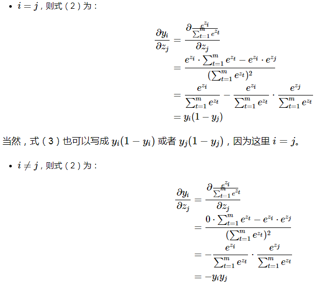
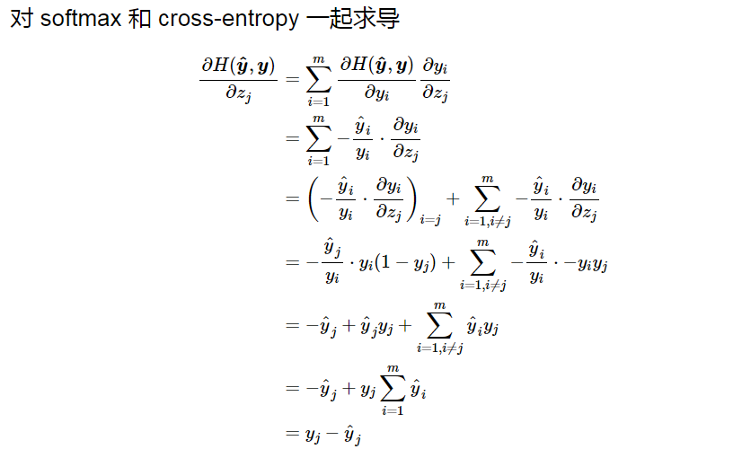

## 四、偏差与方差

[参考链接](http://liuchengxu.org/blog-cn/posts/bias-variance/)

1. 泛化误差：以回归任务为例, 学习算法的平方预测误差期望为:

$$Err(\mathbf{x}) = E\left[\left( y - f(\mathbf{x}; D) \right)^2\right]$$

2. 方差：在一个训练集 D上模型 f 对测试样本 x 的预测输出为 f(x;D), 那么学习算法 f 对测试样本 x 的 期望预测和使用样本数相同的不同训练集产生的方差为:

$$\overline{f}(\mathbf{x}) = E_D\left[f\left(\mathbf{x}; D\right)\right]$$
$$var(\mathbf{x}) = E_D\left[\left( f(\mathbf{x}; D) - \overline{f}(\mathbf{x}) \right)^2\right]$$

3. 偏差：期望预测与真实标记的误差称为偏差(bias), 为了方便起见, 我们直接取偏差的平方:

$$bias^2(\mathbf{x}) = \left( \overline{f}(\mathbf{x}) - y \right)^2$$

4. 噪声：噪声为真实标记与数据集中的实际标记间的偏差:

$$\epsilon^2 = E_D\left[ (y_D - y)^2 \right]$$

### 方差与偏差推导

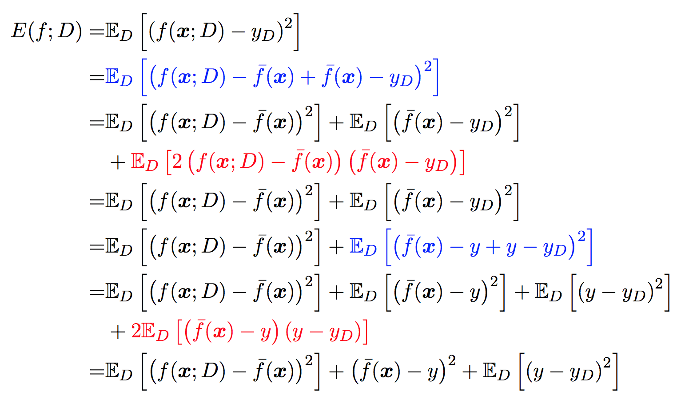
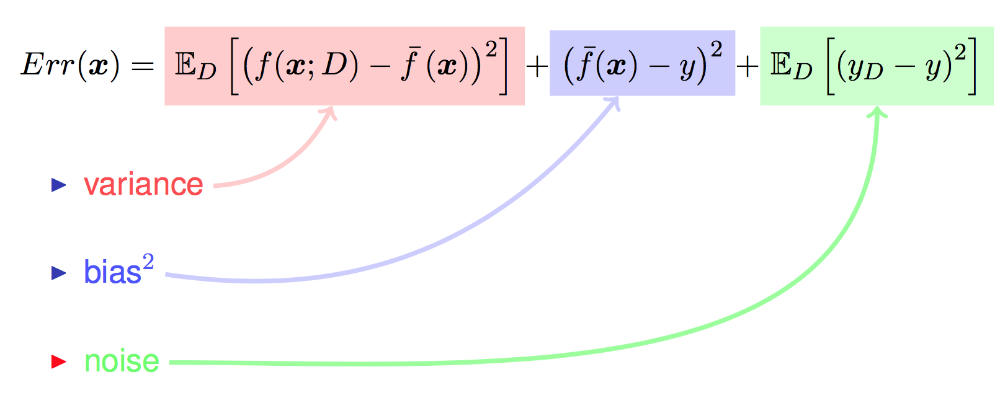

- 偏差度量了学习算法的期望预测与真实结果的偏离程序, 即 刻画了学习算法本身的拟合能力 .
- 方差度量了同样大小的训练集的变动所导致的学习性能的变化, 即 刻画了数据扰动所造成的影响 .
- 噪声表达了在当前任务上任何学习算法所能达到的期望泛化误差的下界, 即 刻画了学习问题本身的难度.

## 五、L1和L2正则

L0范数指向量中非零元素的个数
$\|w\|_0=\sum_{w_i!=0}^{W}{|w_i|}$

L1范数：向量中每个元素绝对值的和
$\|w\|_1=\sum_{i=1}^{N}{|w_i|}$

L2范数：向量元素绝对值的平方和再开平方
$$\|w\|_2=\sqrt{\sum_{i=1}^{N}{w_i^2}}$$

L1正则公式
$$L=L_{0}+\lambda\sum_j|w_j|$$

L2正则公式
$$L=L_{0}+\lambda\sum_jw_j^2$$

### 解的稀疏性

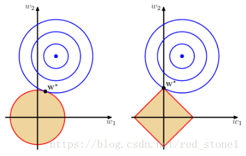

## 六、优化过拟合和欠拟合
### 降低过拟合
1. 更多的数据；
2. 降低模型复杂度；
3. 正则化方法；
4. bagging 多个模型集成在一起，降低单一模型过拟合风险；
5. 减少特征：PCA等
### 降低欠拟合
1. 添加新特征（深度学习提供稠密特征，因子分解机）
2. 增加模型复杂度；
3. 减少正则化系数

## 六、置信度与置信区间

置信度：95%，置信区间(u-a,u+a)样本数目不变的情况下，做100次试验，有95个置信区间包含了总体真值(虚线)。

正因为在100个置信区间里有95个置信区间包括了真实值，所以当我们只做了一次置信区间时，我们也认为这个区间是可信的，是包含了总体参数真实值的。**样本估计总体--核心思想**

样本平均值为整体平均值的一个点估计。置信水平95%表示，有100个样本，每个样本会计算出一个置信区间。100个置信区间有95个包含了总体平均值。也就是包含总体平均值的概率为95%。
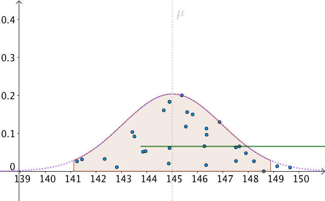

## 七、拉格朗日乘法
$$ \begin{aligned}
&{}\max f(x, y), \\
&{}\text{s.t. } g(x, y) = c.
\end{aligned}$$
$$\mathcal{L}(x, y, \lambda) \overset{\text{def}}{=}f(x, y) + \lambda\cdot g(x, y).$$
$$\begin{cases}
\frac{\partial \mathcal{L}}{\partial x} = 0, \\
\frac{\partial \mathcal{L}}{\partial y} = 0, \\
\frac{\partial \mathcal{L}}{\partial \lambda} = 0.
\end{cases}$$
函数 f(x,y)=x²+y² 是曲面**特别地，对于序列 {d1,d2,…} 来说，f(x,y)=dk 形成了一系列的曲线。若将 dk 理解为高度，则这一系列的曲线即是函数 f(x,y) 的等高线组。** 同样，对于约束 g(x,y)=x²-y=C 来说它也是一条曲线，我们称之为约束曲线。对g曲线求导得到法向量，对f也如此；故有下式成立
$$\Bigl(\frac{\partial f}{\partial x}, \frac{\partial f}{\partial y}\Bigr) = \lambda\Bigl(\frac{\partial g}{\partial x}, \frac{\partial g}{\partial y}\Bigr)$$
函数曲线相切，意味着两个函数的法线在切点重合，也就是两个函数的法向量相差一个系数 λ，这也就是说两个函数在切点的梯度向量相差一个系数 λ 

>>KKT条件

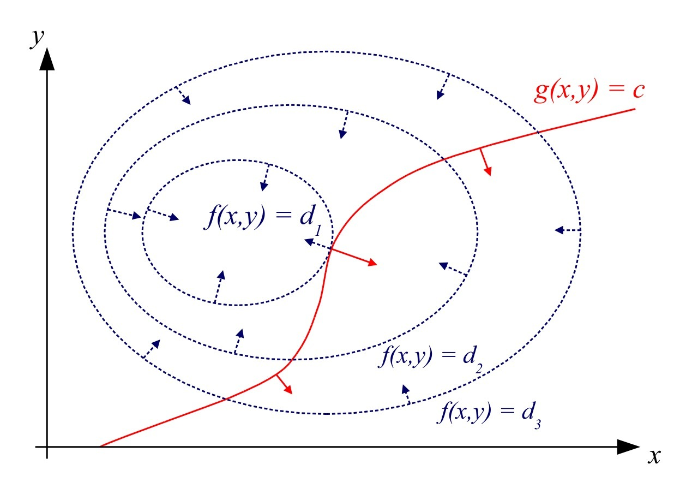
因此我们说，拉格朗日乘数法有很直观的物理意义。

对于h(x)>=0的设定如下
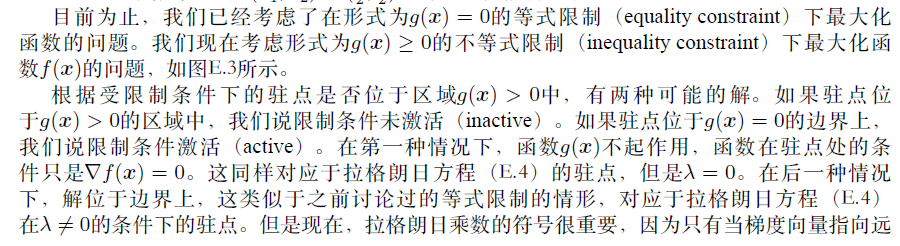
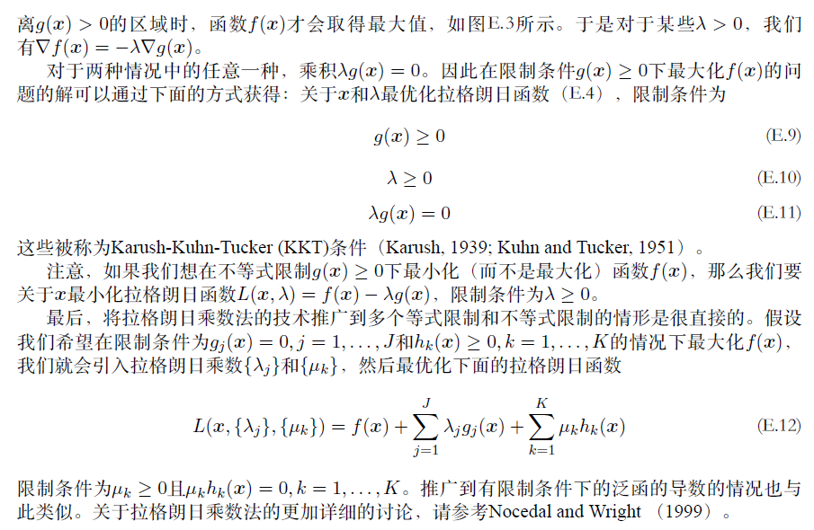
