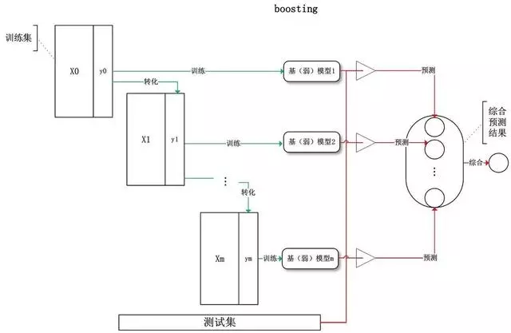
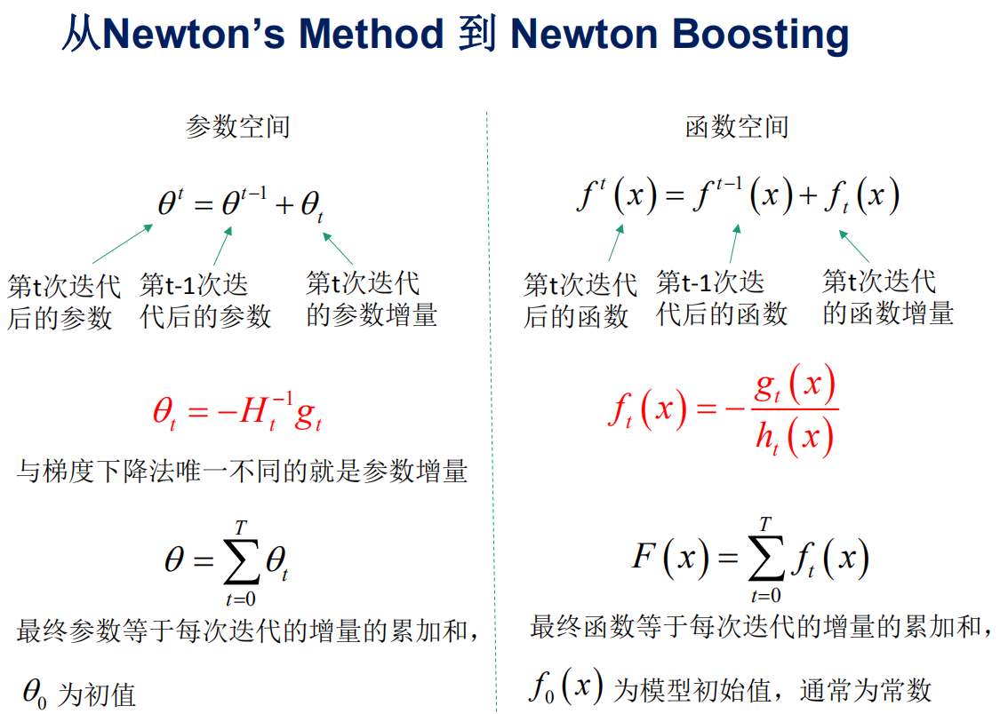

# 树模型总结
## 一、决策树ID3,C4.5,CART树

特征枚举：根据规则选择特征
划分节点：根据特征进一步分裂叶子节点
**根据样本训练出GBDT树，对于每个叶子节点，回溯到根节点都可以得到一组组合特征，所以用叶子节点的标号可以代表一个新的组合特征**

### ID3算法——使用信息增益度量纯度
Gain信息增益=信息熵-条件熵
信息熵：$H(X)=-\sum_{i=1}^{N}p(x_i)logp(x_i))$
条件熵：$H(Y|X)=-\sum_{x\epsilon X}p(x)H(Y|X=x)))$
缺点：
- 信息增益准则倾向于选取多值特征！假如把“编号”也作为一个候选划分属性，因为每一个样本的编号都是不同的（由于编号独特唯一，条件熵为0了，每一个结点中只有一类，纯度非常高），也就是说，来了一个预测样本，你只要告诉我编号，其它特征就没有用了，这样生成的决策树显然不具有泛化能力；

### C4.5算法——使用信息增益率度量纯度
信息增益：
$Gain\_ratio(D,a)=\frac{Gain(D,a)}{IV(a)}$
$IV(a)=-\sum_{i=1}^v \frac{\left|D_i\right|}{\left|D\right|} \log_2\frac{\left|D_i\right|}{\left|D\right|}$
- IV(a)表明：某属性分成的V类别数越大，IV(a)就越大；是对多值属性的罚项。
增益率准则其实对可取类别数目较少的特征有所偏好！毕竟分母越小，整体越大。故C4.5算法不直接选择增益率最大的候选划分属性，候选划分属性中找出信息增益高于平均水平的属性（这样保证了大部分好的的特征），再从中选择增益率最高的（又保证了不会出现编号特征这种极端的情况）
优点：
- 可处理连续特征，排序取中间值。

### CART树——使用Gini系数度量纯度
$Gini(D)=1-\sum_{i=0}^{n}(\frac{D_i}{D})^2$
$Gini(D|A)=1-\sum_{i=0}^{n}\frac{D_i}{D}Gini(D_i))$
无论是回归还是分类问题，无论特征是离散的还是连续的，无论特征取值有多个还是两个，内部节点只能根据属性值进行二分。CART既可以用于分类问题，也可以用于回归问题。
- 作为回归树：使用最小化MSE来选择特征并进行划分。遍历特征以及取值尝试划分，每一个叶子节点给出的预测值，是该叶子节点中所有样本的均值，计算最小平方误差。回归树生成使用平方误差最小化准则。
- 作为分类树：使用Gini指数最小化准则来选择特征并进行划分。Gini指数表示集合的不确定性，或者是不纯度。基尼指数越大，集合不确定性越高，不纯度也越大。这一点和熵类似。另一种理解基尼指数的思路是，基尼指数是为了最小化误分类的概率。

#### CART树，ID3，C4.5对比
|算法|树|准则|多分类|回归|特征|缺失值|特点|
|--------|--------|--------|--------|--------|--------|--------|--------|
|ID3|多叉树|信息增益|仅二分类|不能|仅离散|敏感|倾向多值特征	
|C4.5|多叉树|信息增益比|仅二分类|不能|离散/连续|可处理|偏向少值特征。实际信息增益+信息增益比	
|CART|仅二叉树|Gini系数|多分类|能|离散/连续|可处理|不需对数运算，更偏向于连续属性	
**都较容易过拟合**
## 二、集成学习-随机森林
集成学习——bagging与boosting



|集成学习|基学习器|依赖关系|串/并行|复杂度|关注点|应用|预测结果|数据使用|
|--------|--------|--------|--------|--------|--------|--------|--------|--------|
bagging|强|弱|并行|基学习器同阶|降方差|可回归，可分类|投票/平均|有放回抽取	
boosting|弱|强|串行|基学习器叠加|降偏差|可回归，可分类|累加/阈值|原数据样本权重会改变	

### Random Forest
多棵决策树，随机样本，随即特征进行划分。
分类：投票；回归：简单平均。
样本随机：63.2%（1-1/e）数据会被选区，**36.8%(1/e)未被用到称为OOB样本，包外估计**。
特征随机：从该节点特征集随机抽取K个，然后选择最优属性。
容易做成并行化方法

### GBDT
#### 伪代码

初始化第一棵树；计算损失对前面k-1棵树的负梯度；训练拟合得到第k棵树；有最小化损失获得步长η；将新的树添加到模型Fk。

#### 求解树结构复杂度：
```
树深度K
  1  枚举所有特征d：
        1.1 该特征下值排序 nlogn
        1.2 线性扫描决定最佳分裂点，
  2  计算分裂后MSE或者Gini系数选择最优分裂点
```
总体复杂度：**K * d * nlogn。**
#### 关于GBDT的拟合——伪残差逼近


函数空间的梯度下降，函数拟合的是负梯度；最终函数等于每次迭代的增量的累加和。
参数空间的梯度下降，参数更新方向为负梯度方向；最终参数等于每次迭代的增量累加和。
新的一棵树拟合的是模型的整体损失对前面k-1棵树的负梯度。

### XGBoost
xgb与gbdt的算法对比



GBDT构造新的一棵树，对损失近似到一阶导，拟合负梯度；属于函数空间中利用梯度下降法进行优化；


XGBoost构造新的一棵树，对损失近似到二阶导，拟合负一阶导/二阶导(+正则项)；属于函数空间中的牛顿法进行优化。


####  GBDT VS XGB
||GBDT|XGB|
|--------|--------|--------|
|基分类器|树模型|树模型+LR回归
树拟合|负梯度|负梯度/二阶导
方差-偏差权衡||目标函数+正则（叶子节点数，节点权重）
分割准则|回归：MSE；分类：基尼系数|最大化损失增益
分割方法||分位数法列举候选分割，求Gain最佳
缺失值处理||指定学习缺失值分类方向；忽略缺失值
|||列抽样，数据集抽样
|||并行化：特征值排序找出候选点，保存为列块结构，各个特征增益计算并行运算

#### 正则
L1大部分特征的权重降为0，变稀疏矩阵，只保留少量特征。目标函数等高线与L1正则的解空间决定，“棱”状更能碰撞出稀疏值。类似减少特征的方式解决过拟合
L2少量降为0，大部分权重减小。降低所有特征的权重。整体减小所有特征权重，来解决过拟合

#### 解释梯度下降
