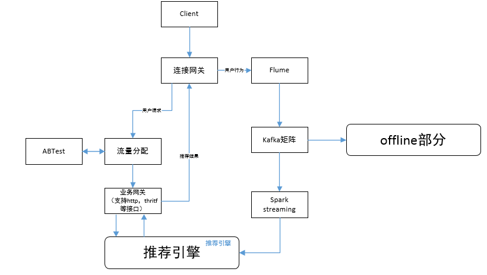
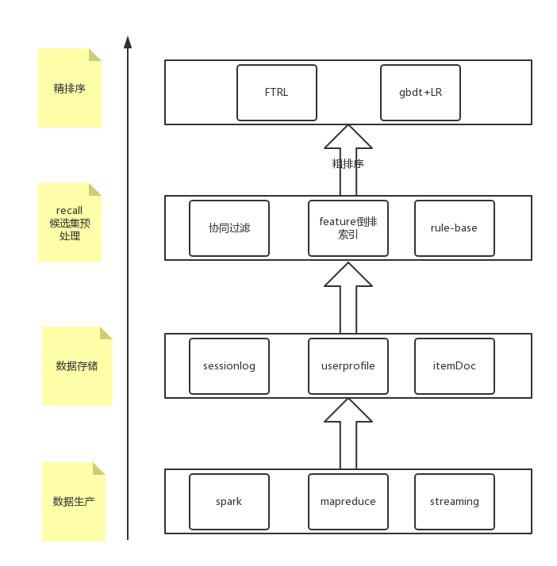

# 推荐系统介绍
目标主要包括：用户满意性，多样性，新颖性，惊喜度，实时性，推荐透明度，覆盖率。
热门、人工、相关、个性化推荐

---
## 一、推荐的分类
### 1、基于内容的过滤
基于物品A的内容，属性信息以及某种相似度定义，求出与物品A类似的物品B。（多为文本内容，标题，名称，标签及其他元数据）
用户表示为接触过的各物品属性的综合，用此来与物品的属性进行比较。
电影：演员属性，流派属性；
用户：人口统计信息，特定问题回答；

### 2、协同过滤
用户会有一些历史显式或隐式的行为（评级，交易）；过去表现出的相似偏好的用户未来的偏好也类似。
基于用户或物品的方法的得分，取决于若干用户或物品之间依据相似度构成的集合。邻居，近邻模型。

#### 2.1基于用户的协同过滤：
用户有相同物品偏好，则兴趣类似；选取相似用户，根据喜好计算各物品综合得分。
小明：A，B，C，D
小红：A，B，C
小明是小红的相似用户，推荐D给小红。 如果其他用户也偏好某些物品，则这些物品很可能值得推荐。

#### 2.2基于物品的协同过滤：
计算物品之间的相似度：根据相似用户-->物品的偏好计算物品之间的相似度；相似用户评级相同的物品更相近；
用户：（接触过A，B，C，D）---->找到与物品相似的物品再推荐。

##### 协同过滤的两种主要方式
- 近邻模型
 1. 面向用户：计算用户之间的关联；
 2. 面向物品的方法：计算待推荐物品与该用户已评级过的物品之间的关联。
 3. 用余弦值表示上述用户关联，该值就是皮尔逊相关系数。

- 隐变量模型
 1. 隐变量描述用户对物品的评级。物品（类型，流派）；用户（评分，评级等）
 2. 神经网络，矩阵分解实现隐变量表示。

## 二、推荐系统架构

### online部分架构

#### 核心模块
业务网关，推荐服务的入口，负责推荐请求的合法性检查，组装请求响应的结果。推荐引擎，推荐系统核心，包括online逻辑，召回、过滤、特征计算、排序、 多样化等处理过程。
#### 数据路径
1. 请求的刷新从gateway，经过流量分配模块，传到业务gateway，业务gateway支持http，tcp（使用thirtf协议或者protobuf 协议）等多种类型接口；

2. 用户行为数据，从gateway到Flume agent，然后到kafka，为后面online，realtime userprofile部分的提供实时数据，也为offline部分的数据存储系统提供数据。

### offline部分架构

从框架的角度看，推荐系统基本可以分为数据层、召回层、排序层。
- sessionlog：对原始数据进行清洗合并，sessionlog一般就是清洗合并后的数据，后续的算法和统计都是根据sessionlog进行再加工。
- userprofile：对用户属性和行为等信息进行采集和统计，为后续算法提供特征支持。
- itemDoc：对视频、商品等属性、曝光、点击等字段进行统计， 为后续算法提供特征支持。
召回层主要是从用户的历史行为、实时行为等角度利用各种触发策略产生推荐的候选集，对不同的策略和算法产生的候选集进行融合并按照产品规则进行过滤，一般融合和过滤后的候选集还是比较多的，一次线上请求过来之后线上系统无法对那么多的候选集进行排序，所以在召回层一般还会有粗排序，对融合的候选集进行一次粗排序，过滤掉粗排分数较低的候选集。
排序层主要是利用机器学习的模型对召回层筛选出来的候选集进行精排序。