# 语言模型简要整理

## 一、word2vec
详见 [word2vec](https://github.com/yuyinxiao/interview/blob/master/3_word2vec.md)
[《word2vec中的数学原理.pdf》](https://github.com/yuyinxiao/interview/blob/master/doc/word2vec-中的数学原理详解.pdf) 
[网页版笔记](http://www.hankcs.com/nlp/word2vec.html)

### 1、层序与负采样
- 层序模型：用哈夫曼树词频高的路径短，更易被搜索，对于生僻词路径更长，搜索树深更深；多个LR二分类；
- 负采样：词频越大更被定为负样本，所以对生僻词更有优势

#### 1.1 补充Huffman树
Huffman树只是二叉树中具体的一种，word2vec训练的时候按照词频将每个词语Huffman编码，由于Huffman编码中词频越高的词语对应的编码越短。所以越高频的词语在Hierarchical Softmax过程中经过的二分类节点就越少，整体计算量就更少了。

#### 1.2 负采样算法
任何采样算法都应该保证频次越高的样本越容易被采样出来。基本的思路是对于长度为1的线段，根据词语的词频将其公平地分配给每个词语：
$$len(w)=\frac{counter(w)}{\sum _{u\epsilon D} counter(u)}$$
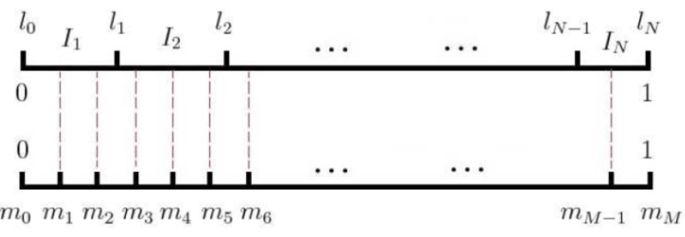
counter就是w的词频。word2vec用的是一种查表的方式，将上述线段标上M个“刻度”，刻度之间的间隔是相等的，即1/M：接着生成0-M之间的整数，去这个刻度尺上一查就能抽中一个单词了。对于机器学习中的分类任务，在训练的时候不但要给正例，还要给负例。对于Hierarchical Softmax，负例是二叉树的其他路径。对于Negative Sampling，负例是随机挑选出来的。Negative Sampling能**提高速度、改进模型质量。**

### 2、网络结构
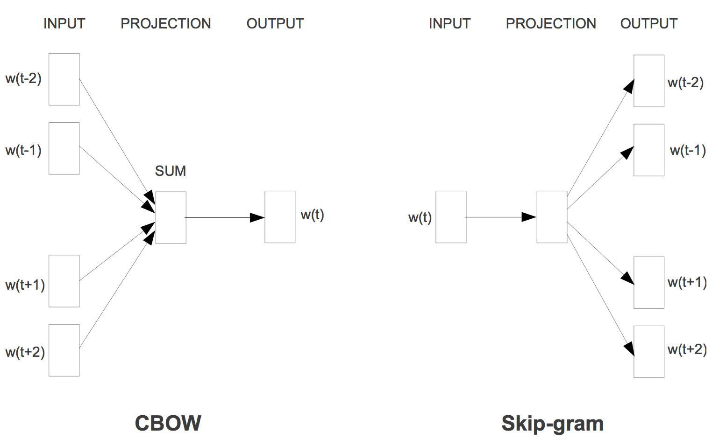
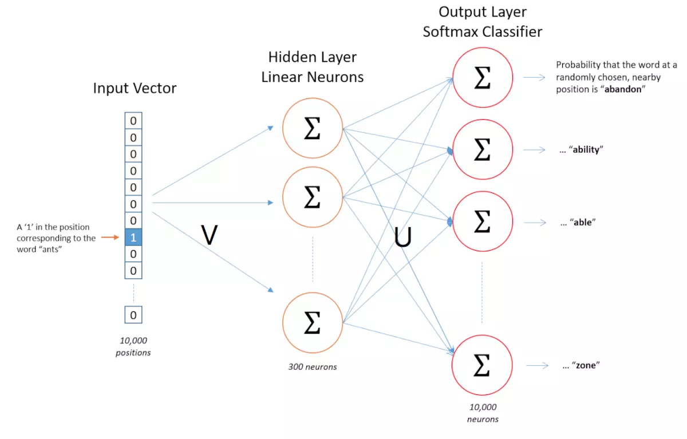
Word2Vec模型是一个超级大的神经网络（权重矩阵规模非常大）。10000个单词的词汇表，如果嵌入300维的词向量，那么输入-隐层权重矩阵和隐层-输出层的权重矩阵都会有 10000 x 300 = 300万个权重，在如此庞大的神经网络中进行梯度下降是相当慢的。**隐层中间embedding拿出来做词向量**，输出是窗口大小的K分类。

### 3、CBOW与Skip-gram
- CBOW：训练次数等同于样本次数V(词典大小)；效率高，质量较差
- SKip-gram：训练次数为KV,即每个样本训练K次(窗口大小)；效率较低，质量高
#### 3.1 CBOW
给定训练样本，即一个词w和它的上下文Context(w)，Context(w)是输入，w是输出。那么w就是正例，词汇表中其他的词语的就是负例。假设我们通过某种采样方法获得了负例子集NEG(w)。对于正负样本，分别定义一个标签：正样本为1，负样本为0。
$$L^w(\tilde{w})=\left \{ 
\begin{array}{ll} 
1 & \tilde{w}=w;\\ 
0 & \tilde{w} \neq w;
\end{array}
\right.$$

对于给定正样本（Context(w),w）我们希望最大化
$$g(w)=\prod _{
    u{\epsilon {\left \{ w \right \}} \cup NEG(w)}}
    p(u|Context(w))$$
其中，
$$p(u|Context(w))=[\sigma (X_w^T\theta ^u)]^{L^w(u)}\cdot [1-\sigma(X_w^T\theta ^u)]^{1-L^w(u))}$$
也就是说，当u是正例时，$\sigma (X_w^T\theta ^u)$越大越好，当u是负例时，$\sigma (X_w^T\theta ^u)$越小越好。因为$\sigma (X_w^T\theta ^u)$ 等于模型预测样本为正例的概率，当答案就是正的时候，我们希望这个概率越大越好，当答案是负的时候，我们希望它越小越好，模型也符合极大似然估计。
$$\log\prod _{w\epsilon C} g(w)=\sum _{w\epsilon C}\log g(w)$$
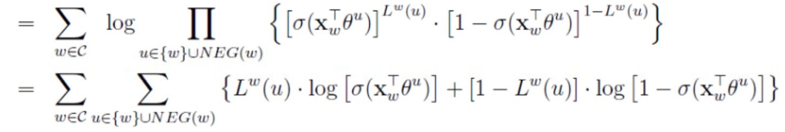
每个词都是如此，语料库有多个词，我们将g累积得到优化目标。因为对数方便计算，我们对其取对数得到目标函数：
训练伪码为：

#### 3.2 Skip-gram
对于(w,Context(w))我们希望最大化：
$$g(w)=\prod _{\tilde{w}\epsilon Context(w)} \prod _{u\epsilon \left \{ w \right \}\cup NEG^{\tilde{w}}(w)}p(u|\tilde w)$$
其中，
$$L =\sum _{w\epsilon C} \sum _{\tilde{w}\epsilon Context(w)} \sum _{u\epsilon \left \{ w \right  \}\cup NEG^{\tilde w }(w)} L(w,\tilde w,u)$$

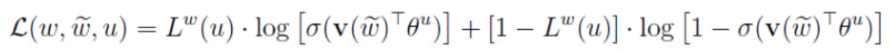

训练伪码为：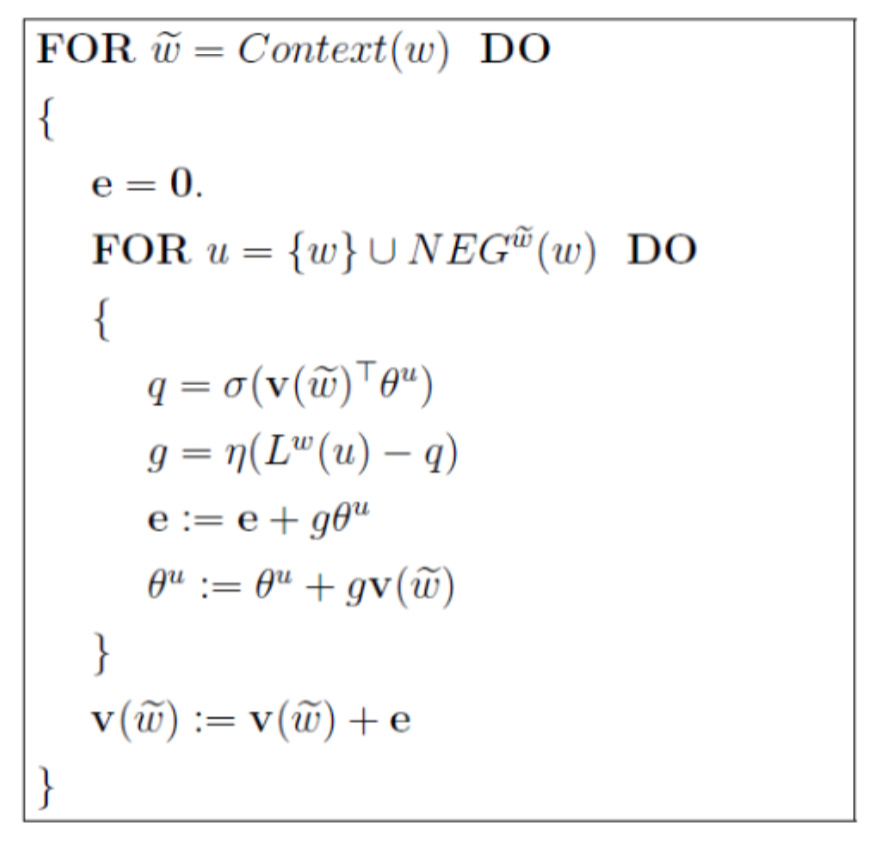

## 二、TextCNN

$$W^*=\frac{(W-f+2p)}{s}+1$$

## 三、Transformer
### 1、编码器与解码器
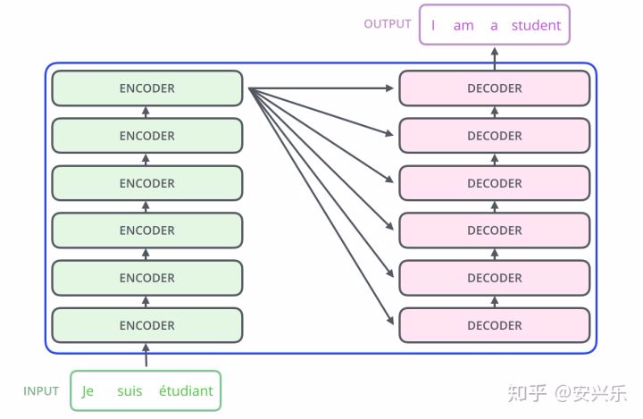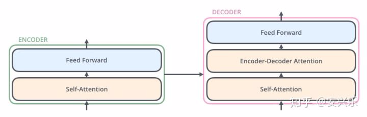

各层结构相同，权重不共享
### 2、编码器结构细节
we+pos_en，词向量+位置编码

### 3、计算任意两词的注意力加权后的向量表示

### 4、单词的矩阵运算，获取注意力加权后的向量表示

#### 解码器端动态展示

---
## 四、EMLO——特征融合
word embedding：无法解决多义词问题；
elmo：we训练后获得上下文语义了，根据这个语义调整单词的we表示；we适配语义，完成多义词问题。
两阶段：语言模型预训练+下游任务。
语言模型预训练：we输入到双层双向LSTM网络；最终得到句子每个单词对应的(单词we，单词的句法信息，单词的语义信息)。每一个we对应一个权重a，累加求和整合成一个。
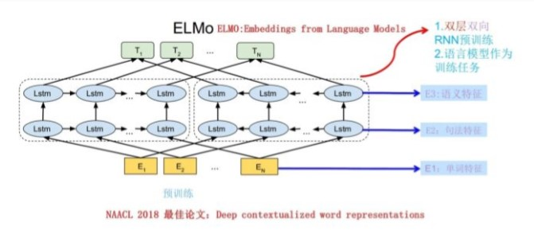

---
## 五、GPT——预训练+fine tune
重点是Transformer，特征抽取的能力强于RNN，只有单向的特征提取能力。
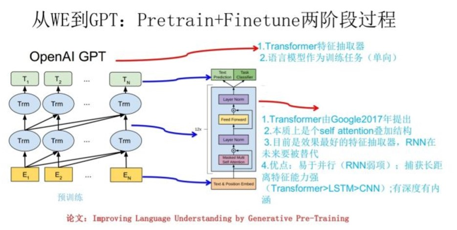

---
## 六、BERT
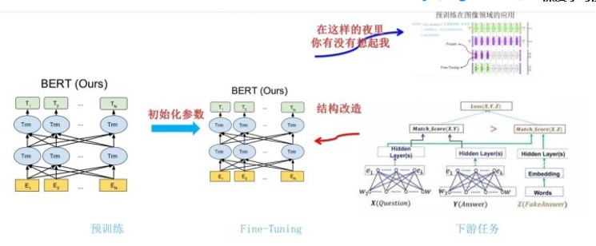
### Mask LM
随机选择预料15%单词，用掩码覆盖，然后要求模型去正确预测被抠掉的单词。实际上80%真正被mask标记，10%替换成另外的词，10%未改。
### Next Sentence Prediction

多任务训练，增加句子关系推断。（选择两个句子：语料中真正顺序相连的两个句子；或者选择随机取两个句子）判断第二个是否是第一个句子的后续句子。考虑到单词预测粒度到不了句子关系层级。

---
## 七、QA系统基本框架

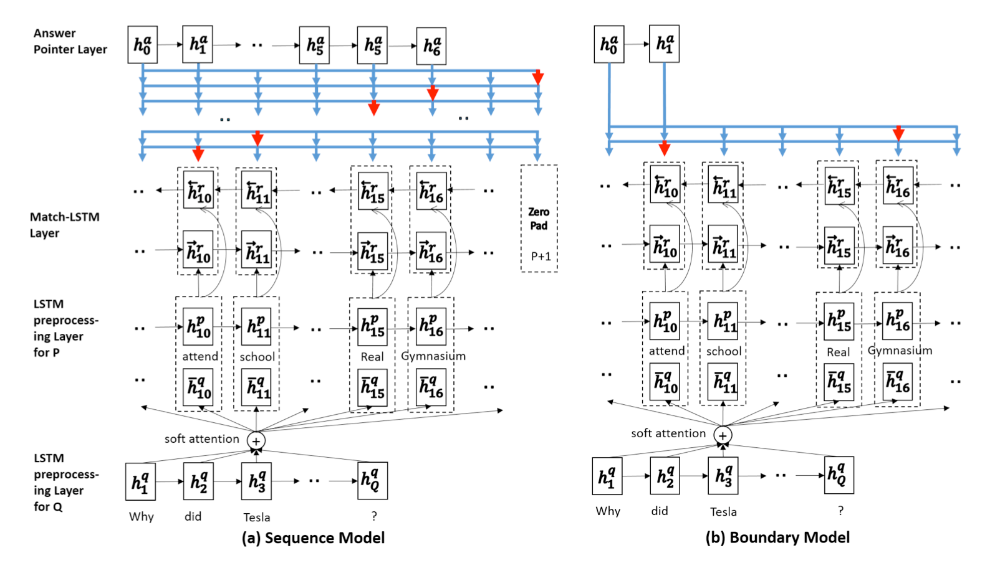
