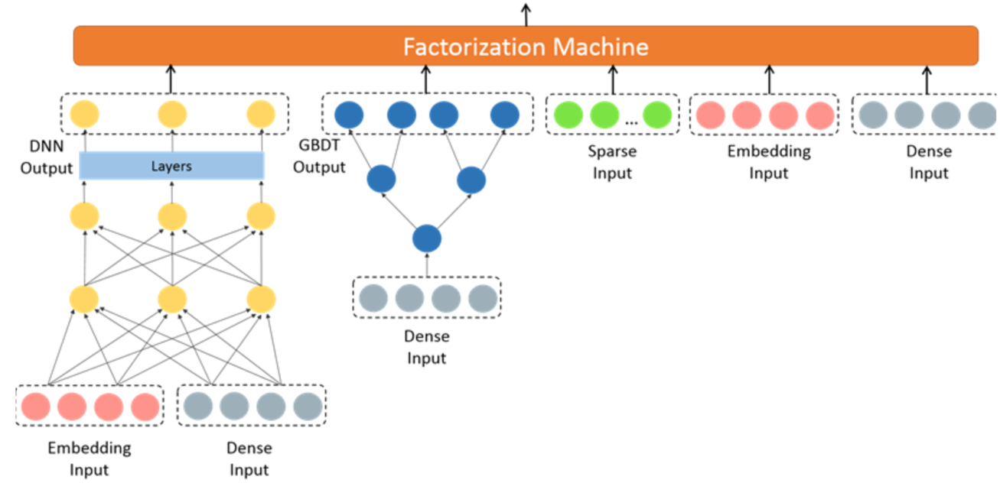

# 面试整理

## 面经题目
1. 阿里:https://www.jianshu.com/p/304e1023c4cb
2. 百度核心搜索部:https://www.jianshu.com/p/02d931d5c1c8
3. 知乎:https://www.jianshu.com/p/40259bb05357
4. ThoughtWorks:https://www.jianshu.com/p/0b5514908683
5. 美团:https://www.jianshu.com/p/bbe21ff40724
6. 便利蜂:https://www.jianshu.com/p/51e2d16f16a5
7. 贝壳:https://www.jianshu.com/p/cd0a809cf198
8. 一点资讯:https://www.jianshu.com/p/fffc15c9d31d
9. 百度Feed:https://www.jianshu.com/p/65032f77f903
10. 猫眼:https://www.jianshu.com/p/c32787be3dc8
11. 搜狗:https://www.jianshu.com/p/8a116eb7fd32
12. 小米:https://www.jianshu.com/p/e34ebebae15f
13. 滴滴:https://www.jianshu.com/p/bc9d5f8206a0
14. 拼多多:https://www.jianshu.com/p/a15bc7d0686a
15. 爱奇艺:https://www.jianshu.com/p/4ceb5de29c76
16. 头条:https://www.jianshu.com/p/5bc533d1bf62

- 您对于这个岗位的规划是怎样的？如果我的话，期待有怎样的产出？
- 目前团队的核心工作是哪些？
- 为了更好地胜任这个岗位，我还需要补充哪些技能？
- High count

## 工程
### 1、spark
- 数据倾斜：某个key下value过多，reduce_task处理任务过重导致运行特别慢。shuffle出现在期间。造成后果：有得任务执行完毕，某个任务执行很慢而且可能出现OOM错误；一般增大执行器与核数，并行数，自定义partition

- 尽量减少spark任务的空间占用，同时加速spark任务运行速度

### 2、hive
```sql
#以某字符连接字段
concat_ws：SELECT CONCAT_WS('_',id,name) AS con_ws FROM info;
#对字段A分区，取字段B的top3
row_number：select id,age,name,sex from
(select id,age,name,sex,row_number() over(partition by sex order by age desc) as rownumber from rownumber) temp where rownumber<3 
#条件真值与假值
case..when：case tb1.os when 'android' then 'android' when 'ios' then 'iPhone' else 'PC' end as os
##[{"name":"王二狗","sex":"男","age":"25"},{"name":"李狗嗨","sex":"男","age":"47"}]
get_json_object：
1.SELECT get_json_object(xjson,"$.[0]") FROM person;
2.SELECT get_json_object(xjson,"$.[0].age") FROM person;
```


## 第一部分：机器学习
### 1、层序与负采样，CBOW与skip-gram？
#### 1.1 层序与负采样
- 层序用哈夫曼树，词频高的路径短，更易被搜索，对于生僻词路径更长，搜索树深更深；多个LR二分类；
- 负采样：词频越大更被定为负样本，所以对生僻词更有优势
#### 1.2 CBOW与skip-gram
- CBOW： 训练次数等同于样本次数V(词典大小)；效率高，质量较差
- SKip-gram：训练次数为KV,即每个样本训练K次(窗口大小)；效率较低，质量高

### 2、如何选取特征？
特征选取包含一些特征处理的操作：
- 特征清洗（缺失，异常，样本比例权重）
- **标准化**和归一化）

标准化：更好保持样本间距；符合统计假设

什么时候需要标准化：**正则一定标准化**.$w$的大小与特征数值范围有关；此外标准化w大小可以反映不同特征对样本的贡献度。**与测试集分开标准化**

特征选取方法：树模型（组合，特征重要性）；DNN；业务相关统计特征（线性与非线性特征转换）

### 4、XGB细节
[XGBoost整理](https://github.com/NLP-LOVE/ML-NLP/tree/master/Machine%20Learning/3.3%20XGBoost#11-xgboost%E6%A0%91%E7%9A%84%E5%AE%9A%E4%B9%89)
#### 4.1 缺失值处理
xgboost把缺失值数据分到左子树和右子树分别计算损失，选择较优的那一个。如果训练中没有数据缺失，预测时出现了数据缺失，那么默认被分类到右子树

#### 4.2 树怎么生长
枚举所有不同树结构的贪心法，用打分函数来寻找出一个最优结构的树，每次在上一次的预测基础上取最优进一步分裂。
#### 4.3 树怎么停止生长或循环生成
- 分裂带来的增益小于设定阀值$\gamma$；
- 树达到最大深度时则停止建立决策树；
- 某个节点内样本权重和小于设定阈值时。

#### 4.4 如何实现并行
boosting技术中下一棵树依赖上述树的训练和预测，所以树与树之间应该是只能串行。**只是在选择最佳分裂点，进行枚举的时候并行，节点内选择最佳分裂点，候选分裂点计算增益用多线程并行。也是树形成最耗时的阶段**

#### 4.5 XGB与GBDT
- GBDT是算法，XGBoost工程实现；
- XGBoost显式地加入了正则项；
- GBDT使用代价函数的一阶导数信息，XGBoost可以同时使用一阶和二阶导数；
- GBDT采用CART，XGBoost支持多种类型的基分类器，比如线性分类器；
- GBDT在每轮迭代使用全部数据，XGBoost采用数据采样。
- 传统的GBDT没有设计对缺失值进行处理，XGBoost能够自动学习出缺失值的处理策略。

### 5、FM好处
1. 降低数据稀疏导致特征较差参数学习不充分的影响；
2. 提升参数学习效率和模型预估能力。

### 6、特征离散化优点
1. 离散特征的增加和减少都很容易，易于模型的快速迭代；
2. 稀疏向量计算快，特征易存储和扩展；
3. 对异常数据有很强的鲁棒性，更稳定；
4. 单变量离散化为N个后，相当于引入了非线性，加大拟合；
5. 离散化后可以进行特征交叉，由M+N个变量变为M*N个变量，进一步引入非线性，提升表达能力；
6. 简化模型，降低了过拟合的风险。


## 第二部分：深度学习（NLP）
### 1、LSTM与RNN，Transformer比较
- RNN：易梯度消失；（梯度<1反向传播越乘越小或者越大）
- LSTM：缓解梯度消失；缓解长期依赖；但路径复杂，模型训练复杂
- Transformer：可并行计算，解决长期依赖

#### 1.1 为何出现梯度消失和梯度爆炸，LSTM又是如何解决（改善）的
原因：链式求导法则导致梯度表示为连乘积的形式，梯度过大或者过小会造成梯度消失和爆炸
忘记门：通过相乘加和形式保证梯度流传播稳定；
输入门：与普通RNN类似仍然是连乘形式，依旧会可能发生梯度问题。

**通过改善一条路径的梯度缓解总体的远距离梯度太弱的问题。**


### 2、Transformer：PE，残差和正则
#### 2.1 Trm的位置编码
原因：Trm打乱输入顺序依然会实现自注意力机制，仅计算两两之间的attention值，这样只会得到强大的词袋模型；因为是无序的；
解决：通过三角函数实现位置编码

%20%3D%20sin(%5Cfrac%7Bpos%7D%7B10000%5E%7B%5Cfrac%7B2i%7D%7Bd_%7Bmodel%7D%7D%7D%7D))

%20%3D%20cos(%5Cfrac%7Bpos%7D%7B10000%5E%7B%5Cfrac%7B2i%7D%7Bd_%7Bmodel%7D%7D%7D%7D))

三角函数的和角性质可以既考虑到绝对位置又可以考虑到相对位置。

#### 2.2 残差网络
原因：实际上随着网络深度的加深，训练错误会先减少，然后增多；深度越深意味着用优化算法越难训练，冗余的网络层学习了不是恒等映射的参数造成，DNN(x)!=x不是恒等映射后面就会学偏。
解决：引入残差网络希望这些冗余层能够完成恒等映射，保证DNN(x)=x。有助于解决梯度消失和梯度爆炸问题，让我们在训练更深网络的同时，又能保证良好的性能。


## 第三部分：推荐系统
- uctr和ppui含义
uctr:unique ctr;
ppui:playtime per unique impression


## 1、Wide&Depp与DeepFM
### 1.1 Wide&Deep
- Wide模型利用交叉特征高效的实现记忆能力，实现精准推荐
- Embedding类的模型通过学习到的低维稠密向量，实现模型的泛化推荐（未见过的内容）

W&D模型，平衡Wide模型和Deep模型的Memorization 与 Generalization(记忆与泛化)
$$P\left ( Y=1\mid \mathbf{x} \right )=\sigma \left ( \mathbf{w}_{wide}^T\left [ \mathbf{x},\phi \left ( \mathbf{x} \right ) \right ] + \mathbf{w}_{deep}^Ta^{\left ( l_f \right )}+b \right )$$


### 1.2 DeepFM

黑色线表示带有权重的连接，红色线表示权重为1的连接，蓝色线表示one-hot映射到对应的embedding。图中的Field表示一个特征类别,每个field用one-hot表示，构成最下面的Sparse Features。稀疏特征有两部分输出，一部分是加权求和得到FM Layer中的第一个节点，另一部分索引对应的embedding得到Dense Embeddings。FM：LR的权重为一阶权重，组合特征权重为高阶权重。Dense Embeddings也有两部分输出，一部分是两两做点积输出到FM Layer，另外一部分是拼接起来作为Hidden Layer的输入

**精排部分**

- wide模型部分由LR替换为FM,FM模型学习交叉特征的能力
- 共享原始输入特征。DeepFM模型的原始特征将作为FM和Deep模型部分的共同输入，保证模型特征的准确与一致。
- DeepFM模型包含FM和DNN两部分，FM模型可以抽取低阶特征，DNN可以抽取高阶特征。
- 由于输入仅为原始特征，而且FM和DNN共享输入向量特征，DeepFM模型训练速度很快。

